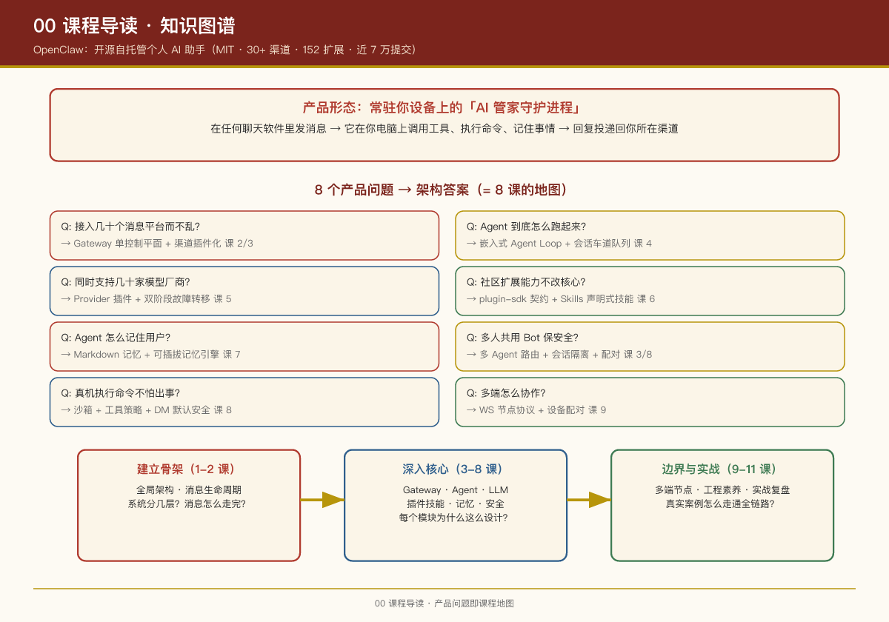

# OpenClaw 架构研习课（面向 AI 产品经理）

> 研究对象：[openclaw/openclaw](https://github.com/openclaw/openclaw)（main 分支，2026-07 快照）  
> 读者画像：AI 产品经理 —— 不需要读懂每一行代码，但需要理解"系统为什么这么设计"。  
> 配套代码：建议 `git clone https://github.com/openclaw/openclaw.git` 后对照阅读。

---

## 这是什么项目

OpenClaw 是一个**开源自托管的个人 AI 助手**（作者 Peter Steinberger 及社区，MIT 协议）。一句话概括它的产品形态：

> 一个常驻在你自己设备上的"AI 管家守护进程"，你在任何聊天软件（微信、WhatsApp、Telegram、Slack、iMessage……共 30+ 渠道）里给它发消息，它就能在你的电脑上调用工具、执行命令、记住事情，并把回复投递回你所在的渠道。

它的吉祥物是一只太空龙虾 🦞（Molty）。项目从 Warelay → Clawdbot → Moltbot → OpenClaw 一路更名演进，如今是一个 **12,000+ 个 TypeScript 文件、152 个官方扩展、近 7 万次提交**的大型 monorepo。

## 为什么值得产品经理研究

OpenClaw 几乎是"个人 AI Agent 产品"这一品类的**完整参考实现**，它回答了这个品类必须回答的所有架构问题：

| 产品问题 | OpenClaw 的答案 | 对应课时 |
|-|-|-|
| 怎么接入几十个消息平台而不乱？ | Gateway 单控制平面 + 渠道插件化 | 第 2、3 课 |
| Agent 到底是怎么"跑"起来的？ | 嵌入式 Agent Loop + 会话车道队列 | 第 4 课 |
| 怎么同时支持几十家模型厂商？ | Provider 插件 + 双阶段故障转移 | 第 5 课 |
| 怎么让社区扩展能力而不改核心？ | plugin-sdk 契约 + Skills 声明式技能 | 第 6 课 |
| Agent 怎么"记住"用户？ | Markdown 文件记忆 + 可插拔记忆引擎 | 第 7 课 |
| 多人共用一个 Bot 怎么保证安全？ | 多 Agent 路由 + 会话隔离 + 配对白名单 | 第 3、8 课 |
| AI 在真机上执行命令不怕出事吗？ | 沙箱 + 工具策略 + DM 配对默认安全 | 第 8 课 |
| 桌面/手机/Web 多端怎么协作？ | WS 节点协议 + 设备配对 | 第 9 课 |

## 课程结构

| 课时 | 标题 | 核心问题 |
|-|-|-|
| 第 1 课 | 全局架构：一只龙虾的骨架 | 系统分几层？代码怎么组织？ |
| 第 2 课 | 一条消息的奇幻漂流 | 从微信消息到 AI 回复，中间经过哪些模块？ |
| 第 3 课 | Gateway 与渠道层：万物入口 | 控制平面做什么？渠道插件怎么接入？ |
| 第 4 课 | Agent 运行时：大脑如何思考 | Agent Loop、Prompt 组装、队列与转向 |
| 第 5 课 | LLM 抽象层与故障转移 | 如何统一几十家模型厂商并保证可用性？ |
| 第 6 课 | 插件与技能生态：开放的设计 | 核心如何保持精简？社区如何扩展？ |
| 第 7 课 | 记忆与会话：Agent 的"长期人格" | 记忆怎么存取？会话怎么隔离和回收？ |
| 第 8 课 | 安全模型：能力越强，默认越保守 | 默认安全如何设计而不牺牲能力？ |
| 第 9 课 | 多端应用与节点体系 | macOS/iOS/Android/Web 如何接入同一个大脑？ |
| 第 10 课 | 工程素养：7 万提交不失控的秘密 | 这个团队怎么做质量工程？ |
| 第 11 课 | 实战复盘：AI 砍价买车的架构之旅 | 真实案例如何走通全链路？代码长什么样？ |

每课结构统一：**产品视角问题 → 概念讲解 → 架构图 → 代码/配置实证 → 设计启示（PM Takeaways）**。

## 建议的阅读方式

1. **第一遍**：顺序读完第 1、2 课，建立全链路心智模型；
2. **第二遍**：按你关心的主题跳读（做渠道的看 3，做 Agent 的看 4、5、7，做生态的看 6）；
3. **动手验证**：每课末尾的"实证"小节给出了真实的文件路径与配置示例，可以 clone 仓库后对照查看。

## 学习路径总览

12 课按认知梯度分为三个阶段，与"从架构到产品"的学习目标对应：

| 阶段 | 课时 | 学完能回答什么 |
|-|-|-|
| **建立骨架**（1-2 课） | 全局架构、消息生命周期 | 系统分几层？一条消息怎么走完？ |
| **深入核心**（3-8 课） | Gateway、Agent、LLM、插件技能、记忆、安全 | 每个核心模块怎么设计、为什么这么设计？ |
| **边界与实战**（9-12 课） | 多端节点、工程素养、实战复盘 | 怎么部署多端？怎么保证工程质量？真实案例怎么落地？ |

这套课程的独特之处在于**始终用"产品经理视角"提问题**：不只讲"代码在哪"，更讲"这个设计回答了哪个产品问题、付出了什么权衡"。建议配合开源仓库对照阅读，效果最佳。

> 资料来源：课程基于 GitHub main 分支源码快照（2026-07-17）与官方文档站 docs.openclaw.ai 交叉验证。项目迭代极快（日均数十个提交），具体细节请以最新代码为准。

