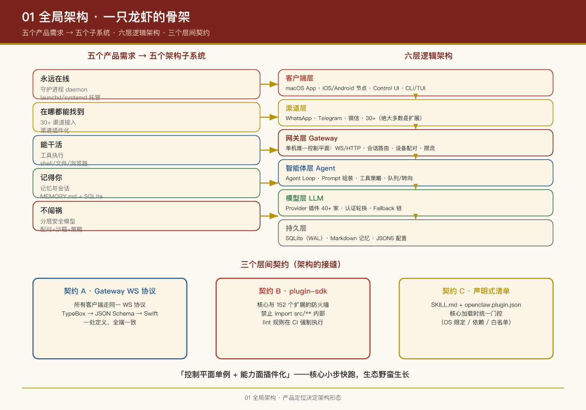

# 第 1 课：全局架构 —— 一只龙虾的骨架

## 本课问题

面对一个 12,000+ 文件的 monorepo，产品经理最先要问的不是"每个文件做什么"，而是：

1. 系统**逻辑上**分几层？
2. 代码**物理上**怎么组织？
3. 各层之间靠什么**契约**通信？

---

## 1. 产品定位决定架构形态

OpenClaw 的 README 里有一句关键的话：

> "The Gateway is just the control plane — the product is the assistant itself."

这句话是理解整个架构的钥匙。OpenClaw 不是一个"聊天机器人框架"，它的产品本体是一个**常驻的个人助理**，而这个助理需要：

- **永远在线** → 必须是守护进程（daemon），由 launchd/systemd 托管自动重启
- **在哪都能找到** → 必须同时接入几十个消息渠道
- **能干活** → 必须有工具执行能力（shell、文件、浏览器、定时任务……）
- **记得你** → 必须有持久化的记忆与会话
- **不闯祸** → 必须有分层的安全模型

五个产品需求，对应五个架构子系统。

### 1.1 它在市场中的位置（PM 视角）

把 OpenClaw 放进 2026 年的个人 AI 助手市场看，竞争者大致分四类：

| 类别 | 代表 | 优势 | 劣势 |
|-|-|-|-|
| 云端助手 | ChatGPT、Claude | 模型强、持续更新、开箱即用 | 数据上云、必须联网、定制有限 |
| 企业助手 | Microsoft Copilot 等 | 深度集成办公套件、企业级安全 | 成本高、生态锁定、定制受限 |
| 开发者助手 | GitHub Copilot、Cursor | 深度集成 IDE、代码理解强 | 场景单一、只面向开发者 |
| **本地化助手** | **OpenClaw** | **数据主权、离线可用、高度可定制** | **需要技术配置、维护成本** |

OpenClaw 瞄准的正是第四类空白——**本地化、跨平台、高度可定制**。这个定位直接决定了架构的三条主线：

1. **本地优先**：数据不离开设备 → 网关必须跑在用户本机、SQLite 单机持久化、无云端依赖（除 LLM API 调用本身）
2. **跨平台统一**：一次配置、多端使用 → 必须有统一的网关抽象层 + 渠道适配器
3. **高度可扩展**：按需加功能 → 必须有技能（说明书）与插件（进程内代码）双层扩展体系

> **PM 视角**：理解"本地优先"的代价同样重要——它换来的隐私、离线、低延迟，代价是用户要自己维护、更新、排障。这套权衡直接映射到第 3 课的"默认保守"与第 8 课的"能力与风险不对称分配"：**产品敢把 Agent 放在用户真机上跑，是因为架构默认值足够保守。**

## 2. 逻辑架构：六层视图

```
┌─────────────────────────────────────────────────────────────┐
│  客户端层  macOS App · iOS/Android Node · Windows Hub ·      │
│            Control UI (Web) · CLI · TUI                      │
├─────────────────────────────────────────────────────────────┤
│  渠道层    WhatsApp · Telegram · Slack · Discord · iMessage  │
│  (Channels)· 微信 · QQ · 飞书 · Matrix · IRC · …30+ 个       │
│            —— 绝大多数是可插拔的扩展（extensions/）           │
├─────────────────────────────────────────────────────────────┤
│  网关层    Gateway 守护进程（单机唯一控制平面）               │
│  (Gateway) WS/HTTP 服务器 · 会话路由 · 设备配对 · 限流        │
│            事件总线 · RPC 方法注册表                          │
├─────────────────────────────────────────────────────────────┤
│  智能体层  Agent Runtime                                     │
│  (Agent)   Agent Loop · Prompt 组装 · 工具策略 · 队列/转向   │
│            多 Agent 路由（bindings） · 沙箱执行               │
├─────────────────────────────────────────────────────────────┤
│  模型层    LLM Provider 插件（OpenAI/Anthropic/Bedrock/…）   │
│  (LLM)     认证轮换 · 模型 Fallback 链 · 流式传输             │
├─────────────────────────────────────────────────────────────┤
│  持久层    SQLite（会话/凭证/状态，WAL 模式）                 │
│            Markdown 记忆文件（MEMORY.md / memory/*.md）       │
│            JSON5 配置（~/.openclaw/openclaw.json）           │
└─────────────────────────────────────────────────────────────┘
              贯穿全局：plugin-sdk 契约 + Skills 技能体系
```

**理解要点**：

- **单机单 Gateway**：一台主机上只有一个 Gateway 进程，它是所有渠道的"总机"，也是所有客户端的"服务端"。这个"单点"是有意为之——个人助理产品的会话状态、渠道连接必须收敛到一处，否则多开就会互相打架（比如 WhatsApp 的 Web 会话只允许一个持有者）。
- **控制平面 vs 数据平面**：Gateway 是控制平面（管连接、路由、会话），真正"思考"的是 Agent 运行时，真正"传话"的是渠道插件。三层解耦。
- **一切皆插件**：30+ 渠道、40+ 模型厂商，核心仓库里只内置了 iMessage、Telegram、WebChat 三个渠道，其余全部以扩展（extensions/ 下 152 个包）形式存在。

## 3. 物理架构：monorepo 目录地图

| 目录 | 角色 | 对应逻辑层 |
|-|-|-|
| `src/` | 核心源码（Gateway、Agent、CLI） | 网关层 + 智能体层 |
| `src/gateway/` | Gateway 服务器、RPC 方法、认证、配对 | 网关层 |
| `src/agents/` | 嵌入式 Agent 运行时、会话、工具定义 | 智能体层 |
| `src/llm/` | 模型注册表、Provider 流式传输 | 模型层 |
| `src/channels/` | 渠道通用机制（白名单、配对、流式草稿） | 渠道层（核心侧） |
| `packages/` | 22 个可复用子包（agent-core、llm-core、plugin-sdk、gateway-protocol…） | 契约层 |
| `extensions/` | 152 个官方扩展：渠道、模型厂商、记忆引擎、工具 | 渠道/模型/生态层 |
| `skills/` | 47 个内置技能（SKILL.md 声明式指令） | 生态层 |
| `apps/` | macOS、iOS、Android、Linux 原生应用 | 客户端层 |
| `ui/` | Control UI（Lit + Vite 的 Web 管理台） | 客户端层 |
| `docs/` | Mintlify 文档站全部源文件 | —— |

**技术栈一览**（对 PM 有用的部分）：

- **TypeScript + Node.js（24+）+ pnpm workspace** —— VISION.md 解释了为什么选 TS："OpenClaw 本质上是一个编排系统（prompts、tools、protocols、integrations），TS 让它保持默认可hack（hackable）"
- **SQLite（WAL 模式）** —— 单机持久化的标准答案，无外部依赖
- **TypeBox → JSON Schema → Swift 模型代码生成** —— 协议类型一处定义，多端生成
- **Vitest + Oxc（oxlint/oxfmt）** —— 测试与 lint 工具链
- **发布**：npm 全局包（`npm i -g openclaw`），stable/beta/dev 三个更新通道

## 4. 层间契约：三个关键接口

产品经理理解架构，重点是理解**层与层之间的接缝**：

**契约 A：Gateway WebSocket 协议**（`packages/gateway-protocol`）  
所有客户端（macOS App、CLI、Web UI、手机节点）通过同一个 WS 协议与 Gateway 通信。第一帧必须是 `connect` 握手，之后是 `{type:"req"|"res"|"event"}` 的 JSON 帧。用 TypeBox 定义 schema，生成 JSON Schema，再生成 Swift 模型——**一处定义，全端一致**。

**契约 B：plugin-sdk**（`packages/plugin-sdk`）  
核心与 152 个扩展之间的防火墙。扩展只能 import `openclaw/plugin-sdk/*` 暴露的入口，**禁止** import `src/**` 内部实现——仓库里有专门的 lint 规则（`lint:extensions:no-src-outside-plugin-sdk` 等）在 CI 里强制执行这条边界。

**契约 C：SKILL.md / openclaw.plugin.json 清单**  
技能用 Markdown + YAML frontmatter 声明，插件用 JSON 清单声明资源（`extensions`、`skills`、`prompts`、`themes`）。**声明式**意味着核心可以在加载时统一做门控（OS 限定、依赖检查、白名单），而不需要理解每个扩展的内部逻辑。

## 5. 配置与数据的物理布局

```
~/.openclaw/
├── openclaw.json                    # 主配置（JSON5）
├── workspace/                       # 默认 Agent 工作区（Agent 的 cwd）
│   ├── AGENTS.md / SOUL.md / USER.md / MEMORY.md …   # 人格与记忆文件
│   └── skills/                      # 工作区级技能
├── agents/<agentId>/agent/
│   └── openclaw-agent.sqlite        # 每个 Agent 的会话/凭证/状态库
├── state/openclaw.sqlite            # 共享状态（工作区认证等）
└── skills/                          # 全局托管技能
```

注意这个设计：**每个 Agent 一个独立 SQLite 库**，天然实现多 Agent 数据隔离（第 7 课展开）。

## PM Takeaways

1. **"控制平面单例 + 能力面插件化"是 Agent 产品的可复制范式**：一个常驻核心收敛所有连接和状态，外围能力（渠道、模型、记忆后端）全部插件化。这让核心可以小步快跑，生态可以野蛮生长。
2. **接口边界要用工具强制执行，不靠自觉**：OpenClaw 用 lint 规则在 CI 里挡住"扩展 import 核心内部"的行为。架构腐化 usually 不是因为设计错了，而是因为边界没人守。
3. **声明式清单 > 命令式注册**：插件和技能都用清单声明自己是什么、需要什么，核心就能统一做安全门控、加载策略、市场分发（ClawHub）。

## 实证

- `docs/agent-runtime-architecture.md` —— 官方运行时架构说明
- `packages/plugin-sdk/package.json` —— SDK 的 exports 列表即"契约清单"
- 根 `package.json` 的 `lint:extensions:*`、`lint:plugins:*` 脚本 —— 边界守卫规则
- `pnpm-workspace.yaml` —— workspace 范围

---

下一课：第 2 课：一条消息的奇幻漂流


