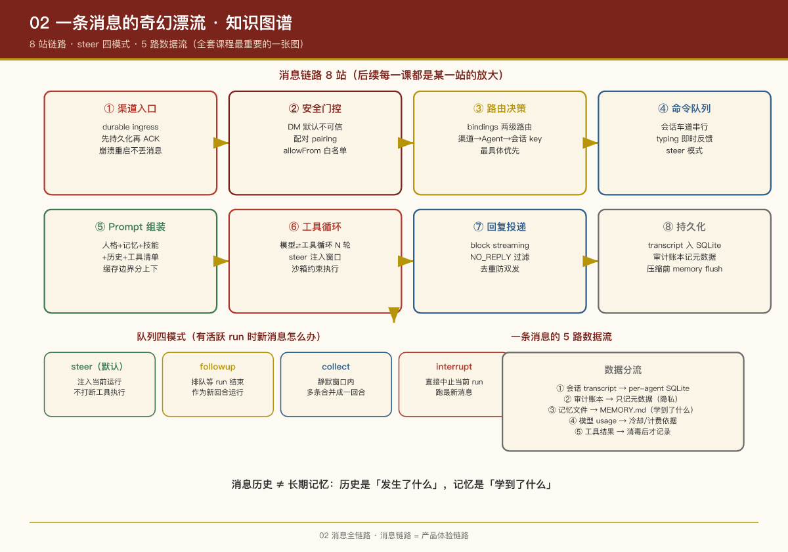

# 第 2 课：一条消息的奇幻漂流

## 本课问题

用户在 WhatsApp 里给助手发了一句"帮我把桌面上的报销单整理成 Excel"，10 秒后收到回复。这 10 秒里，消息在系统里经过了哪些模块？每个模块做了什么决策？

这是全套课程最重要的一课——**后续每一课都是这条链路上某一站的放大**。

---

## 1. 全链路时序图

```
用户                渠道插件           Gateway            队列          Agent 运行时        LLM 厂商       工具/沙箱
 │  "整理报销单"        │                 │                │                │                 │              │
 │──────────────────>│                 │                │                │                 │              │
 │                   │ 1.持久化入队     │                │                │                 │              │
 │                   │   再 ACK         │                │                │                 │              │
 │                   │ 2.上报入站消息 ──>│                │                │                 │              │
 │                   │                 │ 3.安全门控       │                │                 │              │
 │                   │                 │  (配对/白名单)   │                │                 │              │
 │                   │                 │ 4.路由决策       │                │                 │              │
 │                   │                 │  (渠道→Agent     │                │                 │              │
 │                   │                 │   →会话 key)     │                │                 │              │
 │                   │                 │ 5.入队 ────────>│                │                 │              │
 │                   │ 6.typing 指示 <──│                │                │                 │              │
 │  "对方正在输入…"   │                 │                │ 7.轮到我了     │                 │              │
 │<─────────────────│                 │                │──────────────>│                 │              │
 │                   │                 │                │                │ 8.组装 Prompt    │              │
 │                   │                 │                │                │ (人格+记忆+技能   │              │
 │                   │                 │                │                │  +历史+工具清单)  │              │
 │                   │                 │                │                │ 9.调模型 ──────>│              │
 │                   │                 │                │                │<─ tool_call ────│              │
 │                   │                 │                │                │ 10.执行工具 ─────────────────────>│
 │                   │                 │                │                │<── 结果 ─────────────────────────│
 │                   │                 │                │                │ 11.再调模型 ───>│  (循环 N 轮)   │
 │                   │                 │                │                │<── 最终文本 ────│              │
 │                   │ 12.流式块/最终回复│<──────────────│<───────────────│                 │              │
 │  收到回复 ✅       │<────────────────│                │                │                 │              │
 │<─────────────────│                 │                │                │                 │              │
 │                   │                 │ 13.持久化会话     │                │                 │              │
 │                   │                 │    写入 SQLite   │                │                 │              │
```

## 2. 逐站拆解

### 第 1 站：渠道入口 —— "先落袋，再 ACK"

渠道插件（如 `extensions/whatsapp` 基于 Baileys）收到平台推送后，做的第一件事是**把原始消息信封持久化入队，然后才向平台返回 ACK**。这叫 **durable ingress（持久化入口）** 模式：

- 之后进程崩溃、重启、升级，消息都不会丢
- 调度失败可以重试，反复失败进**死信队列**（保留 30 天 / 2 万条墓碑记录）
- 对用户透明：平台侧立即显示"已送达"

> **PM 视角**：这是"可靠性"与"实时性"的经典权衡。机器人产品丢消息是最伤信任的故障，OpenClaw 选择在第一跳就用持久化换可靠。

### 第 2 站：安全门控 —— "你是谁？我认识你吗？"

消息到达 Gateway 后先过安全检查，**所有入站 DM 默认被视为不可信输入**：

- `dmPolicy: "pairing"`（默认）：陌生发送者会收到一个短配对码，Bot 不处理其消息；机主用 `openclaw pairing approve <channel> <code>` 批准后，发送者进入本地白名单
- `allowFrom` 白名单：渠道级的发送者准入列表
- `dmPolicy: "open"` + `allowFrom: ["*"]` 才是公开 Bot——必须**显式**开启

详见第 8 课。

### 第 3 站：路由决策 —— "这条消息归哪个 Agent、哪个会话？"

两级路由：

**第一级：消息 → Agent（bindings）**  
按 `(渠道, 账号, 对端)` 匹配 bindings，规则**确定性且最具体优先**：exact peer → peer 通配 → guild+roles → guild → team → account → channel → 默认 Agent。比如可以让"工作 WhatsApp 号 → work Agent（Opus 模型）"、"家庭群 → home Agent（便宜模型+严格工具白名单）"。

**第二级：消息 → 会话 key**

- 群聊/频道：每个群一个独立会话
- DM：默认所有 DM 共享 `main` 会话（单人使用场景，保持连续性）；多人共用场景应配置 `session.dmScope: "per-channel-peer"` 按发送者隔离——否则 Alice 的私信 Bob 也能看到
- Cron/Webhook：每次运行全新会话

### 第 4 站：命令队列 —— "别急，排队"

入站消息按**会话车道（session lane）**串行化：同一个会话同一时刻只有一个 Agent 运行在跑，防止两个 run 同时写会话文件、竞争资源。全局还有 `main` 车道做总并发上限（默认 4）。

排队时用户体验不掉线：**typing 指示在入队瞬间立刻发出**。

如果运行时已有活跃 run，新消息按队列模式处理（默认 `steer`）：

| 模式 | 行为 |
|-|-|
| `steer`（默认） | 消息**注入当前运行**——在当前 assistant 回合的工具调用执行完、下一次 LLM 调用前送达，不打断工具执行 |
| `followup` | 排队等当前 run 结束后，作为新回合运行 |
| `collect` | 静默窗口内多条消息合并成一个 followup 回合 |
| `interrupt` | 直接中止当前 run，跑最新消息 |

> **PM 视角**：`steer` 模式是个精妙的产品设计——用户在 AI 干活时补充一句"顺便把格式调成中文"，AI 能"听到"并调整，而不是傻等或粗暴打断。这是把"异步队列"做出"实时对话感"的关键。

### 第 5 站：Prompt 组装 —— "给模型看什么？"

轮到执行时，Agent 运行时动态组装系统提示词（**没有静态默认提示词，每次运行从零组装**）。固定分区自上而下：

1. **Tooling**：工具清单与使用纪律
2. **Execution Bias**："在回合内把事情做完，别问无谓的问题"
3. **Safety**：简短护栏提醒
4. **Skills**：可用技能的紧凑 XML 列表（`<available_skills>`，每条约 24 token）
5. **Workspace**：工作目录
6. **Workspace Files (injected)**：`AGENTS.md`（操作指令）、`SOUL.md`（人格）、`USER.md`（用户画像）、`MEMORY.md`（长期记忆）等 bootstrap 文件注入
7. **Runtime**：主机、OS、模型、思考级别
8. 缓存边界之下：Messaging、Group Chat Context、Heartbeats 等易变内容

**缓存感知设计**：稳定内容在上、易变内容在下，让支持前缀缓存的模型后端跨轮次复用——省钱省延迟。

### 第 6 站：模型调用与工具循环 —— "思考-行动"循环

这是 Agent Loop 的核心（`packages/agent-core/src/agent-loop.ts`）：

```
loop:
  调 LLM（流式）
  if 模型返回 tool_call:
      执行工具（受工具策略/沙箱约束）
      把结果追加进上下文
      continue          # 再调模型
  else:
      break             # 模型给出最终文本，结束
```

一次用户消息可能触发 N 轮"模型→工具→模型"循环。每轮之间都是 steering 消息的注入窗口。

### 第 7 站：回复投递 —— "怎么送回用户面前？"

- 默认等整个 run 结束，发送最终回复
- 可选 **block streaming**：assistant 每写完一块（默认按 800-1200 字符、优先段落边界切分）就先发一块，用户看到"分段输出"的效果；支持合并微块防止刷屏
- 回复中精确匹配 `NO_REPLY` 的部分被过滤（AI 决定"这条不用回"的机制）
- 消息发送工具的投递会被跟踪，避免 assistant 文本与工具发送重复确认

### 第 8 站：持久化 —— "记下来"

- 会话 transcript 写入 per-agent SQLite（`~/.openclaw/agents/<agentId>/agent/openclaw-agent.sqlite`）
- 会话写入有**跨进程文件锁**保护（默认等待 60s）
- Gateway 把生命周期事件投影到**审计账本**（只记元数据：谁、何时、结果码——不复制 prompt 和工具参数，保护隐私）
- 上下文太长时自动 compaction（摘要压缩），压缩前先跑一个静默回合提醒 AI 把重要事实写入记忆文件（**memory flush**，防止压缩丢信息）

## 3. 全链路上的"失败处理"地图

| 环节 | 挂了怎么办 |
|-|-|
| 渠道收消息 | durable ingress：重启后重放，反复失败进死信队列 |
| 模型调用 | auth 轮换 → 模型 fallback 链 → 过载时整链指数退避重试（最多 10 次）→ 报 `FallbackSummaryError` |
| 工具执行 | 工具错误返回给模型让它自己恢复；最终无法恢复则发兜底错误回复 |
| 会话卡死 | 诊断系统分类 `long_running`/`stalled`/`stuck`，超阈值自动 abort 释放车道 |
| 整体超时 | run 级超时默认 48 小时；模型空闲 watchdog（云端 120s/自托管 300s） |

## 4. 链路之外：消息的"数据流"视角

前面是纵向的时序链路（一条消息怎么走完），这一节换成横向的**数据流**视角——同样是这条消息，它在系统里产出了几路数据、各流向哪里？这对理解"消息系统"和"记忆/审计系统"的分工很有帮助：

```
一条用户消息，在系统里产生 5 路数据流：
① 会话 transcript  → per-agent SQLite（对话连续性）
② 审计账本        → 生命周期/工具事件元数据（谁、何时、结果码，不复制内容）
③ 记忆文件        → MEMORY.md / memory/*.md（Agent 主动沉淀的关键事实）
④ 模型 usage      → usage 元数据（第 5 课：冷却、计费依据）
⑤ 工具结果        → 消毒后（尺寸/图片载荷）才记录或广播
```

对照着看，两个设计意图很清晰：

- **内容数据与元数据分流**：transcript（内容）进会话库，审计账本（元数据）独立投影——审计可用性与隐私保护的折中（第 8 课展开）。
- **记忆不是消息的影子**：消息历史 ≠ 长期记忆。历史是"发生了什么"，记忆是"学到了什么"——记忆由 Agent 主动策展（第 7 课），这才是跨会话能力的来源。

> **PM 视角**：画链路图时容易只画"一条消息走到底"，但真正的系统设计是**多路数据流的编排**。评估一个消息系统是否成熟，可以数一数"一条消息分了几路数据、每路给谁用、谁负责清理"——回答得越清楚，系统的职责边界越健康。

## PM Takeaways

1. **消息链路 = 产品体验链路**：typing 即时反馈、steer 中途补充、block streaming 分段输出——这些"体验细节"都长在架构的特定关节上，想改体验要先找到关节。
2. **每个环节都有降级方案**：AI 产品的用户信任建立在"最坏情况下表现如何"，而不是"最好情况下多惊艳"。
3. **持久化前置（先落袋再 ACK）是消息系统的通用可靠模式**，做任何接入第三方消息平台的产品都适用。

## 实证

- Agent 循环：`packages/agent-core/src/agent-loop.ts`
- 运行编排：`src/agents/embedded-agent-runner/`（官方说明见 `docs/agent-runtime-architecture.md`）
- 队列：`docs/concepts/queue.md`、路由：`src/bindings/`
- 会话存储：`src/agents/sessions/session-manager.ts`

---

上一课：第 1 课：全局架构 ｜ 下一课：第 3 课：Gateway 与渠道层


