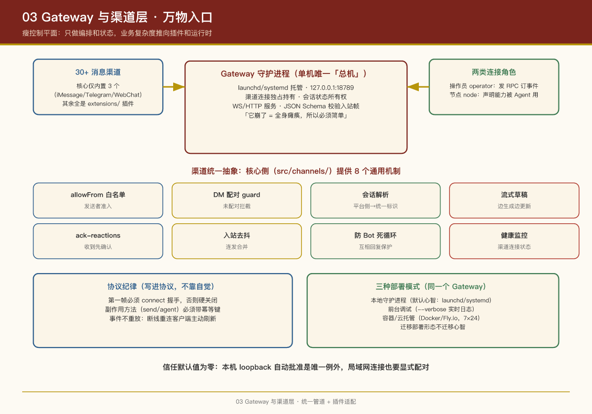

# 第 3 课：Gateway 与渠道层 —— 万物入口

## 本课问题

1. Gateway 这个"控制平面"到底管什么、不管什么？
2. 30+ 个消息渠道怎么接入同一个系统而不互相污染？
3. 客户端（手机 App、Web 控制台）和设备节点（iPhone、Android）如何安全地连上 Gateway？

---

## 1. Gateway：单机唯一的"总机"

### 它是什么

一个以守护进程运行的 Node.js 进程（`openclaw gateway`），由 launchd（macOS）/ systemd（Linux）托管自动重启，默认监听 `127.0.0.1:18789`。

### 它管什么（控制平面职责）

| 职责 | 说明 |
|-|-|
| **渠道连接持有** | 所有渠道的长连接（如 WhatsApp 的 Baileys 会话）由 Gateway 独占持有——单机只有一个 Gateway，保证不冲突 |
| **WS/HTTP 服务** | 对客户端暴露类型化 WS API（请求/响应/服务器推送事件），入站帧用 JSON Schema 校验 |
| **会话状态所有权** | 所有会话状态归 Gateway 所有；UI 客户端只查询，不持有 |
| **路由** | 渠道/账号/对端 → Agent → 会话 key 的两级路由 |
| **设备配对** | 所有 WS 连接（客户端+节点）需设备身份 + 配对批准，签发设备令牌 |
| **限流** | 控制平面写操作按方法限流（如 30 次/分钟预算） |
| **事件总线** | 发出 `agent`、`chat`、`presence`、`health`、`heartbeat`、`cron` 等事件 |
| **Canvas 托管** | HTTP 服务下挂 `/__openclaw__/canvas/`（Agent 可编辑的实时工作区）和 `/__openclaw__/a2ui/` |

### 它不管什么

- **不做"思考"**：模型调用、工具执行在 Agent 运行时（Gateway 通过 `agent` RPC 触发并订阅其事件流）
- **不实现渠道细节**：渠道协议由各渠道插件实现，Gateway 只提供统一的注册、路由、投递管道

> **PM 视角**：这是典型的"**瘦控制平面**"设计。Gateway 只做编排和状态，业务复杂度被推到插件和运行时两个方向。好处是 Gateway 本身极稳定（它崩了=全身瘫痪，所以必须简单）；代价是理解系统要跨三层看。

### 协议细节（理解多端协作的基础）

- 传输：WebSocket 文本帧 + JSON
- **第一帧必须是 `connect`**（握手），否则硬关闭
- 之后：`{type:"req", id, method, params}` → `{type:"res", id, ok, payload|error}`；事件为 `{type:"event", event, payload, seq?}`
- **幂等键**：有副作用的方法（`send`、`agent`）必须带幂等键，服务端短时间去重——客户端可以安全重试
- **事件不重放**：客户端断线重连后必须主动刷新，而不是等服务端补发——简化服务端，复杂度留给客户端
- 认证：共享密钥（token/password）、Tailscale 身份头、或显式的 `mode:"none"`（仅限私有入口）

### 不变式（Invariants，官方文档原文）

- 每台主机**恰好一个** Gateway 控制一个 Baileys（WhatsApp）会话
- 握手是强制的
- 事件不重放

## 2. 渠道层：30+ 平台，一个姿势

### 渠道的统一抽象

尽管各平台协议千差万别（Bot API、WebSocket、Webhook、QR 扫码登录……），OpenClaw 把渠道收敛为几个统一问题，核心侧（`src/channels/`）提供通用机制：

| 通用机制 | 解决什么 |
|-|-|
| **allowlist / allowFrom** | 发送者准入白名单 |
| **direct-dm guard / pairing** | DM 配对与未配对拦截 |
| **conversation-resolution** | 把平台侧的 chat/group/thread 解析成统一会话标识 |
| **draft-streaming** | 流式草稿（边生成边更新同一条消息，如 Telegram 的 edit message） |
| **ack-reactions** | 收到消息先用表情/状态确认（用户体验） |
| **inbound-debounce** | 用户连发多条消息的合并去抖 |
| **bot loop protection** | 防止两个 Bot 互相回复到死循环 |
| **channel-health-monitor** | 渠道连接健康监控 |

### 渠道作为插件

核心只内置 3 个渠道（iMessage、Telegram、WebChat），其余全部是 `extensions/` 下的插件：

- **官方插件**：`openclaw plugins install @openclaw/<id>` 一键安装，或在 `openclaw onboard` 引导中按需安装（如 whatsapp、slack、discord、feishu、matrix、signal、qqbot……）
- **外部插件**：社区维护（如 wechat、yuanbao）
- **冲突治理**：两个插件声明同一个渠道时产生 duplicate ownership 诊断；插件可在清单里声明 `channelConfigs.<id>.preferOver` 实现有意的替换

### 渠道安装的产品化细节

以 WhatsApp 为例：**onboarding 可以先展示设置引导，插件包还没装；只有当渠道真正激活时，Gateway 才从 ClawHub/npm 加载插件**。这种"按需安装"让首次设置的感知负担最小化——用户不需要先理解"什么是插件"。

## 3. 客户端与节点：同一条 WS，两种角色

连到 Gateway WS 的实体分两类：

**操作员客户端（role: operator）**：macOS App、CLI、Control UI（Web）、TUI  
→ 发请求（`health`、`send`、`agent`）、订阅事件

**设备节点（role: node）**：iOS、Android、macOS、无头设备  
→ 在 `connect` 里声明 `role: "node"` + 能力集（caps/commands），暴露设备命令如 `canvas.*`、`camera.*`、`screen.record`、`location.get`、`device.apps`

→ 这样 Agent 就能通过工具调用"让用户的手机拍张照"、"列出配对 Mac 上装了哪些 App"。

### 配对与本地信任

- 所有连接携带**设备身份**，新设备 ID 需配对批准，Gateway 签发设备令牌
- 本机 loopback 连接可自动批准（同机 UX 顺畅）；**tailnet/LAN 连接也必须显式批准**
- 所有连接必须对 `connect.challenge` nonce 签名；签名载荷绑定平台与设备族，重连时元数据变更需重新配对
- Gateway 自身的认证（`gateway.auth.*`）对本地和远程连接**一视同仁**

### 远程访问

首选 Tailscale/VPN；备选 SSH 隧道：`ssh -N -L 18789:127.0.0.1:18789 user@gateway-host`；远程部署可开 WS TLS + 证书固定。

### 部署模式：同一个 Gateway，三种跑法

Gateway 虽然是"单机唯一控制平面"，但"这台机器"可以是本地设备、也可以是云上的一个实例——部署模式决定了产品的维护心智：

| 模式 | 形态 | 适用场景 | 命令/载体 |
|-|-|-|-|
| **本地守护进程** | launchd（macOS）/ systemd（Linux）托管的常驻服务，开机自启 | 个人主力使用：隐私优先、离线可用 | `openclaw onboard --install-daemon` |
| **前台调试** | 终端前台运行，实时日志 | 开发调试、排障 | `openclaw gateway --verbose` |
| **容器/云托管** | Docker、Fly.io、Render 上跑一个实例 | 7×24 在线、远程访问、与本地设备配合 | 仓库内置 Docker 配置 |

三条路线的产品含义：**本地守护进程是默认心智**（个人助理 = 私人管家，住在你的机器上）；云托管是"进阶玩法"（把管家放到永远在线的服务器上，本地设备通过节点协议连回去）——这正好对应第 9 课"无头核心 + 可选客户端"的设计。无论哪种模式，`~/.openclaw/openclaw.json` 配置语义与 WS 协议都不变，**迁移部署形态不迁移心智**。

## PM Takeaways

1. **"统一管道 + 插件适配"是接入碎片化生态的唯一 scalable 姿势**：先把所有渠道抽象成统一问题（白名单、会话解析、流式草稿、去抖），再让每个插件只解决平台差异。新接一个渠道的成本 ≈ 写一个适配器，而不是改一套系统。
2. **可靠性语义要写进协议，而不是寄希望于实现**：第一帧必须握手、副作用方法必须带幂等键、事件不重放——这些协议级约定让所有客户端实现者的行为可预期。
3. **信任默认值为零**：本机自动批准是唯一例外，其他一切连接（包括同局域网）都要显式配对。个人助理拿着用户的全部数字生活，信任模型必须偏执。
4. **设备即能力**：把 iPhone/Android 建模为"声明能力的节点"，Agent 的产品想象力从"聊天"扩展到"操作你的物理设备"——这是个人助理与网页 Chatbot 的本质差异。

## 实证

- Gateway 服务器：`src/gateway/server/`、RPC 方法注册：`src/gateway/methods/registry.ts`
- 协议契约包：`packages/gateway-protocol`
- 渠道通用机制：`src/channels/`（`allow-from.ts`、`direct-dm.ts`、`draft-stream-loop.ts` 等）
- 渠道插件示例：`extensions/telegram/`、`extensions/whatsapp/`、`extensions/slack/`
- 文档：`docs/concepts/architecture.md`、`docs/gateway/protocol`

---

上一课：第 2 课：一条消息的奇幻漂流 ｜ 下一课：第 4 课：Agent 运行时

