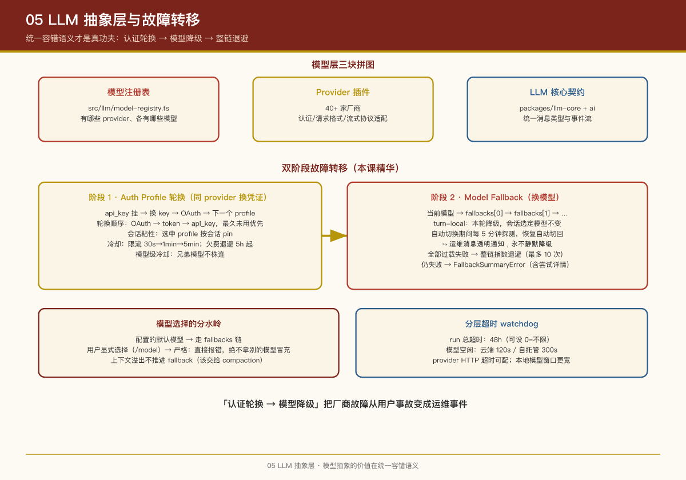

# 第 5 课：LLM 抽象层与故障转移

## 本课问题

1. 40+ 家模型厂商（OpenAI、Anthropic、Bedrock、Ollama、国产厂商……）怎么统一接入？
2. 模型挂掉、限流、欠费时，用户为什么不能感知到中断？
3. 模型选择的产品逻辑是什么（用户怎么选、系统怎么兜底）？

---

## 1. 模型层的三块拼图

| 拼图 | 位置 | 职责 |
|-|-|-|
| **模型注册表** | `src/llm/model-registry.ts` | 维护"有哪些 provider、各有哪些模型"的事实 |
| **Provider 插件** | `extensions/openai/`、`extensions/anthropic/`、`extensions/ollama/` 等 40+ 个 | 每家厂商的认证、请求格式、流式协议适配 |
| **LLM 核心契约** | `packages/llm-core/`、`packages/ai/` | 统一的消息类型、事件流（EventStream）、AssistantMessage 等抽象 |

**模型引用格式**：`<provider>/<model-id>`（按第一个 `/` 切分）。模型 ID 本身带 `/`（如 OpenRouter）时要写全 `openrouter/moonshotai/kimi-k2`。省略 provider 时系统先查别名，再找"唯一暴露该模型 ID 的 provider"，最后回落默认 provider。

**Provider 插件的形状**（`packages/plugin-sdk/src/provider-*.ts` 定义契约）：

- `provider-auth`：认证（api_key / oauth / token 三种凭证类型）
- `provider-stream`：流式传输适配
- `provider-onboard`：onboarding 引导（怎么问用户要 key）
- `provider-http`：HTTP 层（超时、guarded fetch）
- `provider-tools`：厂商特有工具（如 OpenAI web search）

## 2. 双阶段故障转移：这节课的精华

模型调用失败时的处理分**两个递进阶段**，这是 OpenClaw 最值得抄的设计之一：

```
阶段 1：Auth Profile 轮换（同 provider 内换凭证）
   api_key 挂了 → 换另一个 key → OAuth → 下一个 profile
        │ 全部失败且错误"值得转移"
        ▼
阶段 2：Model Fallback（换模型）
   当前模型 → fallbacks[0] → fallbacks[1] → …
        │ 全部因过载失败且还没开始输出
        ▼
整链指数退避重试（最多 10 次，2.5s 起步封顶 30s）
        │ 仍失败
        ▼
抛出 FallbackSummaryError（含每次尝试详情）
```

### 阶段 1 细节：Auth Profile 轮换

- 凭证存在 per-agent SQLite 里，三种类型：`api_key` / `oauth` / `token`
- 轮换顺序：显式 `auth.order` > 配置的 profiles > 库存 profiles；默认 round-robin 按 **OAuth → token → api_key** 排序，同类型内"最久未用"优先
- **会话粘性**：选中的 profile 按会话固定（pin），保持 provider 缓存热度；会话重置或 profile 冷却时才换
- **冷却机制**：限流类错误（429、并发限制、用量窗口）触发冷却，时长递增 30s → 1min → 5min 封顶；**账单失败**走更长的禁用通道（默认退避 5 小时，上限 24 小时）——欠费的 key 不要反复试
- 支持**模型级冷却**：同 provider 的兄弟模型不被株连

### 阶段 2 细节：Model Fallback

**Fallback 是 turn-local 的**：即使用 fallback 模型回答了本轮，会话的选定模型不变，下一轮从 primary 重新开始。自动切换期间每 5 分钟探测一次源模型，恢复后自动切回并通知。

**不同来源的模型选择，fallback 策略不同**（这条规则的产品含义很强）：

| 模型来源 | 失败时行为 |
|-|-|
| 配置的默认模型 | 走 `fallbacks` 链 |
| 用户显式选择（`/model` 切换） | **严格**：直接报错，绝不拿别的模型冒充 |
| Cron 任务指定模型 | 走配置链（除非任务自带 fallbacks） |

> 为什么用户显式选择要严格？因为用户选 Opus 可能就是为了一次重要任务，系统"贴心地"降级到便宜模型反而是欺骗。**自动降级只能发生在系统自己选的模型上**。

**哪些错误推进 fallback**：auth 失败、限流冷却耗尽、过载、超时、账单禁用、以及其他候选存在时的未知错误。  
**哪些不推进**：显式 abort、**上下文溢出**（`request_too_large`——这该交给 compaction 逻辑，换模型没用）。

**用户可见性**：切换时收到运维消息 `↪️ Model Fallback: <fallback> (selected <primary>; <reason>)`，恢复时同样通知——降级永远透明，不静默。

## 3. 超时体系（分层 watchdog）

| 层 | 默认 | 说明 |
|-|-|-|
| run 总超时 | 48h | 整个 Agent run 的预算，可设 0=不限 |
| 模型空闲 watchdog | 云端 120s / 自托管 300s | 流式响应超过这个窗口没有任何 chunk → 判定挂起，中止 |
| provider HTTP 超时 | 可配 `timeoutSeconds` | 连接、header、body、SDK 请求全覆盖 |
| cron 场景特例 | 有显式 cron 超时时，云端 stall 上限 60s | 保证 fallback 还来得及在外层 cron 期限前执行 |

自托管/本地模型（Ollama 等）天然慢，所以有更宽的窗口和专门配置入口——**超时要按 provider 类别分级**，一刀切会误杀本地模型。

## 4. Harness 选择：用谁的"运行时"跑模型

OpenClaw 还有一个抽象层：**harness**（决定用哪个 agent 执行引擎）：

- 内置 runtime id：`openclaw`（自研嵌入式循环）
- 插件可注册额外 harness（如 `codex` app-server）
- 选择策略：`agentRuntime.id` 配置（模型级 > provider 级）→ `auto` 时选支持当前 provider 路由的插件 harness，否则内置
- 特例：OpenAI 官方 Responses 路由可隐式选 `codex`；自定义端点/Completions 适配一律留在内置 runtime

对 PM 的意义：**模型接入和 agent 执行引擎接入是两个正交的扩展点**——新厂商只需要写 provider 插件，不需要碰 agent 循环；想换执行引擎（比如接入 OpenAI Codex 的云执行）也不用动 provider。

## 5. 可复用运行时包：@openclaw/ai 的定位

第 1 课讲过 22 个 packages 子包，其中 `@openclaw/ai` 与 `@openclaw/llm-core` 值得单独理解——它们是**从"OpenClaw 这个产品"里抽出来的"通用 AI 运行时"**。

为什么要把 LLM 能力抽成独立包？三个产品原因：

1. **可复用**：消息类型、事件流（EventStream）、AssistantMessage 等抽象是"AI 应用"的通用骨架，不绑定 OpenClaw 的网关/渠道。第三方项目可以 `npm i @openclaw/ai` 直接用。
2. **契约先行**：包边界即契约边界——plugin-sdk 的 provider 契约（`provider-auth`、`provider-stream` 等）引用这些类型，**厂商适配器只依赖契约包，不依赖产品实现**（第 1 课的契约 B 边界）。
3. **独立演进**：AI 抽象层演进速度独立于产品功能演进。模型协议变化（新响应格式、新流式语义）只需改契约包 + 各 provider 适配器，不牵连整个 monorepo。

> **PM 视角**："抽公共包"和"产品内部建个 util 目录"是两种境界。抽包意味着**你承认这套能力有独立于产品的第二受众**——这是产品公司往平台公司走的标志。判断标准很简单：除了 OpenClaw 自己，还有没有第二个人会 `npm i` 这个包？

## PM Takeaways

1. **"认证轮换 → 模型降级"的双阶段容错，把"厂商故障"从用户事故变成运维事件**。搭配透明的运维消息，信任不塌。
2. **用户显式选择 vs 系统默认选择要区别对待**：前者严格、后者可降级——这是"尊重用户意图"在容错设计里的体现。
3. **冷却时长要区分错误性质**：限流（分钟级）和欠费（小时级）混在一起，要么误杀好 key，要么反复撞欠费 key。
4. **Fallback 不持久化**是个微妙而正确的设计：临时降级不改会话状态，避免"一次故障永久降级"的滑坡。
5. **模型抽象的价值不在"统一 API"，在"统一容错语义"**：各家 API 差异靠适配器抹平容易，把限流/过载/欠费/超时归类成统一的容错决策树才是真功夫。

## 实证

- 模型注册表：`src/llm/model-registry.ts`、流式：`src/llm/stream.ts`
- Provider 契约：`packages/plugin-sdk/src/provider-*.ts`
- Provider 插件实例：`extensions/openai/`、`extensions/anthropic/`、`extensions/deepseek/`、`extensions/qwen/`、`extensions/ollama/`
- 文档：`docs/concepts/model-failover.md`、`docs/concepts/models.md`

---

上一课：第 4 课：Agent 运行时 ｜ 下一课：第 6 课：插件与技能生态


