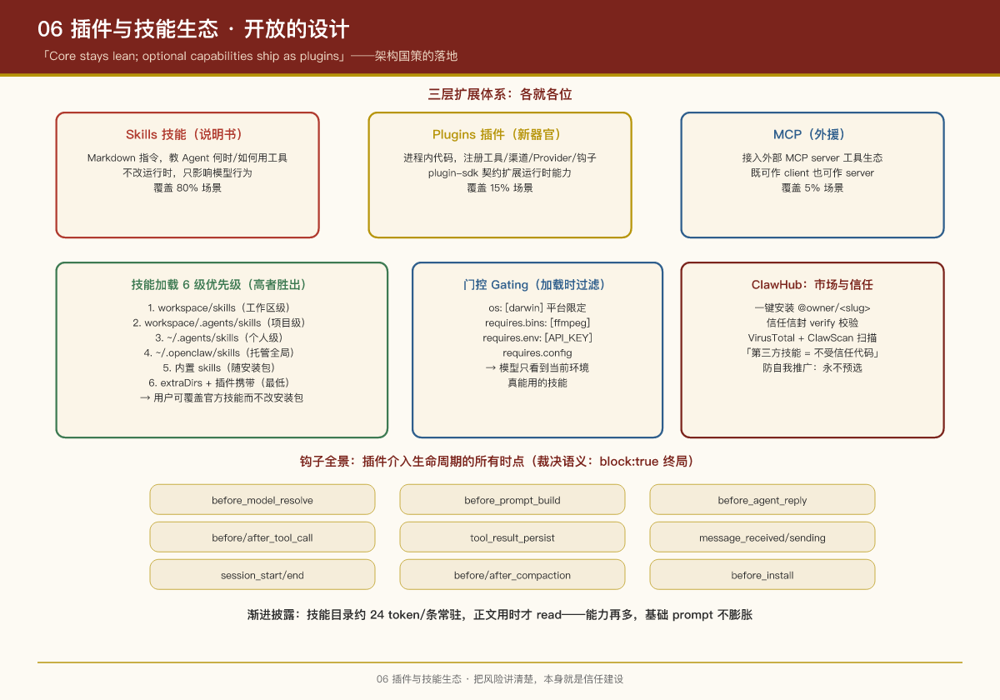

# 第 6 课：插件与技能生态 —— 开放的设计

## 本课问题

1. 核心团队几个人，怎么支撑 152 个官方扩展 + 社区生态？
2. 插件、技能（Skills）、MCP——三种扩展机制各管什么、边界在哪？
3. 开放平台怎么做安全治理（市场、审核、门控）？

VISION.md 里有一条明确的架构国策：

> "Core stays lean; optional capabilities should usually ship as plugins. We are generally slimming down core while expanding what plugins can do."

这一课就是这条国策的落地方式。

---

## 1. 三层扩展体系：各就各位

```
┌────────────────────────────────────────────────────────────┐
│  Skills（技能）                                             │
│  "说明书"——Markdown 指令，教 Agent 何时/如何用工具           │
│  不改运行时，只影响模型行为                                  │
├────────────────────────────────────────────────────────────┤
│  Plugins（插件）                                            │
│  "新器官"——进程内代码，可注册工具/渠道/Provider/钩子          │
│  通过 plugin-sdk 契约扩展运行时能力                          │
├────────────────────────────────────────────────────────────┤
│  MCP（Model Context Protocol）                              │
│  "外援"——接入外部 MCP server 的工具生态                      │
│  OpenClaw 既可作 MCP client 也可作 MCP server                │
└────────────────────────────────────────────────────────────┘
```

选择标准（VISION.md 原文的决策树）：

- 能用 **bundle 插件**（打包 skills、MCP servers、配置等稳定表面）表达的，就不用 code 插件——接口更小更稳、安全边界更清晰
- 需要运行时钩子、provider、渠道、工具等进程内扩展点的，才用 **code 插件**
- 只影响"Agent 怎么用现有工具"的，写 **skill** 就够了

## 2. 插件系统深入

### 插件的两种格式

| 格式 | 说明 |
|-|-|
| **原生插件** | `openclaw.plugin.json` 清单 + 进程内加载的运行时模块 |
| **兼容 Bundle** | 把 Codex / Claude / Cursor 的插件布局映射成 OpenClaw 清单——**直接复用其他 Agent 产品的生态资产** |

兼容 bundle 是个聪明的生态策略：不强迫社区为 OpenClaw 重写，而是"翻译"已有资产。

### 插件能注册什么

通过 `api.on(...)`（类型化钩子，支持优先级/合并/阻断语义）和 `api.registerHook(...)`（粗粒度事件）两套 API：

- **工具**（tool factory 生成，按运行时配置缓存）
- **渠道**（channel ownership，冲突时可用 `preferOver` 声明替换意图）
- **Provider**（模型厂商）
- **钩子**（见下方清单）
- **Gateway RPC 方法**、**服务**、**CLI 命令**

### 钩子全景（插件介入生命周期的所有时点）

| 阶段 | 钩子 |
|-|-|
| 模型解析前 | `before_model_resolve`（可确定性改 provider/model） |
| Prompt 构建前 | `before_prompt_build`（注入 prependContext / 系统上下文） |
| 回复前 | `before_agent_reply`（可"认领"本轮，返回合成回复或静默） |
| 工具调用前后 | `before_tool_call`（`{block:true}` 终局阻断）/ `after_tool_call` |
| 结果落盘前 | `tool_result_persist` |
| 消息进出 | `message_received` / `message_sending`（`{cancel:true}` 终局）/ `message_sent` |
| 会话生命周期 | `session_start` / `session_end` |
| 压缩前后 | `before_compaction` / `after_compaction` |
| 安装拦截 | `before_install`（安全审查插件的挂点） |
| Gateway 生命周期 | `gateway_start` / `gateway_stop` |

**裁决语义**：`block/cancel: true` 是终局（阻止更低优先级处理器）；`false` 是无操作（不会清除已有阻断）。多插件共存时的冲突解决一目了然。

### 加载与安全策略

- 安装来源：ClawHub 市场 / npm / git / 本地路径
- 配置门控：`plugins.allow`（排他白名单）、`plugins.deny`（最高优先）、`plugins.slots.memory`（独占槽位）
- **工作区来源插件默认禁用**（防"项目目录里藏毒"）
- **所有权检查**：插件文件属主与进程用户不一致会被阻止
- 非交互安装任意来源需 `--force`；`security.installPolicy` 可挂自定义审查命令
- 安装/更新插件**必须重启 Gateway**（托管模式下自动重启）

### 独占槽位（slots）设计

某些能力同一时刻只能有一个实现——**记忆（memory）**和**上下文引擎（contextEngine）**就是独占槽位：`plugins.slots.memory: "memory-core"` 选定唯一激活的记忆插件。这避免了"两个记忆系统互相打架"的整类问题。

## 3. 技能系统深入

### Skills 是什么

遵循 [AgentSkills](https://agentskills.io) 开放规范的 **Markdown 指令文件**：

```markdown
---
name: image-lab
description: Generate or edit images via a provider-backed image workflow
---
When the user asks to generate an image, use the `image_generate` tool...
```

最低要求只有 `name` + `description`。**技能不写代码，它是给模型看的"使用说明书"**。

### 加载优先级（6 级，高者胜出）

```
1. <workspace>/skills            （工作区级，最高）
2. <workspace>/.agents/skills    （项目级）
3. ~/.agents/skills              （个人级）
4. ~/.openclaw/skills            （托管/全局）
5. 内置 skills                    （随安装包）
6. skills.load.extraDirs + 插件携带 （最低）
```

同名技能高优先级覆盖低优先级——**用户可以"覆盖"官方技能的行为而不用改安装包**。

### 门控（Gating）：加载时过滤

通过 frontmatter 的 `metadata.openclaw` 声明前置条件：

- `os: [darwin]`——只在 macOS 出现
- `requires.bins: [ffmpeg]`——PATH 里得有这些二进制
- `requires.env: [OPENAI_API_KEY]`——得有这些环境变量
- `requires.config`——配置里某项为真

系统提示词里的技能列表是**过滤后的结果**：模型只看到当前环境真能用的技能。

### Token 经济学

技能以紧凑 XML 块（`<available_skills>`）注入系统提示词，每条**约 24 token** 起步；模型被指示**用时才 `read` 对应的 SKILL.md 全文**。版本标记 `<version>sha256:...</version>` 让模型知道何时该重读。这是"渐进披露（progressive disclosure）"的经典做法：目录常驻、正文按需。

### Skill Workshop：让 Agent 自己沉淀技能

Agent 在工作中发现可复用的模式时，**不直接写 SKILL.md**，而是起草提案进入审批队列，用户审查后 `openclaw skills workshop apply <id>` 才生效。——AI 自创能力 + 人类审批门，这个组合值得记。

## 4. ClawHub：市场与信任

[ClawHub](https://clawhub.ai) 是官方技能/插件注册中心：

- `openclaw skills install @owner/<slug>` 一键安装（默认工作区级，`--global` 全局）
- 信任信封验证：`openclaw skills verify` 基于 `clawhub.skill.verify.v1` 校验
- 市场页展示 VirusTotal、ClawScan、静态分析的扫描状态
- 官方文档明牌警告：**第三方技能应视为不受信任代码**，建议配合沙箱运行
- 防自我推广：第三方技能在 onboarding 推荐中永不预选

## 5. 生态的运营视角：平台不止于"能装"

把视角从"机制"抬到"治理"，ClawHub 其实演示了一套**开放平台的质量飞轮**，这套模型对任何做生态的产品都有参考价值：

**质量分层**（按来源与风险分而治之）：

| 来源 | 审核成本 | 信任等级 | 治理手段 |
|-|-|-|-|
| 内置技能/插件 | 官方维护 | 最高 | 随安装包分发，随版本发布 |
| 官方扩展（extensions/） | 团队 review | 高 | 仓库内合入，CI 边界守卫 |
| ClawHub 第三方 | 扫描 + 社区反馈 | **默认不可信** | VirusTotal/ClawScan/静态分析 + 沙箱运行建议 |
| 本地/工作区 | 用户自己负责 | 用户自担 | 工作区来源默认禁用，属主检查 |

**治理的四个抓手**（对应开发者体验与生态健康度）：

- **发现**：`skills install @owner/<slug>` 的统一寻址让"找得到"有标准格式
- **验证**：`skills verify` 信任信封 + 市场扫描，让"敢不敢用"有客观依据
- **反馈**：Issue/Discord 社区回路，让"质量好不好"有持续校正
- **激励**：开源贡献路径 + 防自我推广的公平规则，让"为什么做"有正向循环

> **PM 视角**：生态产品的护城河不在"功能数量"，而在**质量信号的可信度**——用户敢装第三方技能，是因为市场页明示了扫描状态、官方明说了"不可信"建议。**把风险讲清楚，本身就是一种信任建设。**

## PM Takeaways

1. **扩展体系要分层**：声明式（Skills）覆盖 80% 场景，进程内插件覆盖 15%，协议外援（MCP）覆盖 5%。每层的安全成本和审核成本不同，别用一把尺子。
2. **兼容竞品生态（bundle 映射）比建自家生态更快**：让 Claude/Codex/Cursor 的插件资产可直接复用，冷启动问题瞬间缓解。
3. **钩子设计的关键是"裁决语义"**：多插件对同一事件意见冲突时谁赢？`block:true` 终局 / `false` 无操作，规则简单到不会扯皮。
4. **渐进披露控制 token 成本**：技能目录（24 token/条）常驻 prompt，正文按需读取。能力再多，基础 prompt 不膨胀。
5. **AI 自创能力 + 人类审批门**（Skill Workshop）是"Agent 自我进化"的安全落地姿势。
6. **独占槽位**（memory 只能有一个）是防"能力冲突"的极简方案：有些类别天然不能多实现并存，就在架构上禁止。

## 实证

- SDK 契约：`packages/plugin-sdk/src/`（`plugin-entry.ts`、`plugin-runtime.ts`、`provider-*.ts`）
- 内置插件示例：`extensions/memory-core/`、`extensions/browser/`、`extensions/canvas/`
- 内置技能：`skills/`（47 个，如 `github`、`notion`、`obsidian`、`meme-maker`）
- 边界守卫 lint：`lint:extensions:no-src-outside-plugin-sdk` 等
- 文档：`docs/tools/plugin.md`、`docs/tools/skills`、`docs/plugins/hooks`

---

上一课：第 5 课：LLM 抽象层 ｜ 下一课：第 7 课：记忆与会话


