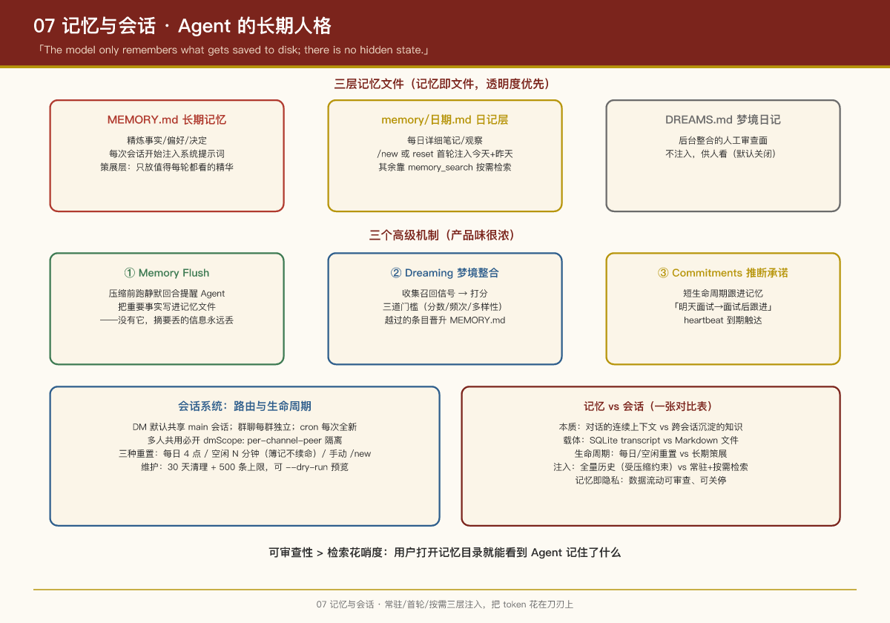

# 第 7 课：记忆与会话 —— Agent 的"长期人格"

## 本课问题

1. Agent 的"记忆"到底存成什么样？（数据库？向量库？文件？）
2. 会话如何标识、隔离、过期、回收？
3. 长对话被压缩时，怎么不丢关键信息？

---

## 1. 记忆系统：朴素外表下的完整设计

OpenClaw 的记忆有一个反直觉的第一原则：

> **"The model only remembers what gets saved to disk; there is no hidden state."**  
> 记忆就是 Agent 工作区里的普通 Markdown 文件，没有隐藏状态。

### 三层记忆文件

| 文件 | 角色 | 注入策略 |
|-|-|-|
| `MEMORY.md` | **长期记忆**：精炼的事实、偏好、决定 | 每次会话开始注入系统提示词 |
| `memory/YYYY-MM-DD.md` | **日记层**：每日详细笔记、观察、原始上下文 | 不逐轮注入；`/new`/`reset` 首轮注入今天+昨天；其余靠 `memory_search` 按需检索 |
| `DREAMS.md`（可选） | 梦境日记：后台整合的人工审查面 | 不注入，供人看 |

**分工逻辑**：`MEMORY.md` 是"策展层"——只放值得每轮都看到的精华；日记层是"工作层"——详尽但按需检索。Agent 会定期把日记里的精华**蒸馏**进 `MEMORY.md` 并清理过期条目（heartbeat 流程自动做，不用人工）。

`MEMORY.md` 超过注入预算时（默认单文件 20K 字符、总计 60K），磁盘文件原样保留，**注入副本被截断**——并提示用户该"减负"了。

### 记忆工具与检索

Agent 有两个工具（由激活的记忆插件提供，默认 `memory-core`）：

- `memory_search`：**混合检索** = 向量相似度（语义）+ 关键词匹配（精确术语、ID、代码符号）
- `memory_get`：按文件/行段精确读取

嵌入模型默认 OpenAI embeddings，可换 Gemini、Voyage、Mistral、Bedrock、本地 GGUF、Ollama 等。

### 记忆后端是可插拔的（独占槽位）

| 后端 | 特点 |
|-|-|
| **Builtin（默认）** | SQLite 实现，关键词+向量+混合检索，零外部依赖 |
| **QMD** | 本地优先 sidecar，带 reranking、查询扩展，可索引工作区外目录 |
| **Honcho** | AI 原生的跨会话记忆，用户建模 |
| **LanceDB** | LanceDB 向量库 + 自动召回/捕获 |

记忆是**独占槽位**（`plugins.slots.memory`），同一时刻只有一个后端生效。

### 三个高级机制（产品味很浓）

**① Memory Flush（压缩前抢救）**  
自动 compaction（上下文压缩）发生前，系统跑一个**静默回合**提醒 Agent："把还没落盘的重要事实写进记忆文件"。默认开启。——没有这一步，压缩摘要丢掉的信息就永远丢了。

**② Dreaming（梦境整合）**  
可选的后台整合流程：收集短期召回信号 → 打分 → 只有越过"分数、召回频次、查询多样性"三道门槛的条目才晋升进 `MEMORY.md`。过程写入 `DREAMS.md` 供人类审查。**默认关闭**（opt-in）。

**③ Commitments（推断承诺）**  
用户说"明天我面试"，有用的记忆不是"永久存储这条"，而是"面试后跟进一下"。Commitments 是**短生命周期**的跟进记忆：后台静默推断、限定在同 agent 同渠道、通过 heartbeat 到期触达。显式提醒则走 cron。

### Action-Sensitive Memory（行动敏感记忆）

文档专门定义了一类记忆写法：当记忆涉及**未来行动边界**时，必须记录"何时可以行动"，而不只是事实本身：

> "API 迁移正在另一个会话中设计。未来回合不要从本线程修改 API 实现，仅把这里的发现作为设计输入，直到迁移方案落地。"

包含要素：什么改变未来行为、何时/何种条件生效、何时过期、应避免什么、信息来源是谁。**记忆可以保留审批上下文，但不执行策略**——硬约束靠审批设置和沙箱。

## 2. 会话系统

### 会话标识与路由

每条入站消息按来源路由到会话：

| 来源 | 会话策略 |
|-|-|
| 私聊 DM | 默认共享 `main` 会话（单人场景保持连续性） |
| 群聊 | 每群独立 |
| 频道/房间 | 每房间独立 |
| Cron 任务 | 每次运行全新会话 |
| Webhook | 每 hook 独立 |

**多人共用一个 Bot 时必须开 DM 隔离**，否则 Alice 的私信上下文 Bob 可见：

```json5
{ session: { dmScope: "per-channel-peer" } }
// 可选: main（默认）/ per-peer / per-channel-peer（推荐）/ per-account-channel-peer
```

同一个人从多个渠道联系，可用 `session.identityLinks` 把多个身份映射到一个 canonical peer，共享会话。

### 会话生命周期

会话复用到过期为止，支持三种重置：

- **每日重置**（默认）：本地时间每天 4 点开新会话（以 `sessionStartedAt` 为准）
- **空闲重置**：N 分钟无真实用户交互后开新会话（heartbeat/cron 等系统事件**不算**交互，不会续命）
- **手动**：`/new`、`/reset`（`/new <model>` 顺带切模型）

可按聊天类型/渠道分别配置（群聊 120 分钟空闲重置、Discord 一周空闲重置……）。

### 存储与维护

- 会话行存于 per-agent SQLite：`~/.openclaw/agents/<agentId>/agent/openclaw-agent.sqlite`
- 三个时间戳各司其职：`sessionStartedAt`（每日重置依据）、`lastInteractionAt`（空闲重置依据）、`updatedAt`（仅列表/清理用）——**簿记写入不会给会话续命**，这是个容易踩坑的细节
- 自动维护：`session.maintenance` 默认 30 天清理、500 条上限，可先 `--dry-run` 预览
- 会话历史跨会话查询走 `sessions_history` 工具：返回**有界、脱敏**的视图（剥离 thinking 签名、工具细节等）

### Compaction（上下文压缩）

长对话逼近模型上下文上限时自动压缩：摘要历史 → 保留近期 → 可触发重试（重试时重置内存缓冲防重复输出）。压缩前后有插件钩子（`before_compaction`/`after_compaction`）。压缩前先跑 memory flush（上文）。

## 3. 记忆 vs 会话：一张对比表

| 维度 | 会话（Session） | 记忆（Memory） |
|-|-|-|
| 本质 | 对话的连续上下文 | 跨会话沉淀的知识 |
| 载体 | SQLite transcript | Markdown 文件 |
| 生命周期 | 每日/空闲重置 | 长期（人工/Agent 策展） |
| 注入方式 | 全量历史（受压缩约束） | MEMORY.md 常驻 + 日记按需检索 |
| 谁负责 | Gateway/Agent 运行时 | 记忆插件（可换后端） |

## 4. 记忆即隐私：个人助理的数据边界

前面说"记忆即文件"是透明度优先，这里把它推到产品层——**记忆系统本质上就是个人助理的隐私系统**。一个记住你全部数字生活的 Agent，它的记忆设计直接定义了产品的数据边界：

| 隐私原则 | OpenClaw 的落地 | 对应机制 |
|-|-|-|
| **数据最小化** | 只沉淀值得长期保留的精华，日记层 30 天清理 | MEMORY.md 策展 + 会话维护清理 |
| **用户控制** | 记忆是明文 Markdown，用户可打开、编辑、删除 | "记忆即文件" |
| **透明度** | 注入策略明确：常驻/首轮/按需三层，无隐藏状态 | 分层注入 + "no hidden state" 第一原则 |
| **可审计性** | 跨会话查询脱敏、审计账本只记元数据 | `sessions_history` 脱敏视图 + 审计投影 |
| **数据主权** | 记忆存本地工作区，不默认上云；记忆后端可插拔 | `plugins.slots.memory` 独占槽位 |

**一个容易忽略的点**：个人 AI 助手的隐私难点不在"存储加密"（本地文件天然可控），而在**"Agent 主动回忆"的边界**——它会主动把日记蒸馏进 MEMORY.md（heartbeat 流程）、会跨会话查询历史（sessions_history）、会在压缩前 flush 关键事实。所以隐私设计的关键不是"锁死数据"，而是**让每一次"数据流动"都可审查、可关停**（比如关闭 dreaming、调整记忆检索路径）。

> **PM 视角**：做个人助理类产品，"隐私"不是一个安全模块，而是**贯穿记忆、会话、审计、插件四个子系统的设计原则**。OpenClaw 的可取之处是把它做成了"默认透明"——用户打开记忆目录就能看到 Agent 记住了什么，比任何隐私政策都可信。

## PM Takeaways

1. **"记忆即文件"是透明度优先的产品选择**：用户能直接打开、编辑、备份自己的记忆，没有黑盒。对"个人助理"品类，可审查性 > 检索花哨度。
2. **分层注入控制成本**：常驻（MEMORY.md）/ 首轮（今日日记）/ 按需（memory_search）三层，把 token 花在刀刃上。
3. **压缩前先 flush** 是个低成本高价值的设计：几乎所有做长上下文压缩的产品都面临"摘要丢信息"，一个静默提醒回合就大幅缓解。
4. **会话隔离默认值要按使用场景定**：单人助理默认共享 DM 会话（连续性优先）是对的，但必须给多人场景留一行配置的出路——而且要写大字警告。
5. **簿记事件不给会话续命**：heartbeat/cron 不算"用户活跃"，否则空闲重置永远触发不了。定义"活跃"时想清楚谁的行为算数。
6. **Dreaming/Commitments 展示了"主动式 Agent"的渐进路径**：从被动记忆 → 后台整合 → 主动跟进，每一步都有人工审查面和 opt-in 开关。

## 实证

- 会话管理：`src/agents/sessions/session-manager.ts`
- 记忆插件：`extensions/memory-core/`、`extensions/memory-lancedb/`、`extensions/memory-wiki/`
- 文档：`docs/concepts/memory.md`、`docs/concepts/session.md`、`docs/concepts/compaction.md`、`docs/concepts/dreaming.md`

---

上一课：第 6 课：插件与技能生态 ｜ 下一课：第 8 课：安全模型


