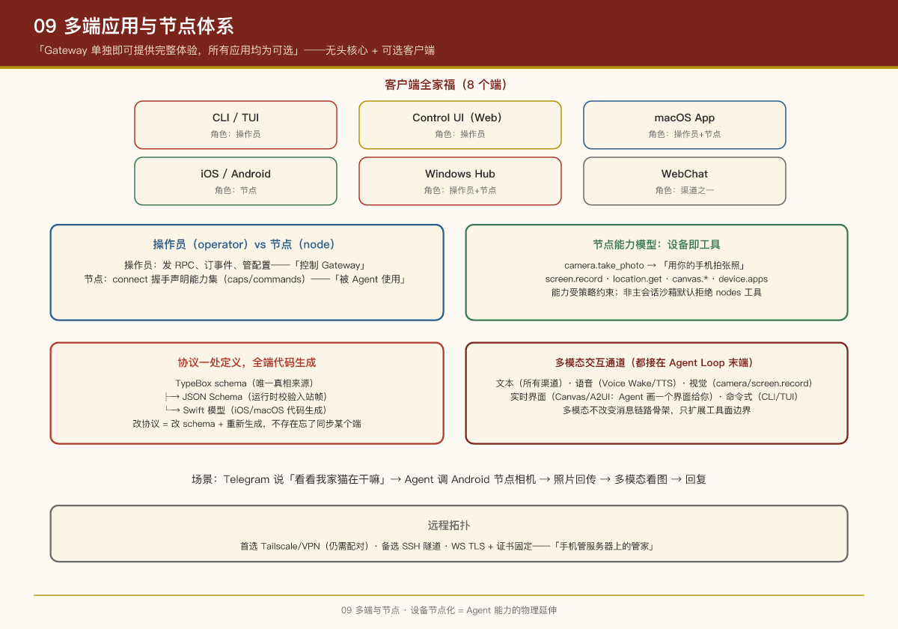

# 第 9 课：多端应用与节点体系

## 本课问题

OpenClaw 的"本体"是无头的 Gateway 守护进程。但用户活在 GUI 世界：Mac 菜单栏、iPhone、Android、Web。这些端怎么长在一个大脑上？

官方立场（README）：

> "Gateway 单独即可提供完整体验，所有应用均为可选。"

---

## 1. 客户端全家福

| 端 | 形态 | 角色 | 源码 |
|-|-|-|-|
| **CLI** | `openclaw` 命令 | 操作员 | `src/cli/` |
| **TUI** | 终端 UI | 操作员 | `src/tui/`（基于 `@earendil-works/pi-tui`） |
| **Control UI** | Web 管理台 | 操作员 | `ui/`（Lit + Vite） |
| **macOS App** | 菜单栏应用 | 操作员 + 节点 | `apps/macos/` |
| **iOS** | 移动 App | 节点 | `apps/ios/` |
| **Android** | 移动 App | 节点 | `apps/android/` |
| **Windows Hub** | 原生伴侣应用 | 操作员 + 节点 | （独立仓库） |
| **WebChat** | Gateway 内置聊天页 | 渠道之一 | Gateway HTTP 服务 |

**两类角色**（第 3 课提过，这里展开）：

- **操作员（operator）**：发 RPC、订事件、管配置——"控制 Gateway"
- **节点（node）**：声明设备能力，等 Agent 调用——"被 Agent 使用"

## 2. 各端的产品职责

### Control UI（Web 管理台）

- 技术栈：**Lit（Web Components）+ Vite**，无重型框架——与项目"可 hack"哲学一致
- 由 Gateway 同端口托管（`/…18789`），也可独立 `pnpm ui:dev` 开发
- 功能：聊天、会话管理、配置编辑、**记忆导入**（从 Codex/Claude Code 导入已有记忆）、技能管理、调试工具
- i18n 有完整的同步/校验工具链（`ui:i18n:*` 脚本）
- 构建产物被 Gateway 直接伺服（`dist/control-ui`，带预压缩资产检查）

### macOS App（OpenClaw.app）

- 菜单栏常驻：显示 Gateway 健康状态、控制启停
- **Voice Wake + push-to-talk**：唤醒词与按键说话的悬浮层
- WebChat + 调试工具内嵌
- 可经 SSH 控制**远程** Gateway
- 细节：macOS 权限（TCC）需要签名构建才能在重新构建后保留——真实桌面开发之痛

### iOS / Android 节点

- 通过 **设备配对**连上 Gateway WebSocket（`role: "node"`）
- iOS：语音触发转发 + Canvas 界面
- Android：Connect/Chat/Voice 三标签页 + **Camera、Screen capture、设备命令族** + 持续语音（ElevenLabs + 系统 TTS 兜底）
- 被控制面：`openclaw nodes …`、`openclaw devices …` 命令管理

### Windows Hub

原生伴侣应用：设置向导、托盘状态、聊天、节点模式、本地 MCP 模式。

## 3. 节点能力模型：设备即工具

节点在 `connect` 握手中声明自己的能力集（caps/commands），例如：

```
camera.take_photo    → Agent 可以"用你的手机拍张照"
screen.record        → 录屏
location.get         → 你在哪
canvas.*             → 渲染实时工作区
device.apps          → 这台 Mac 装了哪些 App（onboarding 用）
```

Agent 侧对应的是一等公民工具（`nodes` 工具族）。于是一个场景成立：

> 你在 Telegram 里说"看看我家猫在干嘛"→ Agent 调用配对 Android 节点的 `camera.take_photo` → 照片回传 → 多模态模型看图 → 回复你。

**能力治理**：节点能力受策略约束（`android-node.capabilities.policy-*` 测试文件可见策略可配置），且非主会话沙箱默认**拒绝**`nodes` 工具——群聊里的 Agent 不能随便调用你的手机。

## 4. Live Canvas 与 A2UI

**Canvas** 是 Agent 驱动的实时可视化工作区：

- Gateway HTTP 服务托管 `/__openclaw__/canvas/`（Agent 可编辑的 HTML/CSS/JS）和 `/__openclaw__/a2ui/`（A2UI 协议宿主）
- 与 Gateway 同端口，各端（macOS 悬浮层、iOS/Android、WebChat）都能渲染
- 有原生同步机制（`canvas:a2ui:native:sync`）保持 Web 与原生实现一致

产品含义：Agent 的输出不局限于"文本消息"——它可以**实时画一个界面给你**（进度仪表盘、对比表格、交互控件），这是"聊天框之外"的交互层。

## 5. 协议一处定义，全端代码生成

多端最大的工程风险是协议漂移。OpenClaw 的解法：

```
TypeBox schema（TS，唯一的真相来源）
     ├─> JSON Schema（运行时校验入站帧）
     └─> Swift 模型（iOS/macOS 代码生成）
```

`packages/gateway-protocol` 是契约包；入站帧一律 JSON Schema 校验；Swift 端模型生成而非手写。**改协议 = 改 schema + 重新生成**，不存在"忘了同步某个端"。

## 6. 远程拓扑

- 首选 **Tailscale/VPN**：Gateway 绑定 tailnet 接口，各端直连（仍需配对）
- 备选 **SSH 隧道**：`ssh -N -L 18789:127.0.0.1:18789 user@host`，握手与认证不变
- 远程部署可开 WS TLS + 证书固定
- macOS App 支持 SSH 控制远程 Gateway——"手机/电脑管家里服务器上的助理"

## 7. 多端的产品交互形态：从"发消息"到"多模态"

第 3 课说"设备即能力"，这里把交互形态再展开一层——**端越多样，交互通道越丰富**：

| 交互通道 | 载体 | 对应的端能力 |
|-|-|-|
| 文本 | 所有渠道 | 聊天消息（最普适） |
| 语音 | macOS Voice Wake / iOS / Android | 语音触发转发、push-to-talk、TTS 回读 |
| 视觉 | Android 节点 | `camera.take_photo`、`screen.record`——Agent 可以"看"你的环境 |
| 实时界面 | Canvas / A2UI | Agent 驱动的可交互 HTML 工作区（各端同端口渲染） |
| 命令式 | CLI / TUI / WebChat | 直接发 RPC 的"控制面"入口 |

设计上的关键点：**多模态不是把每种输入都做成"一等公民"，而是让 Agent 的"眼睛、耳朵、手"都能接到同一条消息管道上**。用户在 Telegram 说"看看我家猫在干嘛"，走的还是普通文本消息 → Agent Loop → 工具调用链，只是链的末端变成了"调用 Android 节点的相机"。交互形态的丰富，不改变消息生命周期的骨架（第 2 课），只扩展工具面的边界。

> **PM 视角**：多模态的产品价值不在"炫"，而在**降低使用门槛**——语音适合手忙脚乱时、视觉适合描述不清时、实时界面适合过程可视化时。判断该不该加一种模态，看它是否覆盖了一个"文本说不清楚"的真实场景，而不是看技术能不能做。

## PM Takeaways

1. **"无头核心 + 可选客户端"让产品边界清晰**：Gateway 是产品本体，App 是锦上添花。核心不依赖任何一端，任何一端坏了不伤核心。
2. **设备节点化 = Agent 能力的物理延伸**：把"手机"建模为声明能力的节点而非特殊客户端，Agent 的工具箱就从软件扩展到物理世界（相机、位置、屏幕）。
3. **协议代码生成是多端团队的刚需**：手写多端协议同步注定漂移，schema-first + codegen 是唯一可持续方案。
4. **同端口托管管理台**（Control UI 挂在 Gateway 上）降低部署心智：用户不需要再起一个 Web 服务。
5. **Canvas/A2UI 代表了 Agent 输出的下一个形态**：从"发消息"到"操作一个共享的实时界面"，值得关注。

## 实证

- Control UI：`ui/`（`package.json` 里依赖只有 lit、vite 等少量包）
- macOS：`apps/macos/`、iOS：`apps/ios/`、Android：`apps/android/`
- 节点命令：`openclaw nodes`（`src/commands/` 下相关命令）
- 协议包：`packages/gateway-protocol`
- 文档：`docs/concepts/architecture.md`、`docs/platforms/`

---

上一课：第 8 课：安全模型 ｜ 下一课：第 10 课：工程素养


