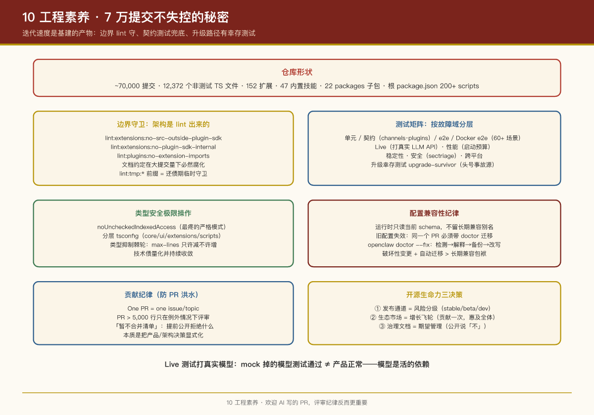

# 第 10 课：工程素养 —— 7 万提交不失控的秘密

## 本课问题

OpenClaw 有 \~70,000 次提交、12,000+ 个 TS 文件、152 个扩展、日均数十个提交，还公开欢迎 "AI/vibe-coded PR"。这种速度下代码为什么不烂？——这一课不看产品，看**工程系统**，对 PM 理解"什么样的团队基建能支撑什么样的迭代速度"很有帮助。

---

## 1. 边界守卫：架构是 lint 出来的

前面各课反复出现的"核心/扩展边界"，不是写在文档里靠自觉，而是**一批专门的 lint 脚本在 CI 里强制执行**（根 `package.json`）：

```
lint:extensions:no-src-outside-plugin-sdk   # 扩展不得 import 核心内部
lint:extensions:no-plugin-sdk-internal      # 不得用 SDK 的非公开入口
lint:plugins:no-extension-imports           # 插件之间不得互相 import
lint:tmp:sqlite-transaction-boundary        # SQLite 事务边界
lint:tmp:session-accessor-boundary          # 会话访问边界
lint:kysely                                 # ORM 使用规范
```

**启示**：架构边界 = 代码规则 + CI 强制。"文档约定"在大提交量下必然腐化。

`lint:tmp:*` 前缀还透露了一个实践：**临时性守卫也可以先上线**，命名成 tmp 表示"这是还债期的特殊守卫，还完就撤"——治理技术债的过渡期管理。

## 2. 类型安全的极限操作

- 基座 tsconfig 强制 `noUncheckedIndexedAccess`——索引访问必须处理 undefined，TS 里最疼的严格模式之一
- Node 侧类型检查剥离 DOM 全局（防 Node 代码误用浏览器 API）
- 分层 tsconfig：`tsconfig.core.json` / `tsconfig.ui.json` / `tsconfig.extensions.json` / `tsconfig.scripts.json`……每层的编译边界与依赖范围独立
- 用原生 TS 编译器 tsgo（Go 版）做类型检查提速
- **类型抑制棘轮（ratchet）**：max-lines 抑制数量只许减不许增——技术债量化并持续收敛

## 3. 测试矩阵：按故障域分层

从 `package.json` 的 scripts 能看到一套惊人的测试分层：

| 层 | 例子 | 目的 |
|-|-|-|
| 单元 | `test:unit`、`test:unit:fast` | 快速反馈 |
| 契约 | `test:contracts:channels`、`test:contracts:plugins` | 渠道/插件与核心的契约不被破坏 |
| e2e | `test:e2e:gateway` | 进程内端到端 |
| Docker e2e | `test:docker:*`（60+ 个场景） | 真实环境下的安装/升级/渠道/插件生命周期 |
| Live | `test:live:*` | 打真实 LLM API（真实模型的行为回归） |
| 性能 | `test:perf:*`、`test:startup:bench*` | 启动耗时、导入耗时、热点 profiling，带预算检查 |
| 稳定性 | `test:stability:gateway` | 竞态与稳定性 |
| 安全 | `test:sectriage`、`commitments-safety` | 安全回归 |
| 平台 | `test:windows:ci`、`test:parallels:*`、`test:macos:ci` | 跨平台 |

两个对 AI 产品特别有价值的点：

1. **Live 测试打真实模型**：模型行为会变（供应商偷偷更新），不打真 API 的测试覆盖不了"模型变了导致 prompt 失效"这类故障。
2. **升级幸存测试**（`upgrade-survivor`）：模拟老版本升级到新版本后配置/数据/会话能否幸存——**有持久状态的产品的头号事故源就是升级**。

## 4. 配置兼容性纪律

VISION.md 里的硬规则：

- 运行时**只读当前 schema**，不留长期兼容别名
- 配置变更导致旧配置失效时，**同一个 PR 必须带 doctor 迁移**：`openclaw doctor --fix` 检测旧形态 → 解释 → 备份 → 改写为新格式
- 核心配置由核心 doctor 修，插件配置由插件自己的 doctor 契约修

这是"破坏性变更"的正确姿势：不留双写/别名这种烂债，但给用户自动迁移的出路。

## 5. 贡献纪律（防 PR 洪水）

- **One PR = one issue/topic**——禁止捆绑多个不相关修改
- **PR > 5,000 行只在例外情况下评审**——大 PR 的评审成本是真实的
- 不要一次开一大批小 PR——每个 PR 都有评审成本
- 明确列出"**暂不合并清单**"（What We Will Not Merge）：可上 ClawHub 的核心技能、全量文档翻译、重复现有路径的 MCP 工作、manager-of-managers 式的 agent 层级框架……

> "暂不合并清单"是开源治理的高级操作：**提前公开拒绝什么**，比逐个 PR 争论省无数心力。它本质上是把产品/架构决策显式化。

## 6. 基础设施速览

- **构建**：tsdown；`pnpm build` 产 `dist/`；`pnpm openclaw ...` 经 tsx 直接跑 TS（开发免构建）
- **CI**：GitHub Actions + Blacksmith；**Crabbox**（远程验证基础设施，可选 AWS/Azure VM）为 PR 提供"远程证明"
- **发布**：npm dist-tag 三通道 stable/beta/dev；macOS App 用 Sparkle 风格 appcast 自动更新
- **部署参考**：Docker / docker-compose / Fly.io / Render 配置在仓库里
- **代码扫描**：Semgrep/opengrep
- **依赖补丁**：pnpm patches 管理第三方包的本地修复

## 7. 数据说话：这个仓库的"形状"

- \~70,000 次提交（2026-07 快照）
- 12,372 个非测试 TS 文件（src + packages + extensions + ui）
- 152 个扩展、47 个内置技能、22 个 packages 子包
- 根 package.json 里 200+ 个 npm scripts——工程流程全部脚本化

## 8. 从工程到产品：开源项目的生命力

这一课讲的是"怎么把代码管好"，但一个开源项目能持续运转，还依赖**工程系统之外的三个产品层决策**——它们共同决定项目的生命力：

**① 发布通道 = 风险分级**：stable / beta / dev 三通道（第 1 课提过）是"用户与风险之间的缓冲"。想稳定的人锁 stable，想尝鲜的人追 dev，项目敢高频发版是因为用户能选自己的风险水位——**工程上的发布纪律，产品上的选择权**。

**② 生态市场 = 增长飞轮**：ClawHub（第 6 课）让第三方技能可分发、可扫描、可验证，社区贡献的每一份能力都变成所有用户可用的资产。开源项目的网络效应不靠广告，靠**"贡献一次，惠及全体"的正和结构**——这也是为什么 VISION.md 要维护"暂不合并清单"：守住核心边界，生态才不会长歪。

**③ 治理文档 = 期望管理**：CONTRIBUTING.md、VISION.md 里的"不做什么"清单，本质是把产品决策显式化。对社区它是效率工具（省去无数 PR 争论），对团队它是护城河（方向不漂移），对商业伙伴它是契约（知道什么能合作）。

> **PM 视角**：开源项目的"商业化"不是工程课的盲区，而是工程系统的延伸——**信任（测试/扫描/验证）、节奏（发布通道）、边界（不做什么）三者齐备，社区和商业才能同时运转**。评估一个开源项目是否健康，除了看 star 数，更值得看：发布通道是否分级？第三方生态是否有质量信号？治理文档是否公开说"不"？

## PM Takeaways

1. **迭代速度是基建的产物**：能日均几十提交还不乱，是因为边界有 lint 守、契约测试兜底、升级路径有幸存测试。团队速度的上限由工程系统决定，不由加班决定。
2. **AI 产品的测试必须包含"打真模型"**：mock 掉的模型测试通过 ≠ 产品正常。模型是活的依赖。
3. **破坏性变更 + 自动迁移（doctor）优于长期兼容包袱**：兼容别名堆几年，代码就没法读了。
4. **公开"不做什么"清单**是最高效的期望管理：对社区、对团队、对客户都适用。
5. **技术债要量化并只减不增（棘轮）**：抑制数、债务基线这些指标进 CI，债才不会悄悄复利。
6. **欢迎 AI 写的 PR 不等于降低门槛**：评审纪律（一 PR 一事、行数上限）反而更重要——生成成本低了，评审就是瓶颈。

## 实证

- 根 `package.json` scripts（本课大部分内容的直接出处）
- `VISION.md`（贡献纪律、配置兼容规则、不合并清单）
- `CONTRIBUTING.md`、`docs/ci.md`
- `test/` 目录与 `scripts/` 目录

---

上一课：第 9 课：多端应用与节点体系 ｜ 返回：课程首页


