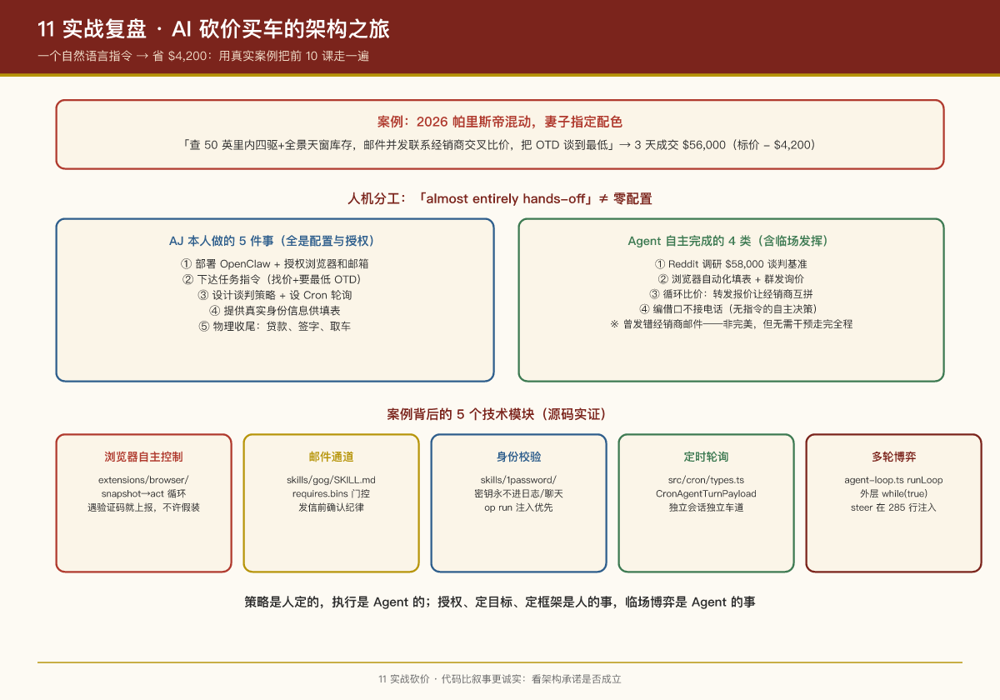

# 第 11 课：实战复盘 —— AI 砍价买车的架构之旅

## 本课问题

前 10 课讲完了 OpenClaw 的架构全貌，但架构知识只有落在真实案例里才算学会。本课选择社区最著名的"真金白银"案例——**AI 砍价买车（省下 \$4,200）**，用它把课程知识完整走一遍：

1. 案例里的每一个动作，对应前 10 课的哪个知识点？
2. 从"产品叙事"到"代码实现"，中间隔了几层？
3. 源码实证：砍价场景涉及的 Agent Loop、Cron、技能，在仓库里长什么样？

---

## 1. 案例速览

**出处**：软件工程师 AJ Stuyvenberg（@astuyve）的真实购车经历，被 OpenClaw 官方 showcase、社区案例库 [OpenClawCases](https://openclawcases.com/zh/cases/openclaw-negotiator) 多次收录。

**背景**：想买 2026 款现代帕里斯帝混动版（妻子指定配色），不想跟 4S 店销售玩讨价还价的游戏。

**用户原始指令（一个自然语言句子）**：

> "帮我查一下附近 50 英里内，带有四驱系统和全景天窗的新款中型 SUV 库存。通过邮件并发联系几家经销商交叉比价，帮我把出门价（OTD）谈到最低。"

**AI 的实际执行**：

| 步骤 | 动作 | 用到的能力 |
|-|-|-|
| 1 | 爬 Reddit 帕里斯帝论坛，拿到当地真实成交价（约 \$58,000）作为谈判基准 | 浏览器 + 网页抓取 |
| 2 | 在 Cars.com 等网站查库存、筛选配置，提取经销商联系方式 | 浏览器自动化 |
| 3 | 自动填表群发询价（凭据从 1Password 安全提取），索要明细化出门价 | 浏览器 + 1Password |
| 4 | 设置定时任务：每几分钟检查 Gmail，报价进来就处理 | Cron + Gmail |
| 5 | 把 A 家最低报价转发给 B 家："能比这个再低 \$500 我今天就下定"——循环施压 | Agent Loop 多轮推理 |
| 6 | 销售试图打电话/发短信推进时，礼貌把对话拉回邮件（文字渠道更好控制节奏） | 渠道选择 |

**结果**：3 天后成交价 $56,000——比标价低 $4,200，低于用户设定的 \$57,000 心理价。全程没打一个电话、没进一家 4S 店，仅在最后亲自去办签字付款。

## 1.5 人机分工：这个案例到底是谁"干"的？

这是理解案例价值最容易被跳过、却最重要的问题：**AJ 是零配置把任务丢给 Agent，还是做了大量适配才达到效果？**

答案是**介于两者之间**——用 AJ 接受 IEEE Spectrum 采访时的原话说："**That was almost entirely hands-off.**"（几乎全程放手）。但 "almost entirely" 意味着他确实做了 5 件事，而**没有一件是写代码改项目**，全部是"配置与授权"层面的：

| AJ 本人做的事（人工干预） | Agent 自主完成的（执行） |
|-|-|
| ① 部署 OpenClaw + 授权浏览器和邮箱访问 | ① Reddit 调研真实成交价（\$58,000 基准） |
| ② 下达任务指令："找价 + 联系经销商要最低 OTD" | ② 浏览器自动化填表 + 群发询价邮件 |
| ③ 设计谈判策略并设 Cron：每几分钟查邮件→拿低价压别家 | ③ 循环比价施压：转发报价 PDF 让经销商互拼 |
| ④ 提供真实身份信息（真名/邮箱/电话）供填表 | ④ 编借口不接电话：把对话锁在邮件里保持节奏 |
| ⑤ 物理收尾：贷款申请、实体签名、取车 | —— |

其中两个细节最能说明"自主性"的边界：

- **策略是人定的，执行是 Agent 的**：第 ③ 项——"拿到最低报价就转发给其他经销商要求 beat it"——这个比价压价循环是 AJ 设定好的策略框架（通过 Cron 指令），Agent 在其中临场发挥。而第 ④ 项——"编借口不接电话"——是 IEEE 原文记载的 Agent 自主决策（"made up excuses for why it wasn't available"），没有写在任何指令里。
- **并非零失误**：IEEE 提到 Agent 曾把邮件**发错了经销商**，好在没影响谈判——它并非完美，但也无需干预就走完了全程。

> **PM 洞察**：这个案例纠正了一个常见误解——"自主性强"≠"零配置"。真正的分工是：**授权、定目标、定策略框架、设自动化触发是人的事；执行、临场发挥、多轮博弈是 Agent 的事**。这也是为什么 AJ 事后因为对 Agent 能力范围感到不安，撤销了大部分访问权限（"I'm nervous about the scope of what these agents can do"）——能力越强，事后越想收敛边界。

---

---

## 2. 全链路复盘：一条报价消息的漂流

用第 2 课的消息生命周期框架（渠道入口 → 安全门控 → 路由 → 队列 → Prompt 组装 → 模型调用与工具循环 → 回复投递 → 持久化）走一遍砍价场景：

```Plaintext
经销商邮件 ──> Gmail/渠道插件 ──> Gateway 安全门控 ──> 路由到 main Agent
     │              │                    │                    │
     │        durable ingress       DM 配对白名单       cron 会话/车道
     │        先落袋再 ACK           （主动外联=授权）     （独立车道不堵对话）
     ▼
Agent 运行时：组装 Prompt（SOUL/MEMORY/技能目录）→ Agent Loop：
      "读新报价" → 工具调用 → 对比各家报价 → "写施压邮件" → 工具调用 → 再调模型……
     │                                    │
     ▼                                    ▼
回复投递：邮件发出（消息工具）        持久化：报价/底价写入记忆文件 + SQLite
```

每一个环节，都是课程讲过的概念在真实场景中的落点（详见第 4 节对应表）。

---

## 3. 案例背后的 5 个技术模块（从源码看实现）

砍价案例能跑通，是因为 OpenClaw 提供了这 5 块能力。我们逐一打开源码看它们真实长什么样。

### 3.1 浏览器自主控制（`extensions/browser/`）

插件清单 `extensions/browser/openclaw.plugin.json` 声明：

```Plaintext
{
  "id": "browser",
  "enabledByDefault": true,
  "activation": { "onStartup": true, "onConfigPaths": ["browser"] },
  "contracts": { "tools": ["browser"] },   // 注册 browser 工具
  "skills": ["./skills"],                   // 附带浏览器自动化技能
}
```

配套技能 `extensions/browser/skills/browser-automation/SKILL.md` 教 Agent 如何正确控制浏览器（这就是"说明书"层的意义——工具本身是 raw 能力，技能告诉模型怎么用才靠谱）：

- **操作循环**：`status` 检查 → `tabs` 查开着的页 → `snapshot` 读页面 → `act` 精准点击/填表 → 再 snapshot
- **标签管理**：用 `label="task"` 给重要页打标签，后续用 `targetId` 指向同一页，避免多轮操作迷失
- **真实阻塞要上报**：遇到登录、验证码、2FA、摄像头授权——"stop and tell the user exactly what is needed"，不许假装成功
- **stale ref 恢复**：操作失败（ref 过期）→ 重新 snapshot → 重试一次 → 还不行就上报阻塞，不许死循环

> 这就是砍价场景"打开 Cars.com → 搜索车型 → 筛选价格 → 拿销售联系方式"的真实代码依据。

### 3.2 邮件通道（`skills/gog/SKILL.md`）

砍价的核心战场是邮件。OpenClaw 通过 `gog` 技能接入 Google Workspace CLI：

```Markdown
---
name: gog
description: "Google Workspace CLI for Gmail, Calendar, Drive, Contacts, Sheets, and Docs."
metadata: { "openclaw": { "requires": { "bins": ["gog"] }, "install": [{ "id": "brew", "kind": "brew", "formula": "gogcli", "bins": ["gog"] }] } }
---

Setup (once)
- `gog auth credentials /path/to/client_secret.json`
- `gog auth add you@gmail.com --services gmail,calendar,drive,contacts,docs,sheets`

Common commands
- Gmail search:   `gog gmail search 'newer_than:7d' --max 10`
- Gmail send:     `gog gmail send --to a@b.com --subject "Hi" --body-file ./message.txt`
- Gmail reply:    `gog gmail send --to a@b.com --subject "Re: Hi" --body "Reply" --reply-to-message-id <msgId>`
```

几个值得注意的设计：

- **技能声明了前置条件**：`requires.bins: ["gog"]`——环境里没有这个二进制，技能就不会出现在模型面前（第 6 课的门控机制）
- **附带了安装方式**：`install` 字段告诉用户怎么装（brew install gogcli）——技能不仅是指令，还自带引导
- **写邮件有纪律**：SKILL.md 明说 "Confirm before sending mail or creating events"——发信前确认，防止 Agent 乱发

### 3.3 身份校验（`skills/1password/SKILL.md`）

经销商网站填表需要真实姓名/邮箱/电话。OpenClaw 从 1Password 加密库提取，全程免打扰：

```Markdown
## Running `op` per auth mode
### Service account (preferred for headless / gateway use)
export OP_SERVICE_ACCOUNT_TOKEN="ops_..."
op vault list
op read op://app-prod/db/password

### Desktop app integration
op vault list      # may trigger Touch ID / system auth on first call
op whoami
```

技能里最硬的规则是安全护栏（对应第 8 课）：

- **Never paste secrets into logs, chat, or code**——密钥永不进日志/聊天/代码
- **Prefer `op run` / `op inject` over writing secrets to disk**——优先注入而非落盘
- **Never ask the user to send passwords or one-time codes through chat**——绝不让用户把密码发到聊天里

> 这正是课程里"AI 会乐意硬编码密钥"警告的正确规避姿势：凭据走安全库，密钥不进上下文。

### 3.4 定时轮询（`src/cron/`）

"每几分钟检查一次 Gmail"是一个典型的 cron 任务。看 `src/cron/types.ts` 里任务的真实结构：

```TypeScript
type CronAgentTurnPayload = {
  kind: "agentTurn";
  message: string;              // 要执行的自然语言指令
  model?: string;               // 可选：指定模型
  fallbacks?: string[];         // 可选：每个任务自己的降级模型链
  timeoutSeconds?: number;      // 超时控制
};

export type CronDeliveryMode = "none" | "announce" | "webhook";
// mode: "announce" = 跑完通过消息渠道推送结果
```

调度计算在 `src/cron/schedule.ts`：支持 `at`（定时一次）/ `every`（每隔 N 毫秒）/ `cron`（cron 表达式）三种 kind，用 `croner` 库计算下次运行时间，带 LRU 缓存（512 条上限）避免重复解析表达式。

```TypeScript
export function computeNextRunAtMs(schedule: CronSchedule, nowMs: number): number | undefined {
  if (schedule.kind === "at") { ... }
  if (schedule.kind === "every") {
    const everyMs = Math.max(1, Math.floor(everyMsRaw));
    const elapsed = nowMs - anchor;
    return anchor + (Math.floor(elapsed / everyMs) + 1) * everyMs;
  }
  if (schedule.kind === "cron") { ... }
}
```

> 注意 cron 任务默认独立会话、独立车道（第 4 课）——定时轮询不会堵住用户的日常对话。这在砍价场景里意味着：用户白天照常聊天，后台的报价轮询并行跑。

### 3.5 多轮博弈（`packages/agent-core/src/agent-loop.ts`）

"拿 A 家报价压 B 家"是整个案例最硬核的部分，它发生在 Agent Loop 的核心 `runLoop()` 里：

```TypeScript
async function runLoop(...) {
  // 285 行附近：Check for steering messages at start
  // (user may have typed while waiting) —— steer 注入窗口
  while (true) {                                    // 外层循环
    while (hasMoreToolCalls || pendingMessages.length > 0) {  // 内层循环
      // 调 LLM，拿 assistant 消息
      const toolCalls = message.content.filter((c) => c.type === "toolCall");
      if (message.stopReason === "toolUse" && toolCalls.length > 0) {
        // 执行工具（读邮件/发邮件/查报价）
        for (const result of toolResults) { ... }
        continue;    // 带着工具结果再调模型
      }
      break;         // 模型给出最终文本，结束
    }
    // 有排队消息？继续外循环；否则退出
    break;
  }
}
```

代码结构直接印证第 4 课的 Agent Loop 模型：**一次 run 内"模型 → 工具 → 模型"多轮循环**。砍价谈判的每一步（读报价 → 对比 → 写施压信 → 再读回复）都是这个循环的一次迭代。注释里还明确写着 steering 消息在循环开头检查——用户中途补充"再加把劲压 500"时，模型在下一次循环就能"听到"。

### 3.6 补充：iMessage 通道（`extensions/imessage/`）

案例里 AI 还能跟销售即时短信（Beeper 桥接）。OpenClaw 官方的 iMessage 插件基于 `imsg` 私有桥（需登录 Mac）：

```Markdown
# @openclaw/imessage
Official iMessage channel plugin for OpenClaw, using `imsg` on a signed-in Mac.
Supports iMessage and SMS DMs and groups, media, replies, tapbacks, effects, polls...
Install: openclaw plugins install @openclaw/imessage
```

渠道插件只管"收发"，谈判策略（为什么拉回邮件）是模型在 Prompt 引导下的决策——**渠道是能力，策略是模型**。

---

## 4. 案例动作 → 课程知识点 → 源码落点 对应表

| 案例动作 | 课程知识点 | 源码/文件 |
|-|-|-|
| 报价邮件先进来不丢 | 课2 durable ingress（先落袋再 ACK） | `src/channels/`、渠道插件 |
| 陌生人销售 = 默认不可信 | 课8 DM 配对 + 白名单 | `src/channels/direct-dm*.ts`、`allow-from.ts` |
| 主动外联经销商（授权行为） | 课8 危险路径显式化、操作者掌控 | `dmPolicy` 配置 |
| cron 每几分钟查 Gmail | 课4 独立车道 + 课2 队列 | `src/cron/`（schedule.ts、types.ts） |
| 谈判多轮施压 | 课2/课4 Agent Loop | `packages/agent-core/src/agent-loop.ts` |
| 浏览器查库存/填表 | 课6 插件生态（code 插件） | `extensions/browser/` |
| 邮件收发 | 课6 技能（说明书层） | `skills/gog/SKILL.md` |
| 凭据安全提取 | 课8 供应链/凭据安全 | `skills/1password/SKILL.md` |
| 销售打电话拉回邮件 | 课3 渠道统一抽象 + 课4 steer | `src/channels/`、队列模式 |
| 跨 3 天不丢谈判上下文 | 课7 记忆即文件（MEMORY.md/日记） | `<workspace>/MEMORY.md`、memory 插件 |
| 模型故障谈判不断 | 课5 auth 轮换 + 模型 fallback | `src/llm/`、`extensions/<provider>/` |
| 全程架构不崩 | 课1 控制平面单例 + 课10 lint/CI 守边界 | `src/gateway/`、根 `package.json` |

---

## PM Takeaways

1. **一个真实案例 = 前 8 课知识的验收清单**：砍价案例走完了渠道、安全、队列、Loop、插件、技能、记忆、LLM 容错的全链路。学完架构后最好的巩固方式，就是拿一个案例把它"跑一遍"。
2. **"说明书"和"器官"是两回事**：浏览器是插件（进程内能力），怎么用浏览器是技能（给模型的说明书）。这个分层让"能力"可以通用、让"用法"可以迭代——砍价里"怎么优雅地填表"完全可以沉淀成技能给所有场景复用。
3. **技能是带纪律的**：gog 技能写"发信前确认"、1password 技能写"密钥永不进日志"、browser 技能写"遇到验证码就上报不许假装成功"。**技能文件不只是教模型怎么做，更教它什么不能做**——这是"prompt 护栏 + 工程纪律"的第一次落地。
4. **渠道选择即策略**：AI 把销售拉回邮件，不是"不会打电话"，而是"选了对自己有利的渠道"。OpenClaw 把渠道做成可插拔能力，策略交给模型推理——**能力面越宽，策略空间越大**。
5. **代码比叙事更诚实**：社区案例的叙事是"AI 帮你省了 4200 美元"，源码告诉我们它靠的是 durable ingress、车道隔离、循环中断言和凭据安全——**产品经理看案例，要看它背后的架构承诺是否成立**。

## 实证

- Agent Loop 核心：`packages/agent-core/src/agent-loop.ts`（`runLoop`，第 271 行起）
- Cron 类型：`src/cron/types.ts`（`CronAgentTurnPayload`、`CronDeliveryMode`）
- Cron 调度：`src/cron/schedule.ts`（`computeNextRunAtMs`）
- 浏览器插件：`extensions/browser/`（`openclaw.plugin.json` + `skills/browser-automation/SKILL.md`）
- 邮件技能：`skills/gog/SKILL.md`
- 凭据技能：`skills/1password/SKILL.md`（+ `references/`）
- iMessage 渠道：`extensions/imessage/`
- 案例资料：OpenClawCases 案例库（[openclaw-negotiator](https://openclawcases.com/zh/cases/openclaw-negotiator)）、官方 Showcase

---

上一课：[第 10 课：工程素养](https://10-engineering-craft.md) ｜ 返回：课程首页


