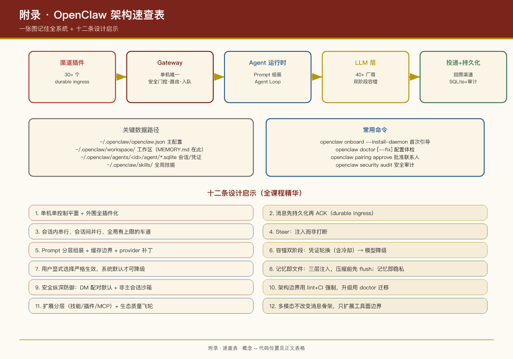

# 附录：OpenClaw 架构速查表

## 一张图记住全系统

```
你在微信/WhatsApp/Telegram 发消息
        │
        ▼
渠道插件（extensions/*，30+ 个）—— durable ingress：先持久化再 ACK
        │
        ▼
Gateway 守护进程（src/gateway/，单机唯一，127.0.0.1:18789）
  ├─ 安全门控：DM 配对 / allowFrom 白名单（默认陌生人不可信）
  ├─ 路由：bindings（渠道/账号/对端 → Agent）→ 会话 key
  └─ 入队：session lane（会话串行）+ global lane（全局并发上限 4）
        │
        ▼
Agent 运行时（packages/agent-core + src/agents/）
  ├─ 组装 Prompt：SOUL/AGENTS/USER/MEMORY.md + 技能目录 + 工具清单（缓存边界分上下）
  ├─ Agent Loop：模型 ⇄ 工具循环（期间 steer 消息可注入）
  ├─ 工具执行：策略 allow/deny + 沙箱（非主会话默认受限）+ 审批
  └─ 回复成型：NO_REPLY 过滤 / 去重 / block streaming 分段输出
        │
        ▼
LLM 层（src/llm + extensions/<provider>，40+ 家厂商）
  └─ 容错：auth profile 轮换（含冷却）→ 模型 fallback 链（turn-local）→ 整链退避重试
        │
        ▼
回复沿原渠道投递 + 会话写入 per-agent SQLite + 审计账本记元数据
```

## 核心概念 ↔ 代码位置

| 概念 | 位置 |
|-|-|
| Agent 循环 | `packages/agent-core/src/agent-loop.ts` |
| 运行编排 | `src/agents/embedded-agent-runner/` |
| 会话管理 | `src/agents/sessions/session-manager.ts` |
| Gateway 服务/RPC | `src/gateway/server/`、`src/gateway/methods/` |
| 渠道通用机制 | `src/channels/` |
| 模型注册/流式 | `src/llm/` |
| 插件契约 | `packages/plugin-sdk/` |
| WS 协议契约 | `packages/gateway-protocol/` |
| 渠道/Provider/记忆插件 | `extensions/`（152 个） |
| 技能 | `skills/`（47 个内置） |
| Web 管理台 | `ui/`（Lit + Vite） |
| 原生应用 | `apps/{macos,ios,android,linux}` |

## 关键配置速查（\~/.openclaw/openclaw.json）

```json5
{
  agent: { model: "<provider>/<model-id>" },
  agents: {
    defaults: {
      workspace: "~/.openclaw/workspace",
      sandbox: { mode: "non-main" },        // 非主会话进沙箱
      maxConcurrent: 4,                      // 全局并发
      model: { primary: "...", fallbacks: [...] },
    },
    list: [{ id: "work", workspace: "...", model: "..." }],
  },
  bindings: [{ agentId: "work", match: { channel: "whatsapp", accountId: "biz" } }],
  session: { dmScope: "per-channel-peer" },  // 多人共用必开
  messages: { queue: { mode: "steer", debounceMs: 500, cap: 20, drop: "summarize" } },
  plugins: { allow: [...], slots: { memory: "memory-core" } },
  channels: { whatsapp: { allowFrom: [...] } },
}
```

## 关键数据路径

| 内容 | 路径 |
|-|-|
| 主配置 | `~/.openclaw/openclaw.json` |
| Agent 工作区 | `~/.openclaw/workspace/` |
| 会话/凭证库 | `~/.openclaw/agents/<agentId>/agent/openclaw-agent.sqlite` |
| 长期记忆 | `<workspace>/MEMORY.md` |
| 日记记忆 | `<workspace>/memory/YYYY-MM-DD.md` |
| 全局技能 | `~/.openclaw/skills/` |

## 常用命令

```bash
openclaw onboard --install-daemon   # 首次引导 + 安装守护进程
openclaw gateway status             # 网关状态
openclaw agent --message "..."      # 直接对话
openclaw doctor [--fix]             # 配置体检/修复
openclaw pairing approve <ch> <code># 批准新联系人
openclaw plugins install @openclaw/<id>  # 装渠道/能力插件
openclaw skills install @owner/<slug>    # 装技能
openclaw security audit             # 安全审计
```

## 十二条设计启示（全课程精华）

1. 单机单控制平面 + 外围全插件化
2. 消息先持久化再 ACK（durable ingress）
3. 会话内串行、会话间并行、全局有上限的车道队列
4. Steer：用户补充消息注入进行中的 run，而非打断
5. Prompt 分层组装 + 缓存边界 + provider 可打补丁
6. 容错双阶段：凭证轮换（含冷却）→ 模型降级（不持久化）
7. 用户显式选择严格生效，系统默认选择才可降级
8. 记忆即 Markdown 文件：常驻/首轮/按需三层注入，压缩前先 flush；记忆即隐私——数据流动可审查、可关停
9. 安全纵深防御：DM 配对默认、非主会话沙箱、prompt 护栏只是建议；三条元原则：纵深防御、最小权限、零信任
10. 架构边界用 lint+CI 强制，升级用 doctor 自动迁移
11. 扩展体系分层（技能/插件/MCP）+ 生态质量飞轮（发现/验证/反馈/激励），把风险讲清楚就是信任建设
12. 多端交互形态的丰富不改变消息链路骨架（第 2 课），只扩展工具面边界——语音/视觉/实时界面都接在 Agent Loop 的末端


