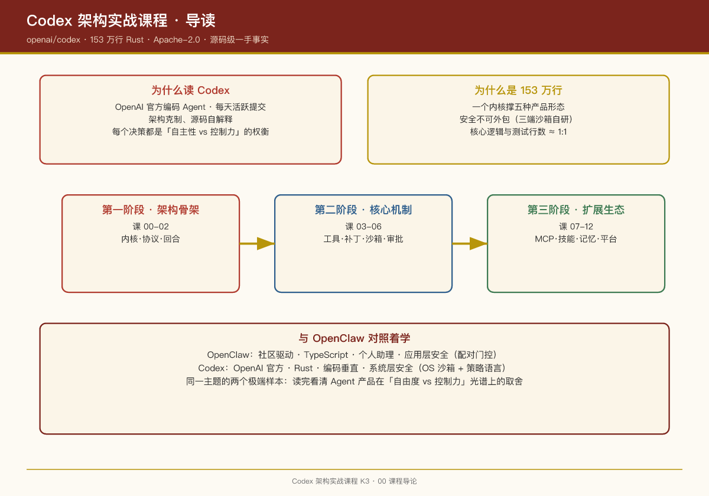

# 第 00 课：课程导论——为什么读 Codex

## 一句话结论

Codex 是目前**最适合 AI 产品经理精读的编码 Agent 开源项目**：它由 OpenAI 官方工程团队维护、每天都在提交、架构文档克制但源码自解释性强，而且它的每一个设计决策背后都是"AI 自主干活"与"人不能失控"这对核心矛盾的权衡——这正是所有 Agent 产品的共同命题。

## 仓库基本面（一手数据）

| 维度 | 事实 |
|-|-|
| Stars | 约 11.9 万（2026-08 快照） |
| 主语言 | Rust（`codex-rs/` 下约 153 万行） |
| 许可证 | Apache-2.0 |
| 构建 | Cargo workspace + Bazel 双构建，Nix flake |
| 发布节奏 | 日均多次提交，GitHub Releases 高频发版 |
| 官方文档 | developers.openai.com/codex（仓库内 `docs/` 刻意保持精简） |

仓库根部的 `AGENTS.md` 本身就是一份绝佳样本：它规定了 crate 命名前缀、clippy 规则、测试风格、禁止事项——**这是写给 Codex 自己看的开发规范**。也就是说，这个仓库同时是"用 Codex 开发 Codex"的实验场。

## 为什么用 Rust？为什么是 153 万行？

很多 PM 看到"153 万行"会以为这是工程膨胀。拆解之后会发现规模来自三个结构性原因：

1. **一个内核支撑五种产品形态**。TUI、exec、IDE 插件、桌面 App、云端任务共用 `codex-core`，协议层（`protocol`、`app-server-protocol`）把界面与内核彻底解耦。界面可以换，内核只有一份。
2. **安全是不可外包的**。三端沙箱（macOS Seatbelt、Linux bubblewrap、Windows 受限令牌）全部自研实现，外加一门 Starlark 语法的命令策略语言 `execpolicy`。这块代码省不掉——Agent 替你跑命令，出一次事故就是品牌事故。
3. **测试密度极高**。`core/src` 下最大的文件几乎全是测试：`config_tests.rs` 12,866 行、`session/tests.rs` 12,325 行、`agent/control_tests.rs` 4,609 行。核心逻辑与测试的行数比接近 1:1。

> **PM 视角**：Rust + 高测试密度 + 双构建系统，传递的信号是"这个产品的失败成本极高"。编码 Agent 删错一个文件、跑错一条命令，用户就流失了。选型即战略。

## 这门课怎么读

每课固定三段式：

1. **结论先行**：这节课的一个核心判断；
2. **源码证据**：给出 crate 名、文件路径、函数名，可复核；
3. **PM Takeaways**：这个设计对你做 Agent 产品意味着什么。

第 12 课会把全部内容收成一张全景图，并和 OpenClaw 课程做一次体系化对照。

## 和 OpenClaw 对照着学

如果你读过本系列的 OpenClaw 课程，可以把两者放在光谱两端：

| 维度 | OpenClaw | Codex |
|-|-|-|
| 出身 | 社区项目 | OpenAI 官方 |
| 语言 | TypeScript | Rust |
| 主场景 | 个人生活助理（多渠道消息） | 编码（终端/IDE/云） |
| 安全模型 | 配对门控、会话车道 | OS 级沙箱 + 命令策略语言 |
| 扩展方式 | ClawHub 技能包 | Skills + MCP + Plugins |

两者共同的底层结构（durable 输入、Agent Loop、工具系统、记忆）将在第 12 课做对照总结。

