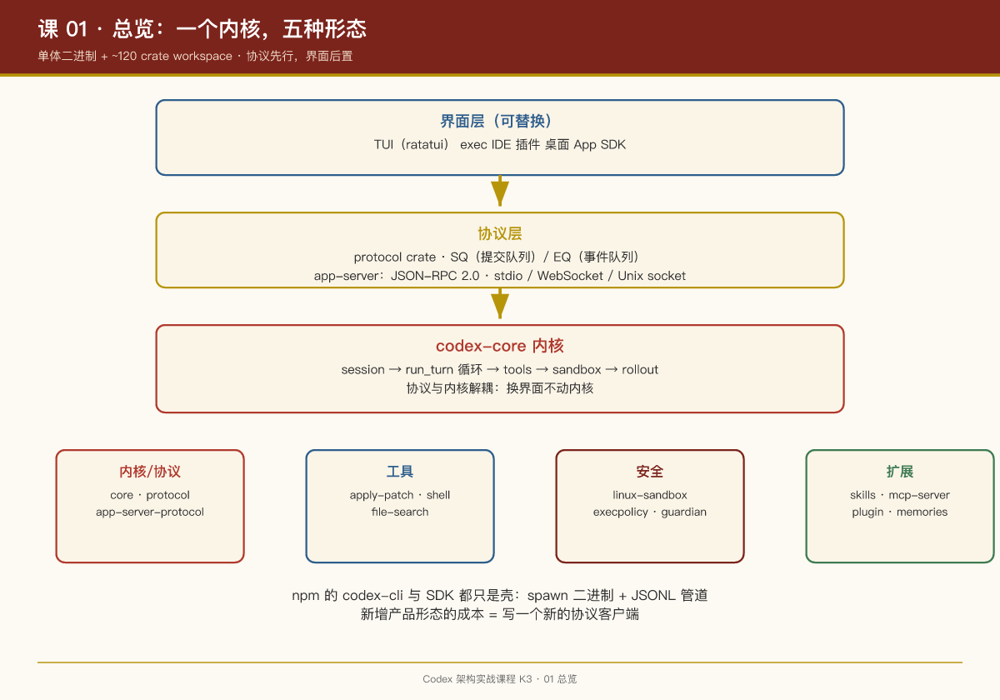

# 第 01 课：总览——一个内核，五种形态

## 一句话结论

Codex 的本质是**一个 Rust 单体二进制 + 一个 \~120 crate 的 workspace**：所有产品形态（TUI、exec、IDE、App、云）都只是 `codex-core` 内核外面不同厚度的"壳"，壳与内核之间用显式协议通信。

## 仓库顶层结构

```
codex/
├── codex-rs/        # Rust 主体：~120 个 crate，全部以 codex- 前缀命名
│   ├── core/        # codex-core：Agent 内核（会话、回合、工具、沙箱编排）
│   ├── protocol/    # codex-protocol：客户端↔Agent 的协议定义
│   ├── tui/         # 终端 UI（ratatui）
│   ├── exec/        # 非交互执行（codex exec）
│   ├── app-server*/ # JSON-RPC 桥（IDE/桌面 App 用）
│   ├── cli/         # multitool 入口二进制
│   ├── mcp-server/  # 把 Codex 暴露为 MCP 服务器
│   ├── linux-sandbox/ windows-sandbox-rs/ bwrap/  # 三端沙箱
│   ├── skills/ memories/ hooks/ plugin/ …         # 能力 crate
│   └── cloud-tasks*/# 云端任务对接
├── codex-cli/       # npm 包装层：bin/codex.js 只是个转发器
├── sdk/             # typescript / python / python-runtime 三个 SDK
└── docs/            # 刻意精简的文档（官方文档在站外）
```

## 分层架构：内核 / 协议 / 界面

```
┌──────────────── 界面层（可替换） ────────────────┐
│  tui        exec      IDE 插件     App      SDK  │
└──────┬────────┬──────────┬──────────┬───────────┘
       │ 进程内  │ 进程内   │ JSON-RPC │ JSON-RPC  │ JSONL/stdio
┌──────▼────────▼──────────▼──────────▼───────────┐
│           协议层 protocol / app-server-protocol  │
│        SQ（Submission Queue）/ EQ（Event Queue） │
├─────────────────────────────────────────────────┤
│                  codex-core 内核                 │
│  session → turn 循环 → tools → sandbox → rollout │
└─────────────────────────────────────────────────┘
```

**协议层的 SQ/EQ 模式**是理解整个系统的钥匙（`protocol/src/protocol.rs` 文件头注释原文）：

> Uses a SQ (Submission Queue) / EQ (Event Queue) pattern to asynchronously communicate between user and agent.

- **Submission（提交）**：客户端→内核的命令（发消息、批准执行、中断回合）；
- **Event（事件）**：内核→客户端的通知（流式输出、工具调用请求、审批请求）。

这是典型的**异步双队列**设计：内核不阻塞等界面，界面不阻塞等内核。用户在模型思考中途插话（steer）、IDE 里点"批准"、TUI 里按 Esc 中断——全是往 SQ 里塞一条 Submission。

## crate 分组地图

\~120 个 crate 可按职责分七组：

| 组 | 代表 crate | 职责 |
|-|-|-|
| 内核 | `core`, `core-api`, `core-plugins` | Agent 循环、会话状态 |
| 协议 | `protocol`, `app-server-protocol`, `exec-server-protocol`, `code-mode-protocol` | 各形态的通信契约 |
| 界面 | `tui`, `exec`, `app-server`, `cli` | 用户触点 |
| 工具 | `apply-patch`, `shell-command`, `file-search`, `web`（在 core 内） | Agent 的"手" |
| 安全 | `linux-sandbox`, `windows-sandbox-rs`, `bwrap`, `execpolicy`, `process-hardening`, `guardian` | 命令拦截与隔离 |
| 模型接入 | `model-provider`, `codex-api`, `responses-api-proxy`, `ollama`, `lmstudio`, `chatgpt` | 多供应商抽象 |
| 扩展生态 | `skills`, `mcp-server`, `rmcp-client`, `plugin`, `hooks`, `connectors`, `memories` | 能力外沿 |

注意模型接入组里出现了 `ollama` 和 `lmstudio`——**Codex 不只支持 OpenAI 模型**，本地模型提供商是一等公民。这对一个官方产品来说是很刻意的开放性设计。

## 前端其实只有"一个半"

- `codex-cli/bin/codex.js`：npm 包入口，内容是按平台定位 Rust 二进制并 spawn——**纯转发器，没有业务逻辑**。
- `sdk/typescript`：README 原文 "It spawns the CLI and exchanges JSONL events over stdin/stdout"——SDK 也是壳。
- Python SDK 同构（另有 `python-runtime` 处理嵌入式解释器）。

所以真正的前端只有 TUI 一个（半个是 exec 的纯输出模式），其余全是协议客户端。**这就是"一个内核五种形态"的工程含义：新增产品形态的成本 = 写一个新的协议客户端。**

## PM Takeaways

1. **协议先行，界面后置**。Codex 把 SQ/EQ 协议定义成独立 crate（`protocol`），IDE 插件、桌面 App、SDK 全部消费同一份协议。做 Agent 产品时，"界面会无限增殖"是确定的——先把内核与界面的契约钉死，比任何界面创新都重要。
2. **单体二进制是分发策略**。npm 包装层 + 平台预编译二进制（`codex-aarch64-apple-darwin` 等），让 `npm i -g @openai/codex` 和 `brew install --cask codex` 都能装到同一个东西。开发者工具的装机门槛直接决定采用率。
3. **多模型提供商是产品开放性的信号**。`ollama`/`lmstudio` crate 的存在说明 OpenAI 刻意不把 Codex 锁死在自家模型上——编码 Agent 竞争的护城河在工作流与安全，不在模型绑定。


