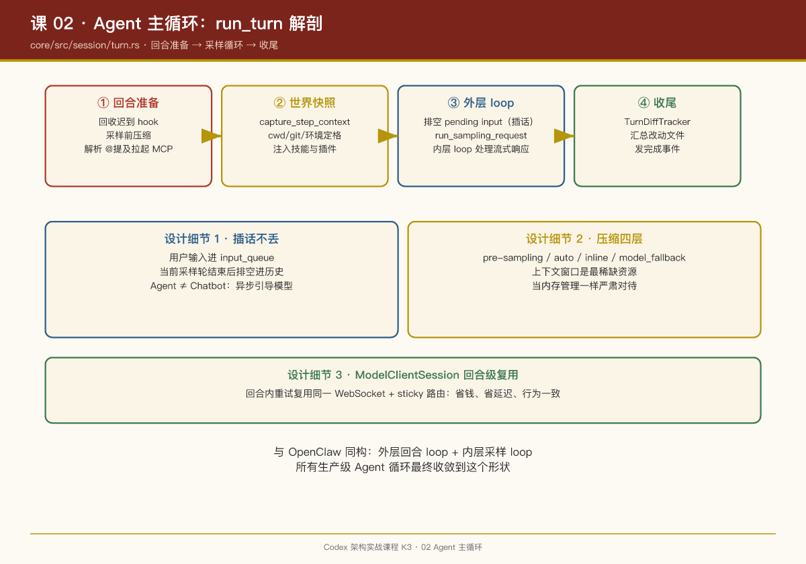

# 第 02 课：Agent 主循环——run_turn 解剖

## 一句话结论

Codex 的 Agent 循环没有魔法：`core/src/session/turn.rs` 里一个 `run_turn()` 函数（约 2,800 行模块），结构是"**回合准备 → 外层 loop { 采样 → 流式解析 → 工具分发 } → 收尾**"，所有复杂性都来自对中断、压缩、并行工具的现实处理。

## 回合的完整生命周期

以源码行号为锚，`run_turn` 做这七件事（行号基于 2026-08 快照，仅供定位）：

1. **回收迟到钩子**（155 行起）：`drain_async_hook_results`——上一回合异步完成的 hook 结果先入账。
2. **采样前压缩**（`run_pre_sampling_compact`，1032 行）：如果历史已逼近上下文上限，先压缩再开工。源码里的 TODO 注释很坦诚：目前还不会预估"新用户输入会不会直接把上下文撑爆"，这是已知改进点。
3. **解析输入依赖**（`required_mcp_servers_for_input`，672 行）：扫描用户消息里的 `@提及`，确定本回合需要拉起哪些 MCP server 和插件。
4. **捕获世界快照**（`capture_step_context_with_required_mcp_servers`）：把 cwd、git 状态、环境信息固化成 `StepContext`——**模型看到的"世界"在这一刻定格**。
5. **注入技能与插件**（`build_skills_and_plugins`，773 行）：技能内容作为 response item 注入会话历史。
6. **外层 loop**（303 行）：

   - 排空 `input_queue` 里的 pending input（用户在模型运行时插的话）；
   - `run_sampling_request`（1361 行）向模型发请求，**内层 loop（1389 行）**处理流式响应与重试；
   - 解析流中的工具调用 → 分发执行 → 结果写回历史 → 下一轮采样；
   - 直到模型不再调用工具，回合结束。
7. **收尾**：`TurnDiffTracker` 汇总本回合改动的文件清单，发完成事件。

## 三个值得 PM 记住的设计细节

### 1. pending input：用户可以随时插话

外层 loop 开头先检查 `sess.input_queue.get_pending_input()`。这意味着**模型在干活时用户输入不会丢，也不会粗暴打断**——而是在当前采样轮结束后被"排空"进历史，作为下一轮采样的上下文。源码注释明说这个设计是为了支持 UI 层的 steer（引导）能力。

这是 Agent 产品与 Chatbot 产品的分水岭：Chatbot 是"一问一答"的同步模型，Agent 是"提交-观察-再引导"的异步模型。

### 2. 压缩（compact）是一等公民

`turn.rs` 里有四个压缩相关函数：`run_pre_sampling_compact`、`run_auto_compact`、`maybe_run_previous_model_inline_compact`、`compact_model_fallback`（独立文件）。压缩策略分了至少三层：回合前预防性压缩、回合中自动压缩、模型切换时的内联压缩。

**上下文窗口是 Agent 最稀缺的资源**，Codex 把它当内存管理一样严肃对待——什么时候 GC、GC 策略如何随模型变化，全是显式逻辑。

### 3. ModelClientSession 是回合级的

源码注释：`ModelClientSession is turn-scoped and caches WebSocket + sticky routing state, so we reuse one instance across retries within this turn`。一个回合内的重试复用同一个 WebSocket 连接和路由状态——省钱、省延迟、避免重试被路由到不同后端导致行为不一致。

## 与 OpenClaw 的 runLoop 对照

OpenClaw 的 `agent-loop.ts` 是"外层 while(true) + 内层 while(hasMoreToolCalls)"的双层循环；Codex 是同构的"外层回合 loop + 内层采样 loop"。**所有生产级 Agent 循环最终都收敛到这个形状**，差异只在周边机制：

| 机制 | OpenClaw | Codex |
|-|-|-|
| 插话 | steer（285 行） | pending input drain（loop 开头） |
| 上下文管理 | 技能注入历史 | 四层压缩策略 |
| 持久化 | 会话车道 | Rollout（见第 09 课） |

## PM Takeaways

1. **"回合"（turn）是 Agent 产品的核心领域对象**。Codex 里 turn 有独立 ID、独立 diff 追踪、独立模型会话、独立压缩边界。你的产品如果还没有显式的 turn 概念，故障排查和计费归因都会很痛苦。
2. **插话能力要从第一天设计进循环**，而不是事后补丁。pending input 队列放在 loop 开头这个位置，决定了"用户引导"和"模型自主"的优雅共存。
3. **上下文压缩策略是产品体验的一部分**。用户感知到的"这个 Agent 记性好不好"，本质是压缩策略调得好不好。把它当成和模型选型同级别的决策。

