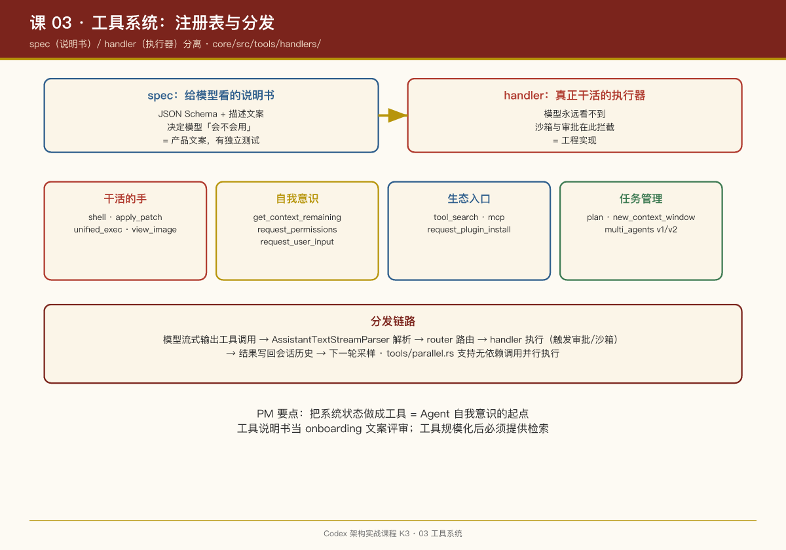

# 第 03 课：工具系统——Agent 的"手"是怎么装配的

## 一句话结论

Codex 的工具系统是一个**显式注册表 + spec/handler 分离**的结构：每个工具由"给模型看的说明书（spec）"和"真正干活的执行器（handler）"两部分组成，回合开始时按配置与特性开关装配，分发时经统一路由。

## 工具清单：模型到底有几只手

`core/src/tools/handlers/` 目录就是完整的工具清单（每个文件一对 spec/handler）：

| 工具 | 文件 | 干什么 |
|-|-|-|
| shell | `shell_spec.rs` / `shell.rs`（经 `shell-command` crate） | 执行 shell 命令（沙箱内） |
| apply_patch | `apply_patch_spec.rs` / `apply_patch.rs` | 用自研补丁语法改文件（第 04 课专讲） |
| plan | `plan_spec.rs` / `plan.rs` | 维护任务计划（让模型"把打算说出来"） |
| unified_exec | `unified_exec/` | 统一执行环境（交互式会话、长进程） |
| request_user_input | `request_user_input_spec.rs` / `.rs` | 模型主动向用户提问 |
| request_permissions | `request_permissions.rs` | 模型主动申请更高权限 |
| multi_agents / multi_agents_v2 | `multi_agents*.rs` | 派生子代理（第 10 课专讲） |
| new_context_window | `new_context_window*.rs` | 模型主动开新上下文窗口 |
| get_context_remaining | `get_context_remaining*.rs` | 模型查询自己还剩多少上下文 |
| view_image | `view_image*.rs` | 看本地图片 |
| tool_search / mcp / mcp_resource | `tool_search*.rs`、`mcp.rs`、`mcp_resource*.rs` | 发现并调用 MCP 工具 |
| sleep / wait_for_environment | `sleep.rs`、`wait_for_environment.rs` | 等待（长任务场景） |
| current_time | `current_time.rs` | 获取当前时间 |

这份清单本身就很有产品意味——**`get_context_remaining` 和 `request_permissions` 这种工具，等于把"系统状态"和"权限协商"也做成了模型可发起的动作**。模型不再只是被动执行者，它可以问"我还能装多少东西""我能不能要更高权限"。

## spec / handler 分离

以 apply_patch 为例：

- `apply_patch_spec.rs`：定义工具的 JSON Schema、描述文案——**这是发给模型的部分**，决定模型"知不知道有这个工具、怎么调"；
- `apply_patch.rs`：真正的执行逻辑——解析补丁、校验路径、落盘——**这部分模型永远看不到**。

分离的价值：

1. **说明书可以独立于实现迭代**。改 prompt 不动代码，改实现不动 prompt；
2. **spec 可以按特性开关动态裁剪**（`built_tools()`，`turn.rs` 1515 行），比如某些模型不给 plan 工具、未启用多智能体时不挂 multi_agents；
3. **handler 可以做模型无感知的安全校验**——模型只管调，沙箱和审批在 handler 层拦截（第 05、06 课）。

## 工具分发的链路

```
模型输出工具调用（流式）
  → turn.rs 解析（AssistantTextStreamParser，1653 行）
  → tools/router.rs 路由到对应 handler
  → handler 执行（可能触发审批 / 沙箱）
  → 结果包装成 response item 写回会话历史
  → 下一轮采样把结果喂给模型
```

`tools/parallel.rs` 支持并行工具调用：模型一轮输出多个工具调用时，可以并发执行再汇总——对"读三个文件"这类无依赖调用，延迟直接砍到 1/N。

## 动态工具与工具搜索

`handlers/dynamic.rs` + `protocol` 里的 `DynamicToolSpec` 支持**运行期注册新工具**；`tool_search` 让模型在大量 MCP 工具里先"搜"再"调"——当挂载的工具总数可能上百时，不能全塞进系统提示，模型需要一个"工具目录检索"能力。这是工具生态规模化后的必然设计。

## PM Takeaways

1. **工具说明书（spec）是产品文案，不是工程细节**。模型用不用、用对用错，一半取决于 spec 写得清不清楚。建议把工具描述当作 onboarding 文案来评审。
2. **把系统能力做成工具，是 Agent "自我意识"的起点**。`get_context_remaining`、`request_permissions`、`request_user_input` 这三个工具的设计思想是：凡是你希望模型"知情并参与"的系统决策，就给它一个工具，而不是在背后替它做掉。
3. **工具并行是免费的速度**。只要工具间无依赖，并行分发对用户是纯粹的体验提升——但要求你的结果汇总逻辑对乱序返回鲁棒。


