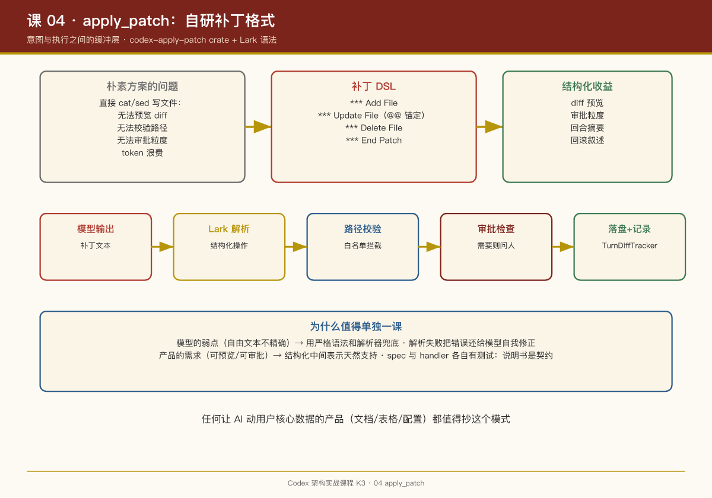

# 第 04 课：apply_patch——为什么发明一种补丁语法

## 一句话结论

Codex 不让模型直接"写文件"，而是定义了一门**自定义补丁格式**（`apply_patch` 工具），配有独立 crate（`codex-apply-patch`）和一份 Lark 语法定义（`handlers/apply_patch.lark`）——因为在"模型改代码"这件事上，**可解析、可校验、可 diff 的中间表示，比自由文本安全得多**。

## 问题：让模型直接写文件有什么不好？

朴素方案是 shell 工具一把梭：模型 `cat > file <<EOF` 或者 `sed -i`。问题是：

1. **无法预览**。用户想知道"AI 到底改了什么"，heredoc 里的全文替换没法直观 diff；
2. **无法校验**。模型把文件写坏了、路径写错了，shell 不会拦你；
3. **无法审批**。审批系统（第 06 课）要回答"这次修改碰了哪些文件"，自由文本命令解析不出来；
4. **token 浪费**。改一行也要输出整个文件。

## 解法：一门最小补丁 DSL

apply_patch 的语法形态（概念示例）：

```
*** Begin Patch
*** Add File: src/new_module.rs
+fn main() {}
*** Update File: src/lib.rs
@@
-old_line
+new_line
*** Delete File: src/obsolete.rs
*** End Patch
```

三类操作语义清晰：**Add / Update / Delete**，Update 内用上下文行锚定位置（`@@` 之后的行用于定位），改动以 +/- 行表达。

语法由 `apply_patch.lark` 严格定义（Lark 是一个解析器生成工具），`codex-apply-patch` crate 负责把补丁文本解析成结构化操作。解析失败 = 明确报错给模型，让它修正后重试——**错误发生在落盘之前**。

## 工程链路

```
模型输出补丁文本
  → apply_patch handler
  → Lark 语法解析（结构化 Add/Update/Delete 操作）
  → 路径校验（是否越出工作区、是否触碰受保护路径）
  → 审批检查（本次改动需不需要用户点头）
  → 落盘 + TurnDiffTracker 记录
  → diff 摘要随回合结束事件推给界面
```

TUI 里用户看到的"本回合修改了 3 个文件 +42 -7"，源头就是 `TurnDiffTracker`（`turn_diff_tracker.rs`）对 apply_patch 结果的聚合。

## 为什么这值得单独一课

apply_patch 是 Codex 里"**为模型能力边界做工程设计**"的最佳样本：

- 模型的弱点（自由文本不精确、容易幻觉路径）→ 用严格语法和解析器兜底；
- 产品的需求（可预览、可审批、可回滚叙述）→ 用结构化中间表示天然支持；
- 安全的要求（路径白名单）→ 在解析层而不是执行层拦截。

一个值得注意的细节：handler 目录里同时存在 `apply_patch_spec_tests.rs` 和 `apply_patch_tests.rs`——**说明书和执行器分别有测试**。spec 测试保证"模型看到的契约"不被意外修改，这印证了第 03 课说的"spec 是产品文案"。

## PM Takeaways

1. **不要让模型直接操作你的核心资产，给它一门 DSL**。文件是用户的核心资产，补丁 DSL 是"意图"与"执行"之间的缓冲层。任何让 AI 动用户数据的产品（改文档、改表格、改配置）都值得抄这个模式。
2. **中间表示 = 产品能力的载体**。有了结构化 patch，diff 预览、审批粒度、回合摘要全是顺手实现。没有它，每个功能都要反向解析自由文本。
3. **解析失败要能把错误还给模型**。严格语法的另一面是模型会写错——把解析错误作为工具结果回传，让模型自我修正，这是 Agent 容错的标准姿势。


