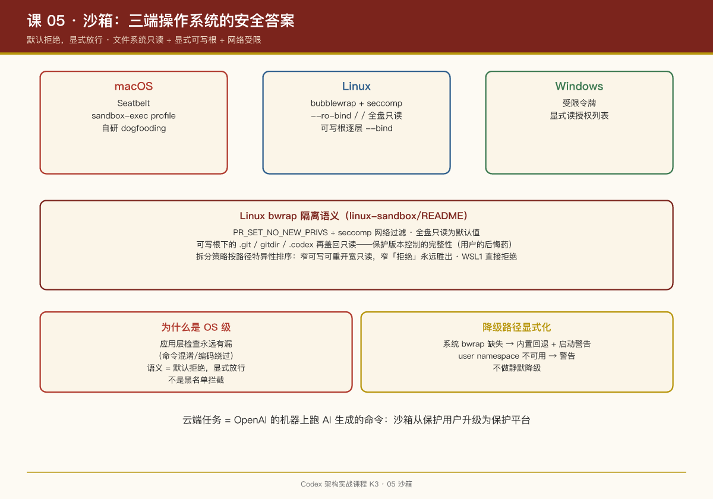

# 第 05 课：沙箱——三端操作系统的安全答案

## 一句话结论

Codex 把"Agent 在用户电脑上跑命令"的风险，用**操作系统级隔离来兜底：macOS 用 Seatbelt（sandbox-exec）、Linux 用 bubblewrap + seccomp、Windows 用受限令牌与读授权——三端各自实现，语义对齐：文件系统默认只读，可写根目录显式声明，网络默认受限**。

## 为什么必须是 OS 级沙箱

在 OpenClaw 课程里我们看到的是"配对门控 + 会话车道"这种**应用层安全——防的是"谁在跟 Agent 说话"。Codex 面对的是更硬的问题：Agent 生成的 shell 命令本身不可信**。应用层检查永远有漏（命令混淆、编码绕过、shell 元字符），所以最后一道防线必须落在内核：

- 模型想 `rm -rf /`？文件系统只读挂载，写到就是 EROFS；
- 模型想 `curl evil.com`？seccomp 网络过滤器直接断网；
- 模型想读 `~/.ssh/id_rsa`？可读路径白名单之外一律拒绝。

**语义是"默认拒绝，显式放行"，而不是"默认放行，黑名单拦截"。**

## Linux：bubblewrap 的细节

`linux-sandbox/README.md` 提供了完整的决策逻辑：

1. **优先用系统 bwrap**（PATH 上、且在 cwd 之外找到的），太老（不支持 `--argv0`）则走兼容路径；
2. **系统没有则用内置 bwrap**（`codex-resources/bwrap` 随二进制分发），并给用户一个启动警告；
3. bwrap 无法创建 user namespace（如某些容器环境）→ 启动警告而不是等运行时炸；
4. WSL2 正常支持；**WSL1 直接拒绝**进入沙箱路径（创建不了 user namespace）。

激活 bwrap 后的隔离语义（README 原文要点）：

- 进程内施加 `PR_SET_NO_NEW_PRIVS` + seccomp 网络过滤；
- `--ro-bind / /`：**全盘只读**是默认值；
- `--bind <root> <root>`：可写根目录逐层叠加（比如项目目录）；
- 可写根下的受保护子路径（`.git`、`gitdir:` 指向的真实 git 目录、`.codex`）再 `--ro-bind` 盖回只读——**防止 Agent 破坏版本控制自身的完整性**；
- 拆分策略（split policy）按路径特异性排序：更窄的可写子路径可以重新打开更宽的只读父路径，但更窄的"拒绝"永远胜出。例：`/repo=write, /repo/a=none, /repo/a/b=write` → repo 可写、a 拒绝、a/b 可写。

另外保留了一条 Landlock 遗留回退路径（`features.use_legacy_landlock`），但仅当拆分策略与旧模型等价时才允许走——新旧语义无损对齐才放行，很克制。

## macOS：Seatbelt

macOS 用系统自带的 `sandbox-exec`（Seatbelt profile）。根目录 `AGENTS.md` 透露了一个有趣的细节：Codex 自己开发 Codex 时，Agent 的 shell 工具就运行在 `CODEX_SANDBOX=seatbelt` 环境下，测试代码会检测这个环境变量来跳过无法在沙箱内跑的集成测试——**狗食（dogfooding）贯彻到了测试基建**。

## Windows：受限令牌

`windows-sandbox-rs` + `core/src/windows_sandbox.rs` + `windows_sandbox_read_grants.rs`：Windows 没有 namespace 机制，方案是受限令牌（restricted token）+ 显式读授权列表。语义同样是默认收紧。

## 沙箱与产品的接口

沙箱策略不是写死的，它从配置流向执行：

```
Config（sandbox_mode / 拆分策略）
  → TurnContext 解析
  → shell handler 执行命令前，把策略翻译成三端各自的沙箱调用
  → 命中限制 → 报错回给模型（或触发审批升级，见第 06 课）
```

`network-proxy` crate 的存在说明网络访问也不是简单的全开/全关——有代理层的细粒度管控。

## PM Takeaways

1. **Agent 安全的终态是"默认拒绝"**。黑名单永远追不上模型的创造力，只有"文件系统只读 + 显式可写根 + 网络受限"这种白名单结构能睡得着觉。
2. **保护 .git 是保护用户的后悔药**。Codex 特意把 `.git` 盖成只读——因为 git 历史是用户在 Agent 搞砸之后最后的回滚手段。做类似产品时想清楚：你的"用户后悔药"是什么？它必须在 Agent 的权限之外。
3. **三端对齐语义、各自实现机制**。不要追求跨平台统一抽象（会变成最低公分母），追求统一的是**策略语义**（默认拒绝、显式放行、特异性排序），实现交给各平台最硬的机制。
4. **降级路径要显式且有警告**。bwrap 缺失 → 内置回退 + 启动警告；WSL1 → 直接拒绝。模糊的静默降级是安全产品的大忌。


