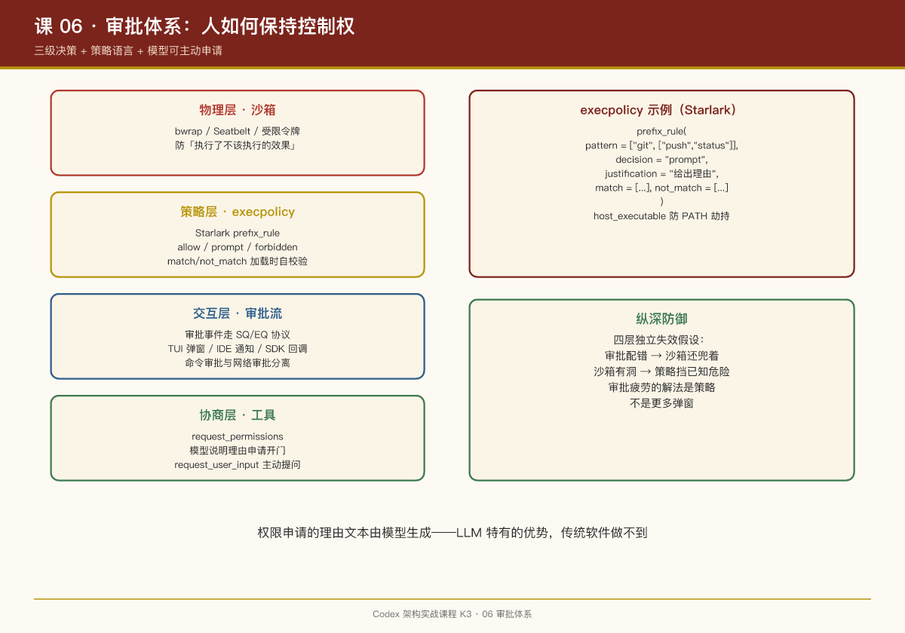

# 第 06 课：审批体系——人如何保持控制权

## 一句话结论

Codex 的审批不是"弹窗确认"这么简单，而是一套**三级决策 + 策略语言 + 模型可主动申请**的完整体系：命令先过 execpolicy（allow / prompt / forbidden），prompt 才升级到人类，模型甚至可以用 `request_permissions` 工具主动谈判权限。

## 第一级：execpolicy——可编程的命令策略

`execpolicy` crate 实现了一门 Starlark 语法的策略语言（README 原文）：

```starlark
prefix_rule(
    pattern = ["cmd", ["alt1", "alt2"]],  # 有序 token；列表项表示"任选其一"
    decision = "prompt",                  # allow | prompt | forbidden，默认 allow
    justification = "为什么有这条规则",
    match = [["cmd", "alt1"]],            # 必须命中的样例（加载时校验，相当于单元测试）
    not_match = [["cmd", "oops"]],        # 必须不命中的样例
)
```

设计要点：

- **前缀匹配**：按命令 token 序列做前缀规则匹配，`git push` 和 `git status` 可以走完全不同的决策；
- **三级决策**：`allow`（静默放行）/ `prompt`（问人）/ `forbidden`（直接拒，README 建议 forbidden 时在 justification 里给出替代方案，比如 "Use `jj` instead of `git`"）；
- **match/not_match 是加载时校验的样例**——策略自带单元测试，写错的规则在加载期就炸，不会带病上线；
- **host_executable 元数据**：可以约束 basename 规则只认特定绝对路径的可执行文件（比如只信 `/usr/bin/git`，不信 cwd 下的同名木马）——防的是 PATH 劫持。

## 第二级：审批流与人机界面

当决策为 `prompt`，请求沿事件链上行：

```
shell handler → 审批请求事件（EQ）
  → 界面层渲染（TUI 弹窗 / IDE 通知 / SDK 回调）
  → 用户决策（SQ 提交回来）
  → handler 继续或终止
```

协议层有专门的 `ElicitationRequestEvent`、`RequestPermissionsEvent`（`protocol/src/protocol.rs` 可见），审批是**协议一等公民**，不是 UI 层的土制弹窗。`tools/approvals.rs` 和 `network_approval.rs` 分别管命令审批与网络审批——网络访问有独立的审批通道。

## 第三级：模型主动谈判权限

这是最有 Agent 味的部分。第 03 课提到的两个工具：

- `request_permissions`：模型判断当前权限不够（比如要写沙箱外的目录、要访问网络），**主动向用户发起权限申请**，说明理由；
- `request_user_input`：模型遇到歧义主动提问。

加上 `permission_preapproval_tests.rs` 可见的预批准机制，整个权限模型是双向的：

```
传统模型：  系统预设权限 → 模型在笼子里干活 → 撞墙就报错
Codex 模型：系统预设权限 → 模型干活 → 撞墙 → 模型说明理由申请开门 → 人决定
```

`core/src/guardian/`（含 3,922 行测试）是另一个守卫层，负责更高阶的安全检查编排。

## 与第 05 课的关系：沙箱是物理层，审批是协议层

| 层 | 机制 | 防什么 |
|-|-|-|
| 物理层（沙箱） | bwrap/Seatbelt/受限令牌 | 防"命令执行了不该执行的效果" |
| 协议层（execpolicy） | 前缀规则三级决策 | 防"命令不该被发起" |
| 交互层（审批流） | SQ/EQ 事件 + 界面确认 | 保留人的最终裁决权 |
| 协商层（工具） | request_permissions | 权限不够时的结构化谈判 |

四层各自独立失效也不会塌：审批配置错了，沙箱还兜着；沙箱有洞，execpolicy 至少挡掉已知危险模式。

## PM Takeaways

1. **审批疲劳是真实的产品问题，解法是策略而不是弹窗**。每次都问 → 用户无脑点同意 → 审批形同虚设。execpolicy 的 allow/prompt/forbidden 三级 + 前缀规则，让"安全的静默、危险的拦截、灰色的问人"成为可配置的工程对象。
2. **让模型参与权限协商，体验远好于冷冰冰的拒绝**。"我需要写 /etc 下的文件，因为要修改系统配置，是否授权？"——用户理解了意图才做得好决策。权限申请的理由文本是模型生成的，这是 LLM 特有的优势，传统软件做不到。
3. **策略即代码，代码即测试**。execpolicy 的 match/not_match 样例在加载时校验——安全策略这种"错了代价极高"的配置，必须自带验证机制。
4. **纵深防御（defense in depth）不是堆料，是独立失效假设**。设计每一层时都问：如果其他三层全失效，这一层还能挡住什么？


