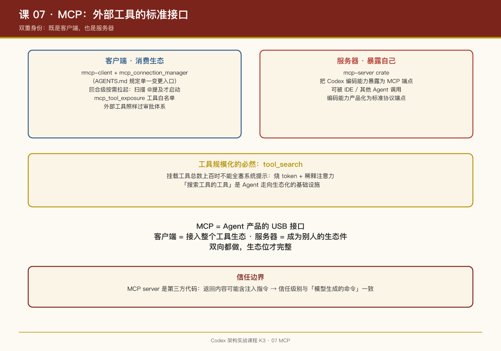

# 第 07 课：MCP——外部工具的标准接口

## 一句话结论

Codex 在 MCP（Model Context Protocol）生态里是**双重身份**：既是客户端（通过 `rmcp-client` 消费外部 MCP server 的工具），也是服务器（通过 `mcp-server` crate 把自己暴露出去）——这让它既能接入工具生态，也能被别的 Agent 系统当工具用。

## 客户端：消费外部工具

`codex-rs` 下与 MCP 客户端相关的 crate 和模块：

- `rmcp-client`：MCP 协议的 Rust 客户端封装；
- `core/src/mcp.rs` + `mcp_connection_manager.rs`：连接管理。仓库根 `AGENTS.md` 有一条专门的贡献规则："When working with MCP tool calls, prefer using `codex-rs/codex-mcp/src/mcp_connection_manager.rs` to handle mutation of tools and tool calls"——连接管理器是所有 MCP 变更的单一入口；
- `mcp_tool_exposure.rs`：控制哪些 MCP 工具暴露给模型（不是连上就给全部）；
- `mcp_tool_approval_templates.rs`：MCP 工具调用的审批模板——**外部工具同样要过审批体系**（第 06 课）；
- `core/src/tools/handlers/mcp.rs`：把 MCP 工具调用桥接进统一工具分发链路；
- `mcp_openai_file.rs`、`mcp_skill_dependencies.rs`：MCP 与文件资源、技能依赖的整合。

### 按需拉起：回合级的 MCP 生命周期

第 02 课讲过 `required_mcp_servers_for_input`（`turn.rs` 672 行）：扫描用户输入中的 `@提及`，**只在需要时启动对应 MCP server**。这是个重要的资源决策——MCP server 是外部进程，常驻一堆既费资源又扩大攻击面。回合级按需拉起 + 回合结束回收，是"用完即走"的节俭模型。

### 工具搜索：规模化后的必然

当挂载的 MCP server 多了，工具总数可能上百。全塞进系统提示既烧 token 又稀释注意力。`tool_search` 工具（第 03 课）让模型先检索工具目录再调用——**工具发现本身被做成了一个工具**。

## 服务器：把 Codex 暴露出去

`mcp-server` crate 让 Codex 自己成为 MCP server：其他支持 MCP 的宿主（IDE、其他 Agent）可以把"Codex 编码能力"当作一个工具调用。

这意味着 Codex 可以嵌套进更大的 Agent 系统：你的编排层 Agent 遇到编码子任务时，不必自己实现，调 Codex 即可。**编码能力被产品化成一个标准协议端点。**

## 工具资源：MCP Resource

`handlers/mcp_resource*.rs` 处理 MCP 的资源（resource）原语——不只是函数调用，还有"读取某份文档/数据"的语义。模型可以把 MCP 资源读进上下文，配合 `mcp_search` 使用。

## 接入审批与安全

外部工具是信任边界：MCP server 返回的内容可能包含注入指令。Codex 的处理：

1. `mcp_tool_exposure` 做工具级白名单；
2. 调用走统一审批（`mcp_tool_approval_templates`）；
3. 连接变更收敛在 connection manager，避免散点修改导致的状态不一致。

## PM Takeaways

1. **MCP 是 Agent 产品的"USB 接口"**。支持 MCP 客户端 = 瞬间接入整个工具生态；提供 MCP server = 让你的产品成为别人的生态件。双向都做，生态位才完整。
2. **按需拉起比常驻更优**。外部进程的生命周期对齐到"回合"，资源占用和攻击面都最小化。这个模式对所有外部依赖（浏览器实例、数据库连接）都适用。
3. **外部工具必须过你自家的审批体系**。不能因为工具来自标准协议就放松——MCP server 是第三方代码，信任级别应该和"模型生成的命令"一致。
4. **工具规模化后必须提供检索**。当工具数 >20，一股脑全给模型是反模式。"搜索工具的工具"是 Agent 产品走向生态化的基础设施。

