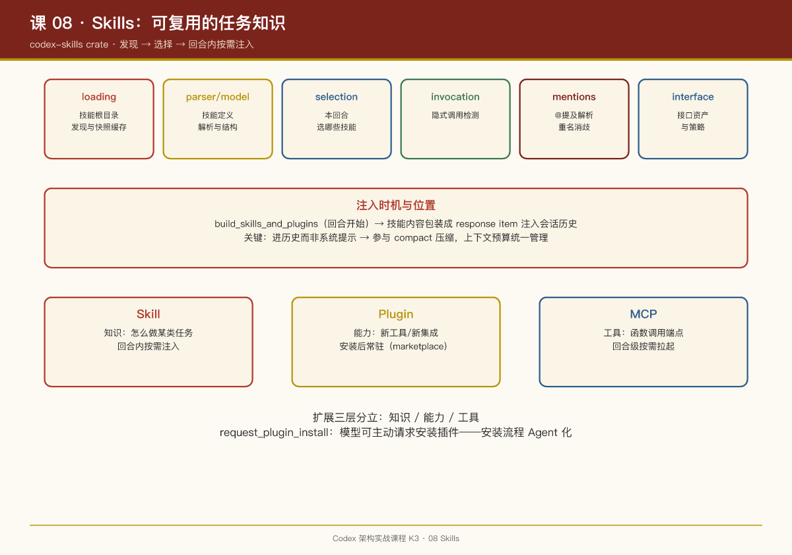

# 第 08 课：Skills——可复用的任务知识

## 一句话结论

Codex 的 Skills 是**带接口资产的任务知识包**：独立 `codex-skills` crate 负责发现、加载、提及解析与按需注入——技能内容在回合开始时才被注入上下文，而不是常驻系统提示。

## crate 结构：八个模块看全貌

`skills/src/lib.rs` 的模块列表就是技能系统的功能地图：

| 模块 | 职责 |
|-|-|
| `loading` | 技能根目录发现与加载（`SkillRootLoader`、`LoadedSkills`、`SkillRootSnapshotCache`） |
| `parser` | 解析技能定义文件 |
| `model` | 技能的数据结构 |
| `selection` | 本回合选哪些技能 |
| `invocation` | 隐式调用检测（`detect_implicit_skill_invocation_for_command`） |
| `mentions` | `@提及` 解析（`extract_tool_mentions`、`normalize_skill_path`） |
| `interface` | 技能的接口资产（`SkillInterfaceAssetPolicy`、`SkillInterfaceFile`） |
| `name_counts` | 重名处理 |

对照 OpenClaw 的技能系统（SKILL.md + requires.bins 门控），Codex 的抽象更重：技能不只是 markdown，还有**接口资产**（`interface` 模块）——技能可以携带文件资源，并有资产策略控制。

## 注入时机：回合开始，按需注入

第 02 课的链路里，`build_skills_and_plugins`（`turn.rs` 773 行）在回合开始时被调用：

```
用户输入
  → 解析 @提及（mentions 模块）+ 隐式调用检测（invocation 模块）
  → selection 选定技能集
  → 技能内容包装成 response item 注入会话历史
  → 模型在本回合看到这些知识
```

关键设计：**技能是注入到会话历史（response item），而不是塞进系统提示**。这意味着技能知识和普通对话一样参与压缩（第 02 课的 compact 机制），上下文预算统一管理。

## 触发方式：显式与隐式

1. **显式提及**：用户输入 `@技能名`，`extract_tool_mentions` 解析出来，`collect_explicit_app_ids_from_skill_items`（turn.rs 1280 行）收集对应应用 ID；
2. **隐式调用**：`detect_implicit_skill_invocation_for_command`——命令本身命中技能的触发条件时自动挂载。

`name_counts` 模块处理重名：多个来源的技能同名时需要消歧策略。

## 技能 vs 插件 vs MCP：三个扩展层的分工

Codex 的扩展体系有三层，容易混：

| 层 | 载体 | 提供什么 | 何时加载 |
|-|-|-|-|
| Skill | 文件包（定义 + 接口资产） | **知识**：怎么做某类任务 | 回合内按需注入 |
| Plugin（`plugin` crate + `marketplace_cmd`） | 可安装包 | **能力**：新工具/新集成 | 安装后常驻 |
| MCP | 外部进程 | **工具**：函数调用端点 | 回合级按需拉起 |

`handlers/request_plugin_install.rs` 说明模型甚至可以**主动请求安装插件**——生态安装流程也做成了 Agent 可发起的动作。`core-plugins`、`install-context` crate 支撑插件运行时。

## PM Takeaways

1. **知识注入要参与上下文预算管理**。技能塞进系统提示 = 永久占用上下文；注入会话历史 = 可以被压缩机制管理。上下文是稀缺资源，每一寸都要可回收。
2. **显式提及 + 隐式触发的双通道**是技能 UX 的标准答案：老手用 @ 精确控制，新手靠隐式检测"自动生效"。
3. **分清"知识"与"能力"的边界**。Skill 教模型"怎么做"（ procedural knowledge），Plugin/MCP 给模型"能做什么"（ capability）。混在一层会导致技能和工具互相污染——Codex 三层分立是教科书式做法。
4. **安装流程 Agent 化**是生态产品的终局：`request_plugin_install` 让"我需要装个插件"成为对话的一部分，而不是打断心流去手动操作。


