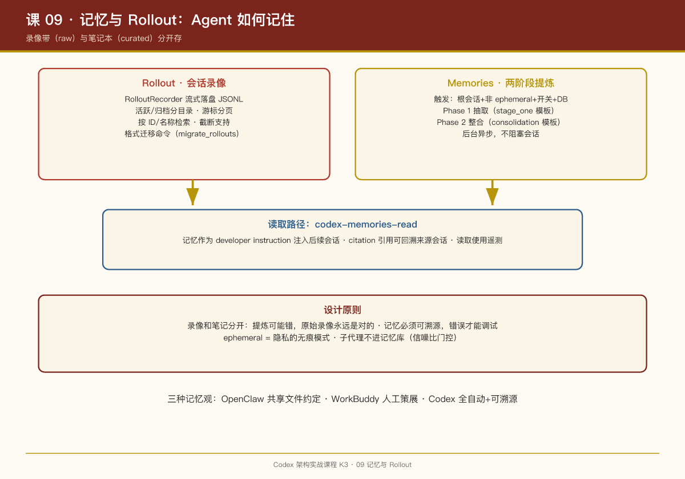

# 第 09 课：记忆与 Rollout——Agent 如何记住

## 一句话结论

Codex 的持久化分两层：**Rollout** 把每个会话完整落盘（可恢复、可检索的会话档案），**Memories** 是后台异步跑的两阶段提炼管线（从会话中萃取长期记忆，再注入后续会话）——前者是"录像带"，后者是"笔记"。

## Rollout：会话的完整录像

`codex-rollout` crate（`core/src/rollout.rs` 是它的 re-export）提供的 API 直接说明了能力面：

- `RolloutRecorder`：录制器——会话事件流式落盘；
- `SESSIONS_SUBDIR` / `ARCHIVED_SESSIONS_SUBDIR`：活跃会话与归档会话分目录存放；
- `find_thread_path_by_id_str`、`find_thread_meta_by_name_str`：按 ID/名称检索历史会话；
- `read_head_for_summary`：读取会话头部生成摘要（列表页用）；
- `ThreadsPage` + `Cursor` + `parse_cursor`：游标分页——会话列表是面向"可能很多"设计的；
- `thread_rollout_truncation`：截断支持——可以从中间裁剪会话；
- `cli/src/migrate_rollouts.rs`：rollout 格式有迁移命令——**格式演进是一等公民**，老数据不会被抛弃。

TUI 里的"恢复上次会话"、会话历史列表，底层都是 rollout 检索。SQLite（`codex-state` crate，`sqlite_config`）承担索引职责。

## Memories：两阶段异步提炼

`memories/README.md` 把管线写得很清楚：

**触发条件**（全部满足才跑）：

- 根会话启动（子代理会话不触发）；
- 会话非 ephemeral（临时会话不留记忆）；
- memory 特性开关打开；
- state DB 可用。

满足后**后台异步**执行，不阻塞会话：

**Phase 1：Rollout Extraction（逐线程抽取）**  
从会话录像中抽取值得记住的事实——模板在 `memories/write/templates/memories/stage_one_system.md` / `stage_one_input.md`。用 LLM 做萃取，提示词模板版本化管理。

**Phase 2：Consolidation（整合）**  
把新抽取的记忆与既有记忆合并去重、解决冲突——模板 `consolidation.md`。

**读取路径**（`codex-memories-read` crate）：

- 记忆作为 developer instruction 注入后续会话；
- `memory_citation` 解析——**记忆带引用**，可以回溯到来源会话；
- 读取使用情况的遥测分类。

配置入口：`Config.memories.generate_memories`（`core/src/rollout.rs` 可见）。

## 架构图

```
会话进行 ──► RolloutRecorder ──► sessions/（JSONL 录像）
                                     │
              （会话启动，条件满足，后台异步）
                                     ▼
                    Phase 1: 抽取（LLM, stage_one 模板）
                                     ▼
                    Phase 2: 整合（LLM, consolidation 模板）
                                     ▼
                              记忆库（state DB）
                                     │
              后续会话启动 ──► read crate 注入 developer instruction
                              （带 citation，可溯源）
```

## 对照：三种记忆观

| 系统 | 记忆方式 | 特点 |
|-|-|-|
| OpenClaw | 共享文件系统 + 会话车道 | 简单直接，靠文件约定 |
| WorkBuddy（你在用的） | MEMORY.md + 每日日志 + 云端画像 | 人工策展为主 |
| Codex | Rollout 录像 + LLM 两阶段提炼 + citation | 全自动、可溯源 |

Codex 的方案是最"重"的，但也是唯一把**记忆质量**当工程问题对待的：两阶段管线本质是"先萃取再压缩"的信息论结构，citation 机制让记忆可审计——记忆错了能查出来源并修正。

## PM Takeaways

1. **录像（raw）和笔记（curated）必须分开存**。Rollout 是原始事实，Memory 是提炼观点——提炼可能错，原始录像永远是对的。任何记忆系统都要保留"回到原文"的能力。
2. **记忆提炼是后台任务，不是会话的一部分**。异步触发 + 明确的条件门控（非临时、非子代理、DB 可用），保证记忆管线永远不拖慢用户体验。
3. **记忆必须可溯源**。citation 机制让"AI 记错了"从扯皮变成可调试的工程问题。没有溯源的记忆系统，错误会复利式累积。
4. **临时会话（ephemeral）是隐私设计**。明确"这次对话不进入记忆"的通道，是用户对 Agent 信任的基础——类比浏览器的无痕模式。


