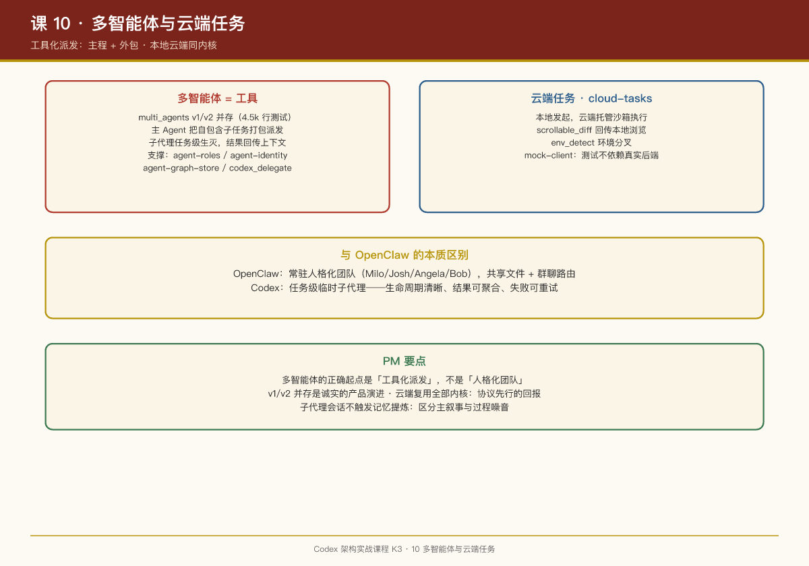

# 第 10 课：多智能体与云端任务

## 一句话结论

Codex 的多智能体走**工具化派发**路线——`multi_agents` 是一组工具，主 Agent 像调工具一样派生子代理；云端任务（cloud-tasks）则是把同一个内核搬到托管环境里跑，本地与云端共享协议与审批语义。

## 多智能体：工具化派发

第 03 课的工具清单里，`multi_agents.rs` / `multi_agents_v2.rs` 和 `multi_agents/`、`multi_agents_v2/` 目录（含 4,517 行测试的 `multi_agents_tests.rs`）就是多智能体入口。

设计思想与 OpenClaw 的"4 个常驻 Agent 团队"（Milo/Josh/Angela/Bob）完全不同：

| 维度 | OpenClaw | Codex |
|-|-|-|
| 子代理形态 | 常驻人格化 Agent | 任务级临时子代理 |
| 协作方式 | 共享文件 + 群聊路由 | 主代理经工具调用派发，结果回传 |
| 生命周期 | 长期存在 | 随任务生灭 |

Codex 模型更接近"**主程 + 外包**"：主 Agent 把自包含的子任务（"去把 X 模块的测试跑一遍并汇总失败原因"）打包派出去，子代理独立跑完，结果作为工具结果回到主 Agent 上下文。

支撑 crate：`agent-roles`（角色定义）、`agent-identity`（代理身份）、`agent-graph-store`（代理关系图存储）、`codex_delegate.rs`（委托逻辑，`core/src`）。`core/src/agent/` 目录（含 4,609 行的 `control_tests.rs`）是代理控制面。

值得注意的是 v1/v2 并存（`multi_agents` 与 `multi_agents_v2`）——**多智能体是活跃迭代中的特性**，两版工具说明 OpenAI 自己也在探索正确的抽象。

## 协议层的多智能体

`protocol/src/protocol.rs` 的 import 里有 `MultiAgentMode`、`CollaborationMode`（来自 `config_types`）——多智能体模式是协议级概念，不只是内部实现。`collaboration-mode-templates` crate 提供协作模式模板。

## 云端任务：cloud-tasks

`cloud-tasks` crate（含 `app.rs`、`new_task.rs`、`env_detect.rs`、`scrollable_diff.rs`）配合 `cloud-tasks-client`、`cloud-tasks-mock-client`、`backend-client`，对接 Codex Web（chatgpt.com/codex）的云端环境：

- **本地发起，云端执行**：在 TUI 里创建一个云端任务，Codex 在托管沙箱里跑，diff 回传本地浏览（`scrollable_diff`）；
- `env_detect`：环境检测——判断当前在什么环境里运行，本地/云端行为分叉；
- `mock-client`：云端客户端有 mock 实现——测试不依赖真实后端。

云端执行时**同一个 codex-core 在托管容器里跑**——这就是为什么第 05 课的沙箱如此重要：云端意味着"OpenAI 的机器上跑 AI 生成的命令"，沙箱从"保护用户"升级成"保护平台"。

## 记忆管线的边界

第 09 课提到记忆提炼"子代理会话不触发"——这个细节在多智能体语境下才显深意：**只有根会话值得进入长期记忆**。子代理是干活的工具，它的过程是噪音，不应污染记忆库。这是"记忆的信噪比"设计。

## PM Takeaways

1. **多智能体的正确起点是"工具化派发"，不是"人格化团队"**。任务级子代理生命周期清晰、结果可聚合、失败可重试；常驻多 Agent 的协调成本（状态同步、冲突仲裁）远超想象，先把单 Agent + 工具化子代理做扎实。
2. **v1/v2 并存是诚实的产品演进**。多智能体没有标准答案，保留两代实现让市场检验，比强行一次性收敛明智。
3. **本地与云端同内核，体验差异只在界面层**。cloud-tasks 复用全部内核能力，云端独有的只是执行环境和 diff 回传 UI——这再次验证第 01 课"协议先行"的价值。
4. **记忆系统要区分"主叙事"与"过程噪音"**。子代理不进记忆库，这个门控值得所有做记忆的产品抄。

