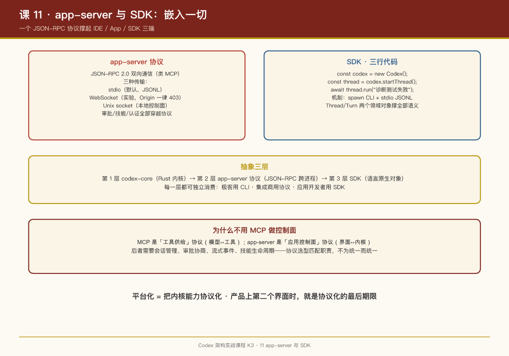

# 第 11 课：app-server 与 SDK——把内核嵌入一切

## 一句话结论

`codex app-server` 是 Codex 平台化的枢纽：**一个 JSON-RPC 2.0 双向协议 + 三种传输（stdio / WebSocket / Unix socket）**，IDE 插件、桌面 App、第三方集成都只是这个协议的客户端；SDK 则进一步把"spawn CLI + JSONL 管道"封装成三行代码。

## app-server 协议

`app-server/README.md` 给了完整定义：

- **协议**：JSON-RPC 2.0（线上省略 `"jsonrpc":"2.0"` 头），**双向通信**——类似 MCP，既能请求-响应，也能服务器推事件；
- **传输**：

  - `stdio`（默认）：换行分隔 JSON（JSONL）——最简单，父子进程场景；
  - `ws://IP:PORT`（实验性，明确标注 unsupported）：每帧一条消息；同端口附带健康探针 `GET /readyz` / `GET /healthz`，**带 Origin 头的请求一律 403**（防浏览器跨站劫持）；
  - `unix://`：走 `$CODEX_HOME/app-server-control/app-server-control.sock` 的 Unix socket，HTTP Upgrade 到 WebSocket——本地控制面；
- **生命周期**：README 里有完整的 Initialization / API Overview / Events / Approvals / Skills / Apps / Auth endpoints 章节——**审批、技能、认证全部穿越协议**，不是 UI 私有逻辑。

VS Code 扩展就是经 app-server 驱动（README 原文："the interface Codex uses to power rich interfaces such as the Codex VS Code extension"）。桌面 App（`codex app`，`cli/src/desktop_app`）同理。

配套的 crate 群展示了工程严肃度：`app-server-client`（官方客户端）、`app-server-test-client`（测试客户端）、`app-server-transport`（传输层抽象）、`app-server-daemon`（守护进程）、`app-server-protocol-noop-macros`（协议宏）——协议有独立 crate（`app-server-protocol`），客户端服务端共享同一份定义。

## SDK：三行代码嵌入 Codex

TypeScript SDK（`sdk/typescript`，README 原文）：

```typescript
import { Codex } from "@openai/codex-sdk";

const codex = new Codex();
const thread = codex.startThread();
const turn = await thread.run("Diagnose the test failure and propose a fix");

console.log(turn.finalResponse);
```

机制：**spawn `codex` CLI，stdio 上交换 JSONL 事件**（README 原文）。`thread.run()` 可重复调用延续同一会话。源码结构（`codex.ts`、`thread.ts`、`events.ts`、`items.ts`、`outputSchemaFile.ts`）就是把协议事件流封装成 `Thread`/`Turn` 两个领域对象。

Python SDK 同构，另有 `python-runtime` 处理嵌入式解释器分发。

抽象层次：

```
第 1 层：codex-core（Rust 内核）
第 2 层：app-server 协议（JSON-RPC，跨进程）
第 3 层：SDK（Thread/Turn 对象，语言原生）
```

每一层都可以独立消费：极客直接用 CLI，集成商用 app-server，应用开发者用 SDK。

## code-mode：远程执行

`code-mode*` crate 群（`code-mode`、`code-mode-host`、`code-mode-protocol`、`code-mode-runtime`）+ app-server 的 `--code-mode-host URL` 参数，支持把执行环境放到远端（gRPC 连接远程 host）——**本地界面 + 远程内核**，这是云端 IDE、容器化开发的接入点。

## 为什么是 JSON-RPC 而不是 MCP

一个自然的问题：OpenAI 自己也推 MCP，为什么 app-server 不用 MCP？README 只说"Similar to MCP"。从工程看，区别在于职责：**MCP 是"工具供给"协议**（模型↔工具），app-server 是"应用控制面"协议（界面↔ Agent 内核）——后者需要会话管理、审批协商、流式事件、技能生命周期，语义远比工具调用丰富。协议选型匹配职责，不为统一而统一。

## PM Takeaways

1. **平台化 = 把内核能力协议化**。Codex 的 IDE 插件、桌面 App、SDK 没有一行重新实现的 Agent 逻辑——全部是 app-server 协议的客户端。你的产品想上第二个界面时，就是协议化的最后期限。
2. **传输分层很实用**：stdio 给父子进程（SDK），Unix socket 给本地控制面（App），WebSocket 给远程（实验）——按信任域选传输，不信任的（浏览器 Origin）直接拒绝。
3. **SDK 的领域对象要克制**。Thread/Turn 两个对象撑起全部 SDK 语义——SDK 设计是"删到不能再删"的艺术，每个多出来的概念都是用户的认知税。
4. **实验性特性要大声标注**。"experimental / unsupported"写在协议文档里，比事后 breaking change 体面得多。


