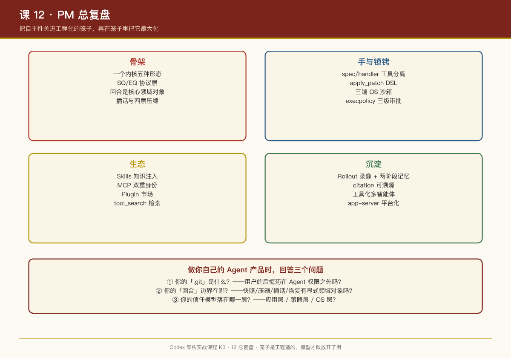

# 第 12 课：实战综合 + PM 总复盘

## 一句话结论

把 12 课收成一句话：**Codex 用"协议化的内核 + OS 级沙箱 + 可编程审批"把 Agent 的自主性关进了工程化的笼子，又用"工具化的自我意识 + 可溯源记忆"把自主性在笼子里最大化**——这是 2026 年编码 Agent 最完整的一份参考答案。

## 全景图

```
                     用户（终端 / IDE / App / SDK / Web）
                        │  Submission │  ▲ Event
              ┌─────────▼─────────────┴─────────┐
              │   SQ/EQ 协议层（protocol crate）  │
              └─────────┬───────────────────────┘
        ┌───────────────▼────────────────┐
        │         codex-core             │
        │  run_turn: 快照→注入→采样→工具  │
        │  compact × 4层 / pending input │
        └───┬────────┬────────┬─────────┘
      ┌─────▼──┐ ┌───▼────┐ ┌─▼───────┐
      │ 工具注册│ │ 沙箱    │ │ 审批     │
      │ spec/  │ │ bwrap  │ │execpolicy│
      │handler │ │Seatbelt│ │allow/    │
      │分离    │ │Win令牌 │ │prompt/   │
      └────────┘ └────────┘ │forbidden │
                            └──────────┘
        ┌─────────────────────────────┐
        │ 扩展生态：Skills / MCP / 插件 │
        ├─────────────────────────────┤
        │ 持久化：Rollout + 两阶段记忆  │
        └─────────────────────────────┘
```

## 十二个核心判断（速查）

1. **选型即战略**：Rust + 单体二进制 + 1:1 测试密度 = "失败成本极高"的产品自我认知。（课 00）
2. **协议先行，界面后置**：新增产品形态的成本 = 写一个协议客户端。（课 01）
3. **回合（turn）是核心领域对象**：独立 ID、diff 追踪、模型会话、压缩边界。（课 02）
4. **插话（pending input）要设计进循环**，不是事后补丁。（课 02）
5. **工具说明书是产品文案**：spec 决定模型用不用得对。（课 03）
6. **把系统状态做成工具**（get_context_remaining / request_permissions）= Agent 自我意识的起点。（课 03）
7. **核心资产前放一门 DSL**（apply_patch）：意图与执行之间的缓冲层。（课 04）
8. **Agent 安全的终态是默认拒绝**：文件系统只读 + 显式可写根 + 网络受限。（课 05）
9. **保护用户的后悔药**（.git 只读），且它必须在 Agent 权限之外。（课 05）
10. **审批疲劳的解法是策略**（execpolicy 三级决策），不是更多弹窗。（课 06）
11. **记忆 = 录像 + 可溯源笔记**：提炼可能错，原始录像永远是对的；子代理不进记忆库。（课 09、10）
12. **平台化 = 内核能力协议化**：JSON-RPC 一个协议撑起 IDE/App/SDK。（课 11）

## Codex vs OpenClaw：光谱两端

| 维度 | OpenClaw | Codex |
|-|-|-|
| 定位 | 个人生活助理 | 编码智能体 |
| 技术栈 | TypeScript，社区驱动 | Rust，OpenAI 官方 |
| 入口 | 多渠道消息（Telegram 等） | 终端/IDE/App/云/SDK |
| 循环 | runLoop 双层 while | run_turn 外层回合 + 内层采样 |
| 安全模型 | 配对门控、会话车道（应用层） | OS 沙箱 + execpolicy + 审批流（系统层） |
| 改代码 | 自由工具调用 | apply_patch DSL |
| 扩展 | ClawHub 技能包 | Skills + MCP + Plugins 三层 |
| 记忆 | 共享文件约定 | Rollout + LLM 两阶段提炼 + citation |
| 多智能体 | 常驻人格化团队 | 工具化临时子代理 |

**共同的底层收敛**：durable 输入、显式回合循环、spec/handler 分离的工具、按需注入的知识、异步记忆。Agent 产品的基础设施正在标准化——差异只剩场景与信任模型。

## 对 Agent 产品经理的终极三问

读完这套课程，做你自己的 Agent 产品时回答三个问题：

1. **你的".git"是什么？**——用户在你的产品里搞砸后的后悔药是什么？它在 Agent 的权限之外吗？
2. **你的"回合"边界在哪？**——从用户提交到任务结束，中间的状态快照、压缩、插话、恢复，你有显式的领域对象承载吗？
3. **你的信任模型在哪一层？**——应用层检查（快但漏）、策略层（可编程但需维护）、OS 层（硬但重）——你的产品形态要求你落到哪一层？

## 结语

Codex 最打动人的不是某个巧妙算法，而是**工程上的诚实**：实验性特性标注 unsupported、WSL1 直接拒绝、压缩策略写明 TODO、v1/v2 多智能体并存接受检验。做大模型产品，模型能力是天给的，但"笼子"是自己造的——笼子造得好，模型才敢放开了用。


