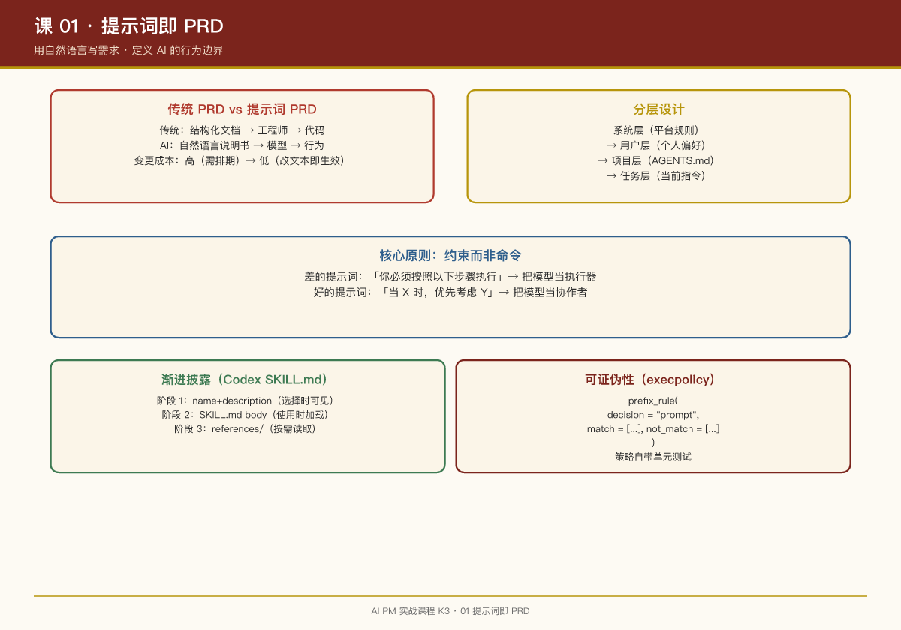

# 第 01 课：提示词即 PRD——用自然语言"写需求"

## 一句话结论

在 AI 产品里，**提示词（prompt）就是你的 PRD**。它不是技术实现细节，而是产品经理直接负责的核心交付物——定义 AI 的行为边界、人格基调和禁区。

## 传统 PRD vs 提示词 PRD

| 维度 | 传统 PRD | 提示词 PRD |
|-|-|-|
| 读者 | 工程师 | 大语言模型 |
| 语言 | 结构化文档（流程图、表格、字段定义） | 自然语言 + 少量结构化约束 |
| 精确性 | 追求完备：所有边界 case 都要覆盖 | 追求引导：给模型足够的判断框架 |
| 变更成本 | 高（需要开发排期） | 低（改文本即生效） |
| 测试方式 | 功能测试 | 行为测试（评估模型输出分布） |

## 案例：Codex 的核心提示词

Codex 的提示词文件（`gpt_5_codex_prompt.md`）是 OpenAI 工程团队写给模型的"入职手册"。虽然我们无法直接读取（文件在编译时嵌入），但从代码结构可以还原其设计哲学：

```rust
// codex-rs/core/src/client.rs 中的提示词组装
let mut prompt = base_instructions.clone();
if let Some(user_instructions) = user_instructions {
    prompt.push_str("\n\n# User Instructions\n\n");
    prompt.push_str(&user_instructions);
}
if let Some(agents_md) = agents_md_content {
    prompt.push_str("\n\n# Project Instructions (AGENTS.md)\n\n");
    prompt.push_str(&agents_md);
}
```

**设计要点**：提示词是**分层组装**的——基础指令 → 用户自定义 → 项目级 AGENTS.md。这对应产品里的"平台规则 → 用户偏好 → 项目规范"三层。

## 案例：Codex 的技能说明书（SKILL.md）

Codex 的技能系统用 `SKILL.md` 定义每个技能的"使用说明书"。这是提示词工程的教科书样本：

```yaml
---
name: skill-creator
description: Create or update a Codex skill with appropriately scoped instructions and any needed supporting resources.
metadata:
  short-description: Create or update a skill
---

# Skill Creator

Create skills that give Codex useful, non-obvious guidance without constraining unrelated work.

## Core Principles

**Assume Codex is already capable.** Include only information that changes its decisions or improves its work. Remove generic advice, repeated instructions, speculative edge cases, and examples that do not materially clarify the task.

**Preserve user intent and scope.** A skill should support the requested task, not replace the user's chosen product, expand the assignment, modify unrelated configuration, or imply permission for additional external actions.
```

**PM 视角解读**：

- `name` + `description` = 技能的"产品定位"，模型用它决定何时加载
- `Core Principles` = 行为规范，告诉模型"什么该做、什么不该做"
- **"Assume Codex is already capable"** = 不要重复模型已知的事情，节省 token

## 案例：OpenClaw 的技能门控

OpenClaw 的 `skills/gog/SKILL.md` 展示了另一种提示词设计——**环境门控**：

```markdown
## Requirements

This skill requires the following binaries to be available:
- `gog` (Google Groups CLI)

If `gog` is not available, inform the user that this skill cannot be used and suggest they install it.
```

**PM 视角**：这不是代码检查，是**提示词层面的行为规范**。模型读到这段话后，会主动检查环境并告知用户，而不是盲目尝试。

## 怎么写好提示词 PRD

从 Codex 和 OpenClaw 提炼的四个原则：

### 1. 分层设计

```
系统层（平台规则）→ 用户层（个人偏好）→ 项目层（项目规范）→ 任务层（当前指令）
```

每层有明确的覆盖关系。Codex 的 AGENTS.md 就是项目层提示词的标准实现。

### 2. 约束而非命令

**差的提示词**："你必须按照以下步骤执行：1. ... 2. ... 3. ..."  
**好的提示词**："当用户要求 X 时，优先考虑 Y 方案。如果 Z 条件满足，可以放宽到 W。"

前者把模型当执行器，后者把模型当协作者。Codex 的 `skill-creator` 说明书大量使用 "should"、"prefer"、"consider" 而非 "must"、"always"、"never"。

### 3. 渐进披露

Codex 技能设计的三阶段披露：

```
阶段 1：name + description（选择时可见，保持简洁）
阶段 2：SKILL.md body（使用时加载，包含核心约束）
阶段 3：references/（按需读取，详细文档）
```

这对应产品的"信息架构"——不要把所有信息一次性塞给用户（或模型）。

### 4. 可证伪性

每个约束都应该能被验证。Codex 的 `execpolicy` 规则自带 `match`/`not_match` 样例：

```starlark
prefix_rule(
    pattern = ["git", "push"],
    decision = "prompt",
    match = [["git", "push"], "git push origin main"],
    not_match = [["git", "status"], "git pull"],
)
```

**PM 练习**：给你负责的 AI 功能写 5 条约束，每条配 2 个应该触发和 2 个不应该触发的例子。

## 常见陷阱

| 陷阱 | 表现 | 解法 |
|-|-|-|
| 过度约束 | 提示词里写满"禁止"、"不允许" | 用"优先考虑"替代"必须"，给模型判断空间 |
| 信息过载 | 把所有背景知识塞进系统提示 | 用分层披露，按需注入 |
| 忽视边界 | 假设模型知道什么时候停止 | 明确写"当 X 条件满足时停止" |
| 无版本管理 | 提示词改了但没记录 | 像代码一样管理提示词版本 |

## 提示词与评测的分工（Dianne Penn 观点）

Anthropic 首位技术 PM Dianne Penn 提出了一个被广泛引用的观点：**"Evals are the new PRDs"**（评测是新的 PRD）。这不是说 PRD 没用了，而是说**PRD 和评测的分工变了**：

| 场景 | 用什么 | 原因 |
|-|-|-|
| 已知问题追踪 | Eval（评测集） | 可反复运行、可量化、可回归 |
| 新方向探索 | PRD | 需要愿景对齐和利益相关者沟通 |
| 模型发布 | PRD + Eval | 法务/安全需要文档，工程需要测试 |

**完整工作循环**：

1. 读取真实用户轨迹（用户说"Claude 幻觉了"→ 追问：调工具了吗？看对文档了吗？）
2. 判断失败类型（tool use / 搜索 / 知识整合 / alignment）
3. 抽象成 eval set（30-40 个具体例子：prompt + response + golden answer）
4. 每次新版本重新运行测试

> **PM 的 test-driven development**：先写清"什么叫做对"，再推动模型向这个标准靠近。

这与提示词 PRD 的关系：**提示词定义行为边界，评测验证行为结果**。两者结合才是完整的 AI 产品需求管理。

## 提示词 PRD 的极简主义（Cat Wu 观点）

Claude Code 产品负责人 Cat Wu 的实践给"提示词即 PRD"补了一个组织维度：**PRD 本身也在变轻**。Anthropic 的功能交付周期从 6 个月压到 1 周、甚至 1 天，靠的不是加班，是三件事：

- **大部分功能不写 PRD**：只有模糊或复杂的功能才写一页纸，日常沟通靠指标更新 + 清晰的团队原则
- **Research Preview 文化**：新功能默认标为"早期阶段、随时可能变"——发布不需要承诺，解除了"必须完美才能上线"的心理负担
- **常设发布室（Launch Room）**：工程师写完代码直接发到发布室频道，市场、文档、开发者关系当天响应，PM 的核心职责是扫清发布路径上的所有障碍

支撑这套轻流程的是**目标锐利度**。Cat 的原话："LLM 的通用性意味着任何东西都可能是一个好方案，你需要用极其锐利的目标来砍掉噪音。"写任何产品文档前先问：**这个目标能自动排除哪些选项？**——答不上来就继续细化。

| 目标 | 效果 |
|-|-|
| 模糊："提升 AI 编程体验" | 方案无限多 → 团队瘫痪 |
| 锐利："让企业里的专业开发者能在零权限提示下安全地使用 Claude Code" | 自动排除大部分选项 → 工程师可以独立决策 |

> 与 Dianne Penn 的"评测取代 PRD"对照：一个说**交付物变了**，一个说**流程变轻了**。两位 Anthropic PM 的共识：在 AI 时代，**重流程是速度的敌人**。

## 本周练习

1. 找出一个你过去写的 PRD，把它改写成提示词格式（假设读者是 LLM）
2. 为 Codex 写一个新的 `SKILL.md`（比如"代码审查技能"），遵循 skill-creator 的规范
3. 对比 OpenClaw 和 Codex 的提示词风格，写出 3 个设计差异

## 延伸阅读

- Codex 仓库：`codex-rs/skills/src/assets/samples/skill-creator/SKILL.md`
- Codex 仓库：`codex-rs/prompts/templates/compact/prompt.md`（压缩提示词的设计）
- OpenClaw 仓库：`skills/gog/SKILL.md`（环境门控示例）
- 播客：Lenny's Podcast × Dianne Penn（2026-07-26）——"Evals are the new PRDs" 的完整阐述


