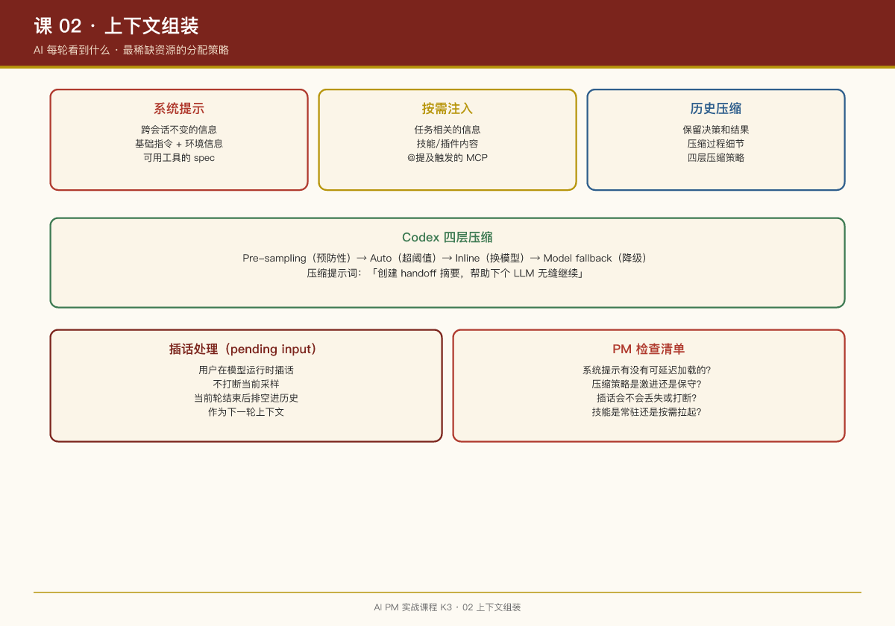

# 第 02 课：上下文组装——AI 每轮"看到"什么

## 一句话结论

AI 产品的核心设计决策之一是**上下文窗口的分配策略**——模型每轮"看到"什么信息，直接决定它能做什么、不能做什么。这不是技术细节，是产品体验的核心。

## 上下文窗口：最稀缺的资源

大语言模型的上下文窗口是有限的（GPT-5 约 128K tokens，Claude 约 200K tokens）。每轮对话能"看到"的信息总量固定，**放入什么、丢弃什么、怎么压缩**，是产品经理的核心决策。

## 案例：Codex 的上下文组装管线

Codex 的 `run_turn` 函数（`core/src/session/turn.rs`）展示了完整的上下文组装流程：

```rust
// 1. 捕获世界快照
let first_step_context = sess
    .capture_step_context_with_required_mcp_servers(...)
    .await;

// 2. 注入技能与插件
let (injection_items, explicitly_enabled_connectors) = 
    build_skills_and_plugins(&sess, first_step_context.as_ref(), ...).await;

// 3. 记录到会话历史
for response_item in injection_items {
    sess.record_conversation_items(&turn_context, ...).await;
}

// 4. 采样前压缩（如果历史太长）
run_pre_sampling_compact(&sess, &turn_context, ...).await;
```

**关键设计**：上下文是**动态组装**的，不是静态模板。每轮根据当前输入、可用工具、历史长度，决定注入什么。

## 案例：Codex 的四层压缩策略

Codex 把上下文压缩当内存管理一样严肃对待：

| 压缩层 | 触发时机 | 代码位置 |
|-|-|-|
| Pre-sampling compact | 回合开始前，预防性压缩 | `run_pre_sampling_compact` |
| Auto compact | 回合中，历史超阈值时自动触发 | `run_auto_compact` |
| Inline compact | 模型切换时，内联压缩 | `maybe_run_previous_model_inline_compact` |
| Model fallback compact | 模型降级时的压缩 | `compact_model_fallback` |

压缩不是简单的"截断"，而是用另一个 LLM 调用来**总结历史**：

```markdown
# 压缩提示词模板（codex-rs/prompts/templates/compact/prompt.md）

You are performing a CONTEXT CHECKPOINT COMPACTION. Create a handoff summary for another LLM that will resume the task.

Include:
- Current progress and key decisions made
- Important context, constraints, or user preferences
- What remains to be done (clear next steps)
- Any critical data, examples, or references needed to continue

Be concise, structured, and focused on helping the next LLM seamlessly continue the work.
```

**PM 视角**：压缩策略直接影响用户体验。压缩太激进 → AI"忘记"用户偏好；压缩太保守 → 超出上下文限制，请求失败。

## 案例：OpenClaw 的技能注入

OpenClaw 的技能系统展示了另一种上下文组装策略：

```typescript
// packages/agent-core/src/agent-loop.ts
// 技能内容作为 response item 注入会话历史
const skillContent = await loadSkillContent(skillName);
const injectionItem = {
    type: 'skill_injection',
    content: skillContent,
    metadata: { skillName, timestamp: Date.now() }
};
await sess.recordConversationItems([injectionItem]);
```

**与 Codex 的对比**：

- Codex：技能作为独立 item 注入，参与压缩管理
- OpenClaw：技能直接写入会话历史，更灵活但更"重"

## 上下文组装的四个决策点

### 1. 什么信息进系统提示？

**原则**：只放**跨会话不变**的信息。

Codex 的系统提示包含：

- 基础指令（"你是 Codex，一个编码助手"）
- 当前环境信息（OS、cwd、git 状态）
- 可用工具的 spec

不放：用户历史对话（放历史区）、项目特定规范（放 AGENTS.md，按需注入）

### 2. 什么信息按需注入？

**原则**：**任务相关**的信息，用的时候再加载。

Codex 的技能系统：`build_skills_and_plugins` 只在检测到用户输入匹配技能触发条件时才注入。

OpenClaw 的 MCP 工具：`required_mcp_servers_for_input` 只在用户 `@提及` 某个工具时才拉起对应服务。

### 3. 历史怎么压缩？

**原则**：保留**决策和结果**，压缩**过程细节**。

Codex 的压缩模板明确要求：

- 保留：关键决策、用户偏好、待办事项
- 压缩：中间推理过程、重复性操作、已完成的步骤

### 4. 插话怎么处理？

Codex 的 `pending input` 队列：

```rust
// 用户在模型运行时插的话，不会打断当前采样
// 而是在当前轮结束后"排空"进历史，作为下一轮上下文
let pending_input = if can_drain_pending_input {
    sess.input_queue.get_pending_input(&sess.active_turn).await.0
} else {
    Vec::new()
};
```

**产品体验**：用户可以随时插话，不会丢失，也不会粗暴打断 AI 的思考。

## PM 检查清单

设计上下文组装策略时，问自己：

- [ ] 系统提示里有没有可以按需注入的信息？（节省 token）

- [ ] 历史压缩策略是什么？（激进/保守/分层）

- [ ] 用户插话会不会丢失或打断？

- [ ] 技能/工具是常驻还是按需拉起？

- [ ] 压缩后的摘要有没有人审阅过？（质量保证）

## 本周练习

1. 画出你当前产品的上下文组装流程图（什么信息从哪里来，什么时候注入）
2. 设计一个压缩策略：如果用户和 AI 聊了 100 轮，哪些信息必须保留？
3. 对比 Codex 和 OpenClaw 的技能注入时机，分析各自的优缺点

## 延伸阅读

- Codex 仓库：`codex-rs/core/src/session/turn.rs`（run_turn 函数）
- Codex 仓库：`codex-rs/prompts/templates/compact/prompt.md`（压缩提示词）
- OpenClaw 仓库：`packages/agent-core/src/agent-loop.ts`（技能注入逻辑）


