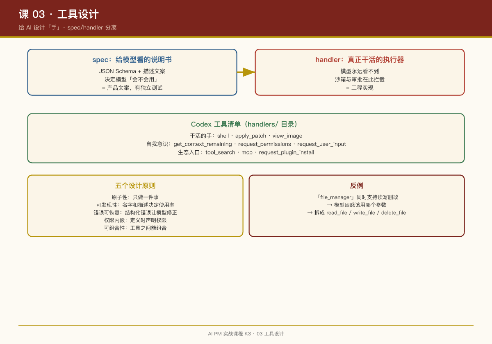

# 第 03 课：工具设计——给 AI 设计"手"

## 一句话结论

AI 产品的能力边界，本质上是由**工具目录**决定的。设计工具就是设计"AI 能做什么"——这是产品经理的核心职责，不是工程师的。

## 工具 = 产品功能

在传统产品里，功能是按钮和表单；在 AI 产品里，功能是**工具**（tool）。每个工具都是 AI 可以调用的一个"动作"。

## 案例：Codex 的工具清单

Codex 的工具目录（`core/src/tools/handlers/`）就是它的功能清单：

| 工具 | 功能 | 产品意义 |
|-|-|-|
| `shell` | 执行 shell 命令 | 让 AI 能操作开发环境 |
| `apply_patch` | 用补丁格式改文件 | 让 AI 能精确修改代码 |
| `plan` | 维护任务计划 | 让 AI 能拆解复杂任务 |
| `request_user_input` | 主动向用户提问 | 让 AI 能澄清歧义 |
| `request_permissions` | 申请更高权限 | 让 AI 能谈判权限 |
| `get_context_remaining` | 查询剩余上下文 | 让 AI 有"自我意识" |
| `tool_search` | 搜索可用工具 | 让 AI 能发现新能力 |
| `multi_agents` | 派生子代理 | 让 AI 能并行处理 |
| `view_image` | 查看图片 | 让 AI 能处理视觉信息 |
| `sleep` / `wait_for_environment` | 等待 | 让 AI 能处理异步任务 |

**关键洞察**：`request_permissions` 和 `request_user_input` 这种工具，把**系统状态和权限协商**也做成了 AI 可发起的动作。模型不再只是被动执行者，它可以问"我还能装多少东西"、"我能不能要更高权限"。

## 案例：apply_patch 的 spec/handler 分离

Codex 的 `apply_patch` 工具展示了工具设计的最佳实践：

**Spec（给模型看的说明书）**：

```rust
// codex-rs/core/src/tools/handlers/apply_patch_spec.rs
pub fn create_apply_patch_freeform_tool(...) -> ToolSpec {
    ToolSpec::Freeform(FreeformTool {
        name: "apply_patch".to_string(),
        description: "The `apply_patch` tool can be used to edit files. 
                      This is a FREEFORM tool, so do not wrap the patch in JSON.".to_string(),
        format: FreeformToolFormat {
            r#type: "grammar".to_string(),
            syntax: "lark".to_string(),
            definition: APPLY_PATCH_LARK_GRAMMAR.to_string(),
        },
    })
}
```

**语法定义（apply_patch.lark）**：

```lark
start: begin_patch hunk+ end_patch
begin_patch: "*** Begin Patch" LF
end_patch: "*** End Patch" LF?

hunk: add_hunk | delete_hunk | update_hunk
add_hunk: "*** Add File: " filename LF add_line+
delete_hunk: "*** Delete File: " filename LF
update_hunk: "*** Update File: " filename LF change_move? change?
```

**Handler（真正干活的执行器）**：

```rust
// codex-rs/core/src/tools/handlers/apply_patch.rs
// 解析补丁 → 校验路径 → 审批检查 → 落盘 → 记录 diff
```

**设计要点**：

1. **Spec 和 Handler 分离**：说明书可以独立迭代，实现可以独立优化
2. **语法严格定义**：用 Lark 语法定义补丁格式，解析失败明确报错
3. **模型只看见 Spec**：Handler 的实现细节模型永远看不到

## 案例：OpenClaw 的技能市场

OpenClaw 的 ClawHub 技能市场展示了另一种工具设计思路——**社区驱动的工具生态**：

```markdown
# skills/gog/SKILL.md

## Requirements

This skill requires the following binaries to be available:
- `gog` (Google Groups CLI)

If `gog` is not available, inform the user that this skill cannot be used.
```

**与 Codex 的对比**：

- Codex：官方定义工具，严格 spec，编译时嵌入
- OpenClaw：社区贡献技能，YAML frontmatter + Markdown，运行时加载

## 工具设计的五个原则

### 1. 原子性

每个工具只做一件事。Codex 的 `apply_patch` 只负责改文件，`shell` 只负责执行命令。

**反例**：一个"file_manager"工具同时支持读、写、删、改——模型会困惑该用哪个参数。

### 2. 可发现性

工具的名字和描述决定模型会不会用它。

**好的描述**（Codex 风格）：

> "The `apply_patch` tool can be used to edit files. This is a FREEFORM tool, so do not wrap the patch in JSON."

**差的描述**：

> "This tool modifies files."

### 3. 错误可恢复

工具执行失败时，返回**结构化错误**让模型自我修正。

```rust
// Codex 的补丁解析失败处理
match parse_patch(&patch_text) {
    Ok(ops) => execute_ops(ops),
    Err(e) => return ToolResult::error(format!(
        "Patch parse error: {}. Please fix the patch format and try again.", e
    ))
}
```

### 4. 权限内嵌

工具定义时就声明权限需求，而不是执行时才检查。

Codex 的 `request_permissions` 工具就是专门用来**显式声明权限需求**的。

### 5. 可组合性

工具之间应该能组合使用。Codex 的 `multi_agents` 工具可以派生子代理，子代理又能调用所有其他工具。

## PM 检查清单

设计 AI 工具时，问自己：

- [ ] 这个工具是原子性的吗？（只做一件事）

- [ ] 工具描述能让模型正确使用吗？（名字、参数、返回值）

- [ ] 错误信息能帮助模型自我修正吗？

- [ ] 权限需求在定义时就声明了吗？

- [ ] 这个工具能和其他工具组合吗？

## 本周练习

1. 为你的 AI 产品设计 5 个工具，写出每个工具的 spec（名字、描述、参数、返回值）
2. 找出一个你过去设计的"大而全"的功能，把它拆成 3 个原子工具
3. 分析 Codex 的 `request_user_input` 工具：它怎么设计才能让模型"知道什么时候该问用户"？

## 延伸阅读

- Codex 仓库：`codex-rs/core/src/tools/handlers/`（全部工具实现）
- Codex 仓库：`codex-rs/core/assets/tools/apply_patch.lark`（补丁语法定义）
- OpenClaw 仓库：`skills/`（社区技能示例）


