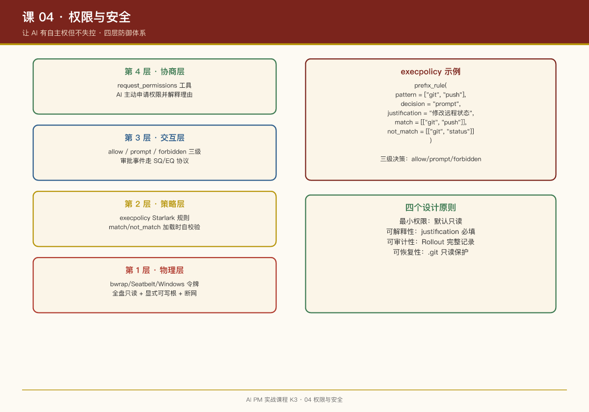

# 第 04 课：权限与安全——让 AI 有自主权但不失控

## 一句话结论

AI 产品的安全设计不是"加限制"，而是**设计一个让 AI 能自主工作、但人类始终掌握最终裁决权的协商机制**。这是产品经理的核心职责，不是安全团队的。

## 传统安全 vs AI 安全

| 维度 | 传统产品 | AI 产品 |
|-|-|-|
| 威胁模型 | 外部攻击者 | AI 自身的不可预测行为 |
| 安全边界 | 网络边界、认证授权 | 命令执行、文件系统、网络访问 |
| 控制方式 | 权限矩阵（RBAC） | 沙箱 + 策略 + 审批 |
| 用户感知 | 登录/权限申请 | AI 行为是否可信 |

## 案例：Codex 的四层安全体系

Codex 把安全做成了四层叠加，每层独立失效也不会塌：

```
┌─────────────────────────────────────┐
│  第 4 层：协商层（工具）              │
│  request_permissions 主动申请权限     │
├─────────────────────────────────────┤
│  第 3 层：交互层（审批流）            │
│  allow / prompt / forbidden 三级决策  │
├─────────────────────────────────────┤
│  第 2 层：策略层（execpolicy）        │
│  Starlark 规则，前缀匹配命令          │
├─────────────────────────────────────┤
│  第 1 层：物理层（沙箱）              │
│  bwrap / Seatbelt / Windows 令牌      │
└─────────────────────────────────────┘
```

### 第 1 层：物理层（沙箱）

Codex 的三端沙箱实现：

```markdown
# codex-rs/linux-sandbox/README.md

- When bubblewrap is active, the filesystem is read-only by default via `--ro-bind / /`.
- Writable roots are layered with `--bind <root> <root>`.
- Protected subpaths under writable roots (for example `.git`, `gitdir:`, and `.codex`) 
  are re-applied as read-only via `--ro-bind`.
- When bubblewrap is active, the helper applies `PR_SET_NO_NEW_PRIVS` and a 
  seccomp network filter in-process.
```

**PM 视角**：**默认拒绝，显式放行**。文件系统默认只读，可写目录需要显式声明，网络默认受限。这不是技术选择，是产品安全策略。

### 第 2 层：策略层（execpolicy）

Codex 用 Starlark 语言定义命令执行策略：

```starlark
prefix_rule(
    pattern = ["git", ["push", "status"]],  # git push 或 git status
    decision = "prompt",                     # 问用户
    justification = "Git operations can modify remote state",
    match = [["git", "push"], "git push origin main"],
    not_match = [["git", "log"], "git diff"],
)

prefix_rule(
    pattern = ["rm", "-rf"],
    decision = "forbidden",                  # 直接拒绝
    justification = "Destructive file operations are not allowed. Use `trash` instead.",
)
```

**关键设计**：

- `allow`：静默放行（安全命令）
- `prompt`：问用户（灰色地带）
- `forbidden`：直接拒绝（危险命令）
- `match`/`not_match`：加载时自校验的样例，相当于单元测试

### 第 3 层：交互层（审批流）

当策略决策为 `prompt`，请求沿事件链上行：

```
shell handler → 审批请求事件（EQ）→ 界面层渲染 → 用户决策（SQ）→ 继续或终止
```

协议层有专门的 `ElicitationRequestEvent` 和 `RequestPermissionsEvent`——**审批是协议一等公民**，不是 UI 层的土制弹窗。

### 第 4 层：协商层（工具）

Codex 的 `request_permissions` 工具让模型**主动谈判权限**：

```rust
// 模型判断当前权限不够时，主动发起申请
let result = session.call_tool("request_permissions", json!({
    "permissions": ["filesystem.write:/etc"],
    "reason": "I need to modify system configuration to complete the task"
})).await;
```

**产品体验**：AI 不是冷冰冰地报错"权限不足"，而是解释"我需要这个权限，因为要完成 X 任务"。

## 案例：OpenClaw 的配对门控

OpenClaw 用不同的方式解决安全问题——**渠道信任分级**：

```typescript
// 新联系人默认不信任，进入"待批准"状态
if (!isPaired(contactId)) {
    return queueForApproval(message, contactId);
}
```

**与 Codex 的对比**：

- Codex：假设 AI 生成的命令不可信，用沙箱兜底
- OpenClaw：假设外部联系人不可信，用配对门控过滤

**共同点**：都是"默认拒绝，显式放行"。

## 权限设计的四个原则

### 1. 最小权限原则

AI 只应该有完成任务所需的最小权限。Codex 的沙箱默认全盘只读，可写根目录逐个声明。

### 2. 可解释性

每次权限申请都应该附带理由。Codex 的 `justification` 字段就是干这个的。

### 3. 可审计性

所有权限决策都应该可回溯。Codex 的 `Rollout` 系统记录每个会话的完整历史。

### 4. 可恢复性

用户应该有"后悔药"。Codex 把 `.git` 目录设为只读——git 历史是用户在 AI 搞砸后的最后回滚手段。

## Jagged Edge：概率系统的边界管理

Dianne Penn 在 Lenny's Podcast 中提出了一个关键概念：**Jagged Edge（锯齿边缘）**——AI 能力不是均匀增长的，模型可能在复杂任务上表现惊人，却在看似普通的任务上暴露粗糙边缘。

**具体案例**：即使语言模型大量学习过优秀文本，用户仍能从固定套路里认出"AI 味道"。更反直觉的是：当模型在 agentic 能力、工具调用等方面进步后，**写作可能反而成为更明显的短板**——因为其他能力进步了，短板就被衬托得更突出。

**应对方式**：Dianne 没有把问题归结为"AI 写得不像人"，而是问：

> **谁在检查输出？谁在签字确认？谁承担发布结果？**

- 月度业务复盘的写作可以委托给 Claude，但**信息的验证、判断和最终签字不能一起委托出去**
- 这与权限设计是同一逻辑：AI 产品的工作不是追求每一次输出都可预测，而是把"什么算是好结果"说得足够清楚，用测试、复核和责任边界守住模型还没跨过去的边缘

**PM 检查清单补充**：

- [ ] 你的产品有哪些"锯齿边缘"？（模型擅长什么、不擅长什么）

- [ ] 每个边缘是否有对应的"检查人"机制？

- [ ] 用户是否清楚知道哪些输出需要人工复核？

## PM 检查清单

设计 AI 权限系统时，问自己：

- [ ] 默认权限是什么？（应该是最小权限）

- [ ] 权限升级的路径是什么？（AI 怎么申请更多权限）

- [ ] 危险操作的定义是什么？（哪些命令必须 forbidden）

- [ ] 用户怎么审计 AI 的行为？（日志、回放、diff）

- [ ] 用户的后悔药是什么？（版本控制、备份、回收站）

## 本周练习

1. 为你的 AI 产品写 10 条 execpolicy 规则（5 条 allow、3 条 prompt、2 条 forbidden）
2. 设计一个"权限申请"的对话流程：AI 什么时候应该主动申请权限？怎么解释理由？
3. 分析你的产品的".git"是什么——用户搞砸后的最后回滚手段是什么？

## 延伸阅读

- Codex 仓库：`codex-rs/execpolicy/README.md`（策略语言完整文档）
- Codex 仓库：`codex-rs/linux-sandbox/README.md`（Linux 沙箱实现细节）
- OpenClaw 仓库：`docs/pairing.md`（配对门控设计）


