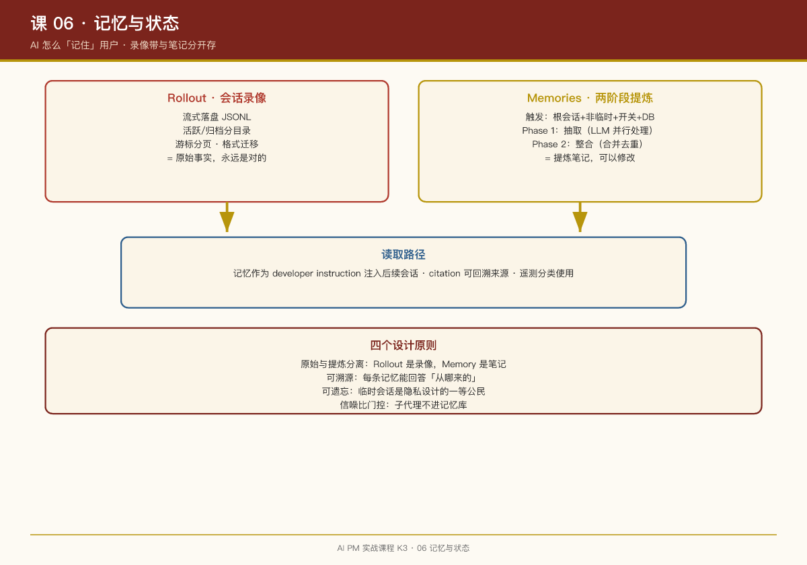

# 第 06 课：记忆与状态——AI 怎么"记住"用户

## 一句话结论

AI 产品的"记忆"不是简单的对话历史存储，而是**一个分层的、可压缩的、可溯源的信息架构**——原始录像带（raw）和提炼笔记（curated）必须分开存。

## 记忆的三个层次

| 层次 | 内容 | 生命周期 | 用途 |
|-|-|-|-|
| 工作记忆 | 当前会话的上下文 | 会话结束即销毁 | 支撑当前对话 |
| 短期记忆 | 近期会话的摘要 | 几天到几周 | 快速回顾最近交互 |
| 长期记忆 | 跨会话的用户画像 | 永久（可删除） | 个性化服务 |

## 案例：Codex 的 Rollout 系统

Codex 的 Rollout 是**会话的完整录像**：

```rust
// codex-rs/core/src/rollout.rs
pub struct RolloutRecorder {
    // 流式落盘会话事件
}

pub const SESSIONS_SUBDIR: &str = "sessions";
pub const ARCHIVED_SESSIONS_SUBDIR: &str = "archived_sessions";
```

**关键设计**：

- 活跃会话和归档会话分目录存放
- 支持按 ID/名称检索历史会话
- 支持游标分页（会话列表可能很长）
- 有专门的格式迁移命令（`migrate_rollouts`）

**PM 视角**：Rollout 是"原始事实"，永远是对的。记忆提炼可能错，但录像带不会错。

## 案例：Codex 的两阶段记忆提炼

Codex 的记忆系统是**后台异步的两阶段管线**：

```markdown
# codex-rs/memories/README.md

The pipeline is triggered when a root session starts, and only if:
- the session is not ephemeral
- the memory feature is enabled
- the session is not a sub-agent session
- the state DB is available

It runs asynchronously in the background and executes two phases in order: Phase 1, then Phase 2.

## Phase 1: Rollout Extraction (per-thread)
- claims a bounded set of rollout jobs from the state DB
- filters rollout content down to memory-relevant response items
- sends each rollout to a model (in parallel, with a concurrency cap)
- expects structured output containing: raw_memory, rollout_summary

## Phase 2: Consolidation
- merges new memories with existing ones
- resolves conflicts
- updates the memory store
```

**关键设计决策**：

1. **触发条件**：根会话、非临时、开关打开、DB 可用——四个条件同时满足才触发
2. **异步执行**：不阻塞用户当前会话
3. **子代理排除**：子代理会话不触发记忆提炼（避免噪音）
4. **临时会话排除**：`ephemeral` 会话不进入长期记忆（隐私设计）

## 案例：Codex 的记忆可溯源

Codex 的记忆带 `citation`——每条记忆都能回溯到来源会话：

```rust
// codex-rs/protocol/src/memory_citation.rs
pub struct MemoryCitation {
    pub memory_id: String,
    pub source_session_id: String,
    pub excerpt: String,
}
```

**产品价值**：

- 用户问"你怎么知道这个的？" → AI 可以展示来源
- 记忆出错时 → 能定位是哪个会话提炼错了
- 支持"忘记这个" → 可以精确删除特定记忆及其来源

## 案例：OpenClaw 的记忆设计

OpenClaw 用更轻量的方式——**文件系统即记忆**：

```markdown
# MEMORY.md（用户级长期记忆）
- 用户偏好
- 项目约定

# 2026-08-29.md（每日日志）
- 当天完成的工作
```

**与 Codex 的对比**：

- Codex：LLM 提炼 + 结构化存储 + 可溯源
- OpenClaw：人工策展 + 文件系统 + 简单直接

**适用场景**：

- Codex 方案适合：企业级产品，需要审计和合规
- OpenClaw 方案适合：个人助理，轻量灵活

## 记忆设计的四个原则

### 1. 原始与提炼分离

```
Rollout（原始录像）→ 永远保留
Memory（提炼笔记）→ 可以修改、删除、重新提炼
```

### 2. 可溯源

每条记忆都应该能回答："这是从哪来的？"

### 3. 可遗忘

用户应该有"忘记这个"的权利。临时会话（ephemeral）是隐私设计的一等公民。

### 4. 信噪比门控

不是所有会话都值得进入长期记忆。Codex 排除子代理会话，OpenClaw 排除临时会话。

## 案例：Jyothi 的 AI Chief of Staff

Jyothi Nookula 用 Claude Code 建了一个个人 agent，读所有会议纪要，逐渐建立关于组织、人脉、政治的知识图谱：

- **实战案例 1**：建议她把某同事发展成盟友（对方在她想拓展的领域很强）
- **实战案例 2**：拦下一封邮件，告诉她该先同步谁

**架构**：context 知识库（人/会议/文档/公司/优先级/模式识别分文件夹）+ 提取模板 + 本地 MCP server

**喂数据按信号密度排序**：会议纪要最高（谁反对、谁沉默、决定了什么）> 战略文档 > Slack 线程

**隐私观点**：知识库放自己电脑上，离职带走——最个人化的工作数据不属于别人的云。

> **PM 启示**：个人知识库是 AI PM 的"第二大脑"，但要自己掌控数据主权。

## PM 检查清单

设计 AI 记忆系统时，问自己：

- [ ] 原始对话和提炼记忆是分开存的吗？

- [ ] 每条记忆能溯源到来源会话吗？

- [ ] 用户能查看和删除自己的记忆吗？

- [ ] 临时会话（ephemeral）的边界清楚吗？

- [ ] 记忆提炼是后台异步的吗？（不阻塞用户体验）

## 本周练习

1. 设计你的产品的记忆分层：工作记忆、短期记忆、长期记忆分别存什么？
2. 写一个"记忆提炼"的提示词模板：从 100 轮对话中提取什么信息？
3. 设计"忘记这个"功能：用户怎么删除特定记忆？怎么处理关联记忆？

## 延伸阅读

- Codex 仓库：`codex-rs/memories/README.md`（记忆系统完整文档）
- Codex 仓库：`codex-rs/memories/write/templates/memories/`（提炼提示词模板）
- OpenClaw 仓库：`docs/memory.md`（文件系统记忆设计）


