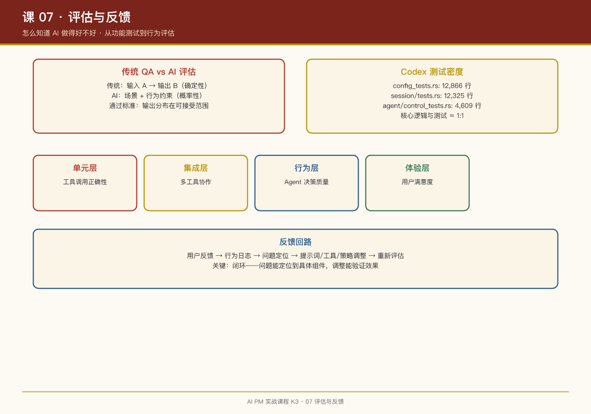

# 第 07 课：评估与反馈——怎么知道 AI 做得好不好

## 一句话结论

AI 产品的评估不是"功能测试"（输入 A 应该输出 B），而是**行为评估**（在分布上，AI 的行为是否符合预期）。这需要新的评估框架、新的指标体系和新的反馈回路。

## 传统 QA vs AI 评估

| 维度 | 传统 QA | AI 评估 |
|-|-|-|
| 测试对象 | 确定性代码 | 概率性模型 |
| 通过标准 | 输出 == 预期 | 输出分布在可接受范围内 |
| 测试用例 | 具体输入输出对 | 场景 + 行为约束 |
| 失败分析 | 定位 bug | 分析模型行为模式 |

## 案例：Codex 的测试密度

Codex 的测试密度极高，核心逻辑与测试行数比接近 1:1：

| 文件 | 行数 | 测试内容 |
|-|-|-|
| `config_tests.rs` | 12,866 | 配置系统行为 |
| `session/tests.rs` | 12,325 | 会话管理行为 |
| `agent/control_tests.rs` | 4,609 | Agent 控制行为 |
| `multi_agents_tests.rs` | 4,517 | 多智能体协作行为 |

**关键洞察**：这些测试不是"单元测试"，是**行为测试**——验证 Agent 在特定场景下的行为是否符合预期。

## 案例：Codex 的 execpolicy 自校验

Codex 的策略规则自带测试样例，加载时校验：

```starlark
prefix_rule(
    pattern = ["git", "push"],
    decision = "prompt",
    match = [["git", "push"], "git push origin main"],      # 必须命中
    not_match = [["git", "status"], "git pull"],             # 必须不命中
)
```

**设计思想**：策略即代码，代码即测试。写错的规则在加载期就炸，不会带病上线。

## 案例：Codex 的记忆遥测

Codex 的记忆系统有使用情况的遥测分类：

```rust
// codex-rs/memories/read/ 模块
// read-usage telemetry classification
```

**PM 视角**：记忆系统不是"建完就完"，需要持续监控——哪些记忆被使用了？哪些记忆导致了错误行为？

## 案例：OpenClaw 的社区反馈

OpenClaw 的技能生态是**社区驱动**的质量控制：

- ClawHub 技能市场有用户评价
- 技能作者响应社区反馈
- 热门技能经过大量用户验证

**与 Codex 的对比**：

- Codex：官方团队写测试，工程化保证质量
- OpenClaw：社区用使用量投票，市场化保证质量

## 案例：Dianne 的 Eval 四步循环（Anthropic 一线实证）

Dianne Penn 在 Anthropic 的完整工作流程：

1. **读取真实用户轨迹**：用户说"Claude 幻觉了"还不够，要追问——模型当时有没有调用工具？调用了正确的工具吗？看了正确的文档却抓错了事实吗？
2. **判断失败类型**：问题属于 tool use、搜索、知识整合，还是 alignment？只有把反馈还原成失败轨迹，研究人员才知道下一步该改什么。
3. **抽象成 eval set**：真实案例——早期大量用户反馈"Claude 不会遵循指令"。追问具体场景后发现，**约 80% 的问题其实是模型没有生成正确的 JSON**。于是整理出 30-40 个具体例子形成 eval set：每个样本包含 prompt、模型 response、期望的 golden answer。
4. **反复运行测试**：每次新版本模型发布，重新运行这组测试，检查问题是否真的改善。

> **这是 PM 的 test-driven development**——先写清"什么叫做对"，再推动模型向这个标准靠近。

## 案例：播客的三张 Eval 集

《AI 产品经理实操手册》提炼了 eval 集的三层结构：

| 类型 | 内容 | 来源 |
|-|-|-|
| Golden Set（黄金集） | 100+ 条"必须答对"的典型输入 | 从用户反馈、客服记录里挑最有代表性的 |
| Edge Case（边界集） | 模糊、对抗、敏感输入 | 竞品翻车案例、安全团队、红队测试 |
| Regression（回归集） | 历史所有改坏过的用例 | 每次线上事故、每个用户投诉，都沉淀进来 |

**发布门禁**：模型/提示词/工作流任何改动 → 跑全量 eval → 通过率 < 95%（按业务定）→ 不许上线。新增 20 个线上失败案例 → 进 eval 集 → 修复 → 通过后才能发。

## AI 评估的四个层次

### 1. 单元层：工具调用正确性

验证单个工具的行为：

- 给定输入，工具是否返回预期输出？
- 错误处理是否正确？

### 2. 集成层：多工具协作

验证工具组合的行为：

- 工具链是否按预期执行？
- 并行工具的结果汇总是否正确？

### 3. 行为层：Agent 决策质量

验证 Agent 的整体行为：

- 任务拆解是否合理？
- 权限申请是否恰当？
- 记忆使用是否准确？

### 4. 体验层：用户满意度

验证最终用户体验：

- 任务完成率
- 用户干预频率
- 用户满意度评分

## 反馈回路设计

```
用户反馈 → 行为日志 → 问题定位 → 提示词/工具/策略调整 → 重新评估
    ↑                                                      ↓
    └──────────────── 持续监控 ←───────────────────────────┘
```

**关键**：反馈回路必须是**闭环**的——问题能定位到具体组件，调整能验证效果。

## Cat Wu 的两条硬标准（Anthropic 一线实证）

Claude Code 产品负责人 Cat Wu 给反馈回路补了两条可以直接落地的标准：

### 1. 自动化要跑通到 100%

> "95% 可靠的自动化几乎没有任何价值——你仍然需要监控那 5% 的失败。唯一有意义的自动化是 100% 可靠的。"

- 如果自动化还在"偶尔出错需要人兜底"，它就没有真正节省时间
- 达到 100% 的方法：**显式的反馈循环**——定义 skill → 运行 → 发现错误 → 纠正 → 指示模型更新 skill 定义 → 重复
- 在达到 100% 之前不要放弃，否则时间投资收益极低

### 2. 模型升级时做拐杖审计

新模型发布后，做一次完整的 system prompt 审计：找出所有"为了弥补旧模型弱点而加的拐杖"（tool、workaround、强制 to-do list），然后拆掉它们。这把评估体系的职责从"改动 → 跑 eval"扩展到**"模型升级 → 审计提示词债务"**。

Cat 的日常实践：花 **30% 的时间**故意把 Cowork 推到极限，和模型对话搞清楚它为什么犯错——通过询问 Claude 为何做出特定决策，来发现系统提示词的漏洞。她称之为**最被低估的 AI 技能**。

## PM 检查清单

设计 AI 评估体系时，问自己：

- [ ] 有没有行为测试（不只是功能测试）？

- [ ] 策略/规则有没有自校验样例？

- [ ] 有没有遥测数据监控 AI 行为？

- [ ] 用户反馈能定位到具体组件吗？

- [ ] 调整后能验证效果吗？

## 本周练习

1. 为你的 AI 产品设计 5 个行为测试场景（不是功能测试）
2. 设计一个"AI 行为监控"面板：你会展示哪些指标？
3. 写出一个完整的反馈回路：从用户反馈到产品调整的流程

## 延伸阅读

- Codex 仓库：`codex-rs/core/src/agent/control_tests.rs`（行为测试示例）
- Codex 仓库：`codex-rs/execpolicy/README.md`（策略自校验设计）
- OpenClaw 仓库：`docs/skills.md`（技能质量控制）


