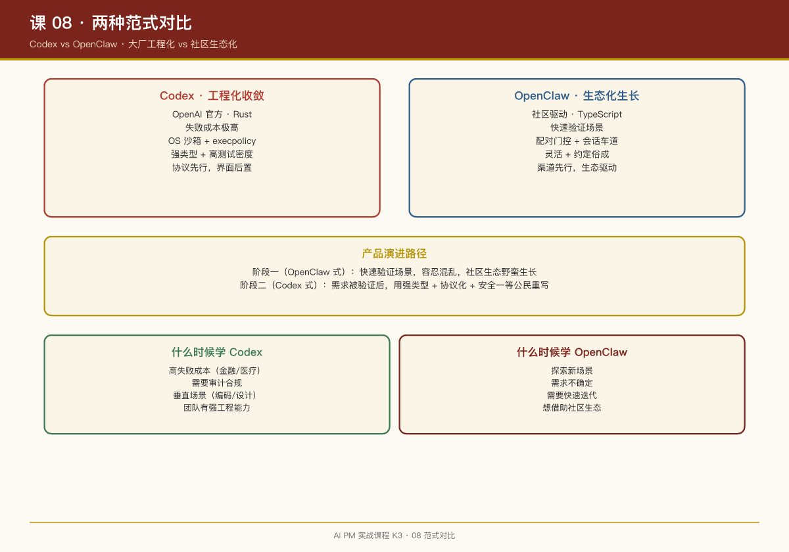

# 第 08 课：两种范式对比——Codex vs OpenClaw 的设计哲学

## 一句话结论

Codex 和 OpenClaw 代表了 AI Agent 产品的两个极端：**大厂工程化收敛** vs **社区生态化生长**。理解它们的差异，比理解它们各自的设计更重要。

## 核心差异一览

| 维度 | Codex | OpenClaw |
|-|-|-|
| **出身** | OpenAI 官方 | 社区驱动（现归 OpenAI） |
| **语言** | Rust | TypeScript |
| **主场景** | 编码（终端/IDE/云） | 个人助理（多渠道消息） |
| **安全模型** | OS 级沙箱 + 策略语言 | 配对门控 + 会话车道 |
| **扩展方式** | Skills + MCP + Plugins | ClawHub 技能包 |
| **多智能体** | 任务级临时子代理 | 常驻人格化团队 |
| **记忆系统** | LLM 两阶段提炼 + citation | 文件系统 + 人工策展 |
| **代码风格** | 强类型、显式协议、高测试密度 | 灵活、约定俗成、快速迭代 |

## 深层原因：为什么长得不一样

### Codex：失败成本极高的产品

Codex 是 OpenAI 的官方产品，失败成本极高：

- 删错用户文件 → 品牌危机
- 执行危险命令 → 安全事故
- 行为不可预测 → 用户流失

**设计回应**：

- Rust 强类型：编译期抓错
- OS 沙箱：物理隔离
- execpolicy：策略语言，可编程审批
- 高测试密度：行为验证

### OpenClaw：快速验证场景的产品

OpenClaw 起源于社区，目标是**快速验证 AI 助理的场景**：

- 多渠道接入（Telegram/WhatsApp）→ 快速触达用户
- 技能市场 → 快速扩展能力
- 常驻多 Agent → 快速验证协作模式

**设计回应**：

- TypeScript：快速迭代
- 配对门控：简单有效的信任模型
- 文件系统记忆：轻量灵活
- 社区驱动：生态活力

## 互补性：它们合起来是什么

Codex 和 OpenClaw 不是竞争对手，是**同一主题的两个阶段**：

```
阶段一（OpenClaw 式）：快速验证场景，容忍混乱，社区生态野蛮生长
         ↓
阶段二（Codex 式）：需求被验证后，用强类型 + 协议化 + 安全一等公民重写
```

**证据**：OpenAI 收购了 OpenClaw——先看社区验证了什么需求真实存在，再用大厂工程能力做掉它。

## 具体设计对比

### 安全：物理隔离 vs 应用层门控

**Codex（物理层）**：

```markdown
# linux-sandbox/README.md
- 文件系统只读 by default（--ro-bind / /）
- 可写根目录显式声明（--bind <root> <root>）
- seccomp 网络过滤
- PR_SET_NO_NEW_PRIVS
```

**OpenClaw（应用层）**：

```typescript
// 配对门控
if (!isPaired(contactId)) {
    return queueForApproval(message, contactId);
}
```

**选择依据**：

- 你的 AI 能执行系统命令吗？→ 需要物理层安全
- 你的 AI 只是处理消息吗？→ 应用层门控可能够用

### 扩展：官方定义 vs 社区贡献

**Codex（官方）**：

```yaml
# skills/src/assets/samples/skill-creator/SKILL.md
---
name: skill-creator
description: Create or update a Codex skill...
---
```

**OpenClaw（社区）**：

```yaml
# skills/gog/SKILL.md
---
name: gog
description: Google Groups CLI integration
---
```

**选择依据**：

- 需要严格控制质量？→ 官方定义
- 需要快速扩展生态？→ 社区贡献

### 多智能体：任务级 vs 常驻

**Codex（任务级）**：

```rust
// 派生子代理处理特定任务
multi_agents::spawn(task="Run tests", context={...})
// 子代理完成任务后销毁
```

**OpenClaw（常驻）**：

```typescript
// 4 个常驻 Agent：Milo/Josh/Angela/Bob
// 共享文件系统 + 群聊路由
```

**选择依据**：

- 任务边界清晰？→ 任务级子代理
- 需要长期协作关系？→ 常驻 Agent

## 岗位现实：两类 AIPM（Jyothi 框架）

Jyothi Nookula 在 Masterclass 中提出了 AI PM 的岗位分类框架：

| 类型 | 占比 | 特征 | 例子 |
|-|-|-|-|
| 传统 PM + AI 功能 | \~80% | 产品先于 AI 存在，AI 是增强层 | 客服机器人、文档总结 |
| AI 原生 PM | \~20% | 产品本身就是 AI，本质是概率系统 | ChatGPT、Claude、Cursor、Perplexity |

**很多人冲着第二类投简历，但绝大多数机会在第一类。**

### 技术栈三层

| 层级 | 占比 | 做什么 | 转型难度 |
|-|-|-|-|
| 应用层 PM | \~60% | 用户与 AI 交互、信任建立、可靠性 | 最容易，传统技能可复用 |
| 平台层 PM | \~30% | 开发者平台、模型编排、评估框架 | 中等 |
| 基础设施 PM | \~10% | 向量数据库、GPU 调度、推理优化 | 最难 |

**转型最现实的路径是从应用层切入，站稳后再决定要不要往下探。**

## 对你的产品决策的启示

### 什么时候学 Codex

- 你的产品有高失败成本（金融、医疗、企业级）
- 你的团队有强工程能力
- 你需要审计和合规
- 你的场景相对垂直（如编码、设计）

### 什么时候学 OpenClaw

- 你在探索新场景，需求不确定
- 你需要快速验证和迭代
- 你想借助社区生态
- 你的场景是通用个人助理

### 什么时候两者结合

- **用 OpenClaw 验证需求，用 Codex 工程化**
- **用 Codex 的内核，加 OpenClaw 的渠道接入**
- **用 OpenClaw 的技能生态，加 Codex 的安全体系**

## 本周练习

1. 分析你的产品：它更像 Codex 还是 OpenClaw？为什么？
2. 写出你的产品可以从另一个范式学到什么（至少 3 点）
3. 设计一个"混合方案"：结合两种范式的优点

## 延伸阅读

- Codex 仓库：`codex-rs/` 目录结构（工程化组织）
- OpenClaw 仓库：`packages/` 目录结构（社区化组织）
- OpenClaw 被 OpenAI 收购的公告（产品演进路径）


