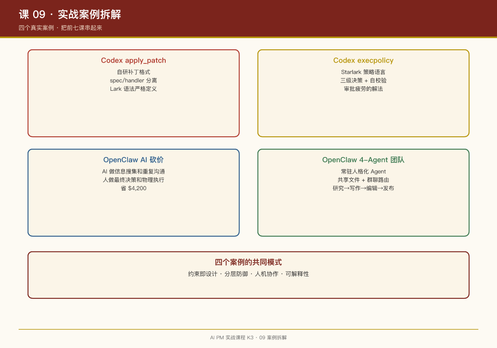

# 第 09 课：实战案例拆解——七个真实案例的完整分析

## 一句话结论

看 100 个设计原则，不如拆 1 个真实案例。这节课用七个真实案例，把前七课的知识点串起来。

## 案例 1：Codex 的 apply_patch——工具设计的教科书

### 背景

让 AI 改代码文件，最直接的方式是让它执行 `cat > file <<EOF`。但这样有问题：

- 无法预览 diff
- 无法校验路径
- 无法审批粒度
- token 浪费

### 解决方案

Codex 发明了**自研补丁格式**：

```lark
*** Begin Patch
*** Add File: src/new_module.rs
+fn main() {}
*** Update File: src/lib.rs
@@
-old_line
+new_line
*** Delete File: src/obsolete.rs
*** End Patch
```

### 知识点映射

| 课 | 知识点 | 在案例中的体现 |
|-|-|-|
| 01 提示词 | spec 即说明书 | `apply_patch_spec.rs` 定义模型可见的语法 |
| 02 上下文 | 按需注入 | 补丁工具只在需要时挂载 |
| 03 工具 | spec/handler 分离 | 说明书和执行器独立迭代 |
| 04 安全 | 路径校验 | handler 层校验是否越出工作区 |
| 05 工作流 | 结构化操作 | Add/Update/Delete 三类操作语义清晰 |
| 07 评估 | 解析失败可恢复 | 解析错误返回给模型自我修正 |

### PM 启示

**为模型能力边界做工程设计**：模型的弱点（自由文本不精确）→ 用严格语法和解析器兜底。

## 案例 2：Codex 的 execpolicy——权限设计的教科书

### 背景

AI 可以执行 shell 命令，但怎么防止它执行危险命令？

### 解决方案

Codex 用 **Starlark 策略语言**定义命令执行策略：

```starlark
prefix_rule(
    pattern = ["git", "push"],
    decision = "prompt",
    justification = "Git push modifies remote state",
    match = [["git", "push"], "git push origin main"],
    not_match = [["git", "status"], "git pull"],
)

prefix_rule(
    pattern = ["rm", "-rf"],
    decision = "forbidden",
    justification = "Destructive file operations are not allowed",
)
```

### 知识点映射

| 课 | 知识点 | 在案例中的体现 |
|-|-|-|
| 01 提示词 | 策略即代码 | Starlark 规则定义行为边界 |
| 04 安全 | 三级决策 | allow / prompt / forbidden |
| 07 评估 | 自校验样例 | match/not_match 加载时校验 |

### PM 启示

**审批疲劳的解法是策略，不是更多弹窗**。让"安全的静默、危险的拦截、灰色的问人"成为可配置的工程对象。

## 案例 3：OpenClaw 的 AI 砍价买车——人机分工的教科书

### 背景

AJ Stuyvenberg 用 OpenClaw 帮他砍价买车，省了 \$4,200。

### 人机分工

**AI 做的（4 类）**：

1. Reddit 调研 \$58,000 基准价
2. 填表群发经销商
3. 循环比价施压
4. 编借口不接电话

**人做的（5 件事）**：

1. 部署授权
2. 下指令
3. 设计策略 + 设 Cron
4. 提供身份
5. 物理收尾

### 知识点映射

| 课 | 知识点 | 在案例中的体现 |
|-|-|-|
| 01 提示词 | 任务指令设计 | AJ 设计的砍价策略 |
| 02 上下文 | 信息搜集 | Reddit 调研结果注入上下文 |
| 03 工具 | 渠道接入 | 邮件、电话、网页表单 |
| 04 安全 | 权限边界 | AI 不能签合同、不能付款 |
| 05 工作流 | 循环比价 | 多轮迭代施压 |
| 06 记忆 | 经销商信息 | 记录每个经销商的报价 |

### PM 启示

**AI 自主性的边界**：AI 做信息搜集和重复沟通，人做最终决策和物理执行。这个边界不是技术决定的，是产品设计的。

## 案例 4：OpenClaw 的 4-Agent 团队——多智能体协作的教科书

### 背景

独立开发者用 OpenClaw 搭建 4 个常驻 Agent：Milo（研究）、Josh（写作）、Angela（编辑）、Bob（发布）。

### 协作方式

- **共享文件系统**：Agent 之间通过文件交换信息
- **群聊路由**：消息按规则路由到不同 Agent
- **常驻运行**：Agent 长期存在，有自己的人设

### 知识点映射

| 课 | 知识点 | 在案例中的体现 |
|-|-|-|
| 03 工具 | 消息路由 | Telegram 群聊消息路由到不同 Agent |
| 05 工作流 | 流水线协作 | 研究 → 写作 → 编辑 → 发布 |
| 06 记忆 | 共享状态 | 共享文件系统作为"团队记忆" |

### 知识点映射（与 Codex 对比）

| 维度 | OpenClaw 4-Agent | Codex multi_agents |
|-|-|-|
| 生命周期 | 常驻 | 任务级 |
| 协作方式 | 共享文件 + 群聊 | 主代理派发 |
| 适用场景 | 长期内容创作 | 编码任务拆解 |

### PM 启示

**多智能体的形态取决于场景**：长期协作关系用常驻 Agent，任务拆解用临时子代理。

## 案例 5：Dianne 的 Golden Gate Claude——研究到产品的 24 小时

### 背景

2024 年，Anthropic 的可解释性研究团队发现：模型内部存在与特定主题相关的 **feature（特征）**。他们把 **Golden Gate Bridge（金门大桥）的 feature 调高**后，Claude 几乎每个回答都会谈金门大桥——问意大利面食谱，它也会把面条的颜色联系到金门大桥的"国际橙"。

### 产品化决策

研究、产品、工程、设计一起协作，**24 小时内**把这个体验做进了 Claude.ai 公开上线。虽然只触达了约 2,000 人，但证明了一个重要道理：

> **研究可以用轻量体验公开验证，产品不必等所有东西成熟才出手。**

### PM 启示

- **对主题强烈坚持，对具体原型保持较弱的承诺**——原型即使没有立即发布，只要帮助团队理解了未来一两代模型可能出现的机会，也有价值
- 某个想法现在做不成不代表永远不做，可能在一两次模型迭代后重新回来看
- 与传统创新部门的区别：**不把"实验失败"当成无效产出**

## 案例 6：Jyothi 的黑客松对抗 Agent——问题优先的胜利

### 背景

Jyothi Nookula 以 PM 身份参加公司黑客松，用 Claude Code 打赢了 30 个工程团队。

### 方案

GAN 启发的自改进循环：

```
一个 agent 构建 → 另一个 agent 找茬 → 反馈回去改进 → 循环到过质量线
```

- 灵感来自 Anthropic 博客的 adversarial agents 和 GAN 架构
- 启动 prompt："构建一个对抗评估器来评估我的 agent，标准要宽，GAN 架构"

### 关键洞察

她强调：赢靠的不是写代码（写代码已经很容易），而是**"问题优先"的 PM 本能**——找到最有摩擦的问题点。

> **构建变容易了，品味变稀缺。**

## 案例 7：Claude Code 的 to-do list——拐杖功能的教科书

### 背景

Claude Code 的 to-do list 功能最初是一个"拐杖"：当时模型难以自主完成长任务——20 个调用点的重构会中途迷失，于是加一个强制性的 to-do list，逼模型按列表逐项执行、自我跟踪进度。

### 方法论

Cat Wu（Claude Code 产品负责人）称之为**拐杖功能（crutch feature）**，完整循环是：

```text
当前模型某能力弱 → PM 加一个拐杖（tool / workaround / 强制 to-do list）
新模型发布 → 做一次完整的 system prompt 审计
找出所有为旧模型弱点加的拐杖 → 拆掉它们
```

**关键事实**：Opus 4 上线后，to-do list 功能就不需要了——模型能力自然覆盖了当初要靠拐杖完成的事。

### 知识点映射

| 课 | 知识点 | 在案例中的体现 |
|-|-|-|
| 01 提示词 | system prompt 管理 | 新模型发布后审计提示词里的拐杖 |
| 03 工具 | 拐杖即工具 | to-do list 是给模型加的"外挂执行力" |
| 05 工作流 | 编排即拐杖 | 与 Codex plan 工具同源——强制模型维护任务列表 |
| 07 评估 | 能力缺口测试 | 拐杖还在不在用 = 模型能力缺口有没有被补上 |

### PM 启示

> "把那些目前还不能完全正常工作的功能做出来，等下一代模型上线后去测试——能力缺口有没有被补上。"

**把产品上限设在模型能力的边缘**：不是只基于今天的模型能力规划功能，而是主动为明天的模型预留位置。这与第 05 课的拐杖警示、第 07 课的拐杖审计形成方法论闭环。

## 七个案例的共同模式

1. **约束即设计**：每个案例都通过约束（语法、策略、权限、分工）来管理 AI 行为
2. **分层防御**：安全不是靠单点，是靠多层叠加
3. **人机协作**：AI 做擅长的（信息处理、重复劳动），人做必须做的（决策、物理执行）
4. **可解释性**：AI 的行为应该能解释、能审计、能回溯
5. **能力演进意识**：为今天的模型弱点加拐杖，为新模型拆拐杖——产品设计跟着模型能力一起迭代

## 本周练习

1. 选一个你负责的功能，用"案例拆解"格式写出：背景、问题、解决方案、知识点映射
2. 分析这个功能的"人机分工"边界：AI 做什么，人做什么？
3. 设计一个改进方案：用课程中学到的知识点优化这个功能

## 延伸阅读

- Codex 仓库：`codex-rs/core/src/tools/handlers/apply_patch_spec.rs`
- Codex 仓库：`codex-rs/execpolicy/README.md`
- OpenClaw 案例：AJ Stuyvenberg 的 AI 买车谈判（IEEE Spectrum 报道）
- OpenClaw 仓库：`docs/multi-agent.md`（多智能体设计）


