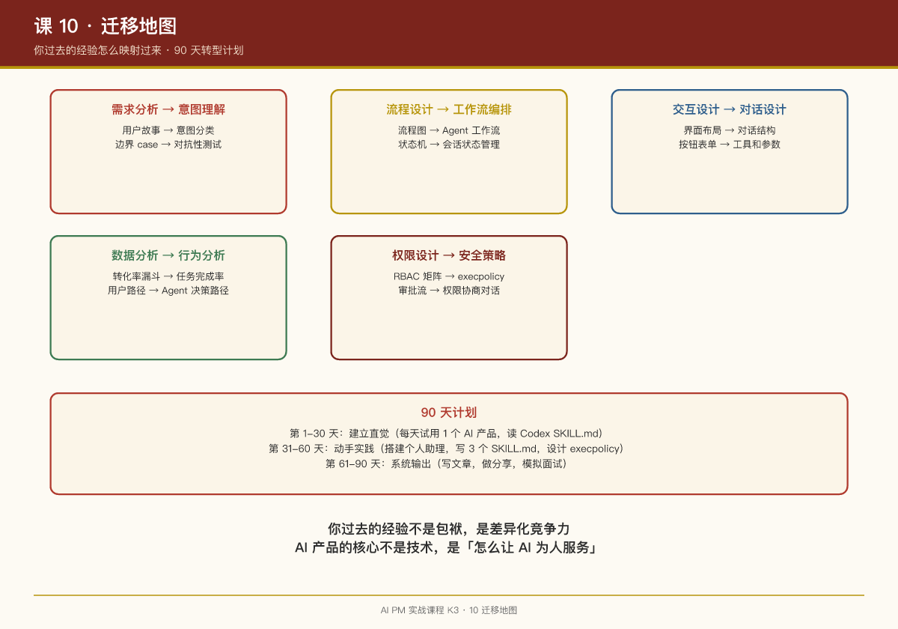

# 第 10 课：迁移地图——你过去的经验怎么映射过来

## 一句话结论

你过去的互联网产品经验不是负担，是**待激活的资产**。这节课给你一张完整的迁移地图：传统 PM 技能 → AI PM 技能。

## 技能迁移地图

### 1. 需求分析 → 意图理解

| 传统 | AI | 映射 |
|-|-|-|
| 用户故事（User Story） | 意图分类（Intent Classification） | 把"作为 X，我想要 Y"翻译成"当用户说 Z 时，AI 应该..." |
| 边界 case 分析 | 对抗性测试（Adversarial Testing） | 不仅考虑正常输入，还要考虑模型误解、恶意输入、边界情况 |
| 竞品分析 | 模型能力边界分析 | 分析竞品不仅看功能，还要看它们用什么模型、怎么设计提示词 |

**练习**：把你过去写的用户故事，改写成"意图-行为"对。

### 2. 流程设计 → 工作流编排

| 传统 | AI | 映射 |
|-|-|-|
| 用户流程图 | Agent 工作流 | 用户操作步骤 → AI 任务拆解步骤 |
| 状态机 | 会话状态管理 | 页面状态 → 对话状态（进行中/等待输入/需要审批） |
| 异常处理 | 容错与恢复 | 网络错误重试 → AI 行为偏离时的纠偏 |

**练习**：把你过去设计的流程图，改写成 AI 工作流（用 plan 工具的格式）。

### 3. 交互设计 → 对话设计

| 传统 | AI | 映射 |
|-|-|-|
| 界面布局 | 对话结构 | 页面信息架构 → 对话轮次组织 |
| 按钮和表单 | 工具和参数 | 用户点击按钮 → AI 调用工具 |
| 错误提示 | 错误恢复对话 | 显示错误信息 → AI 解释错误并提供解决方案 |

**练习**：把你过去设计的界面，改写成对话脚本（用户说什么，AI 怎么回应）。

### 4. 数据分析 → 行为分析

| 传统 | AI | 映射 |
|-|-|-|
| 转化率漏斗 | 任务完成率 | 页面转化率 → AI 任务成功率 |
| 用户行为路径 | Agent 决策路径 | 用户点击流 → AI 工具调用序列 |
| A/B 测试 | 提示词实验 | 界面 A/B 测试 → 不同提示词的效果对比 |

**练习**：设计一个"AI 行为分析"面板，你会展示哪些指标？

### 5. 权限设计 → 安全策略

| 传统 | AI | 映射 |
|-|-|-|
| RBAC 权限矩阵 | execpolicy 策略 | 用户角色权限 → AI 命令执行权限 |
| 审批流 | 权限协商对话 | 人工审批 → AI 主动申请权限 |
| 操作日志 | Rollout 回放 | 用户操作记录 → AI 行为完整记录 |

**练习**：把你过去设计的权限矩阵，改写成 execpolicy 规则。

## 能力升级清单

### 需要新学的能力

| 能力 | 为什么需要 | 怎么学 |
|-|-|-|
| 提示词工程 | AI 产品的核心交付物 | 读 Codex 的 SKILL.md 样本，模仿写 |
| 模型行为直觉 | 预测模型会怎么理解你的设计 | 大量试用各种 AI 产品，观察行为 |
| 概率思维 | 从确定性到不确定性的思维转换 | 读《思考，快与慢》，理解认知偏差 |
| 评估框架 | 怎么知道 AI 做得好不好 | 学 ML 评估指标（准确率、召回率、F1） |

### 需要放弃的习惯

| 旧习惯 | 为什么放弃 | 新习惯 |
|-|-|-|
| 追求完备性 | AI 行为无法完全枚举 | 追求鲁棒性：设计边界，容忍意外 |
| 精确控制 | 模型行为是概率性的 | 引导而非控制：给方向，不给步骤 |
| 功能思维 | AI 产品不是功能的堆砌 | 能力思维：AI 能做什么，不能做什么 |
| 长期路线图 | 模型能力可能一夜跃迁，提前 6 个月规划从根本上就错了 | 用实验替代计划：锐利目标 + 快速迭代 |

## 90 天转型计划

### 第 1-30 天：建立直觉

- 每天试用 1 个 AI 产品，记录它的行为边界
- 读 Codex 的提示词文件（SKILL.md、compact prompt）
- 加入 AI 产品社区，看别人讨论什么

### 第 31-60 天：动手实践

- 用 Codex/OpenClaw 搭建一个个人助理
- 写 3 个自己的 SKILL.md
- 设计一个 execpolicy 规则集

### 第 61-90 天：系统输出

- 写一篇"AI 产品方法论"文章
- 给团队做一次内部分享
- 面试 3 个 AI PM 候选人（或模拟面试）

## 常见陷阱

| 陷阱 | 表现 | 解法 |
|-|-|-|
| 过度设计 | 试图控制 AI 的每一步 | 给方向，给边界，让 AI 自己走 |
| 忽视评估 | 上线后不知道效果好不好 | 设计评估指标，持续监控 |
| 技术崇拜 | 盲目追求最新模型 | 关注产品价值，模型只是工具 |
| 忽视安全 | 觉得"我的产品没风险" | 永远假设 AI 会做错事，设计兜底 |

## 三个核心转变（播客总结）

《AI 产品经理实操手册》从 Satya Nadella 的访谈中提炼了 AI PM 的三个核心转变：

| 转变 | 从 | 到 |
|-|-|-|
| 转变一 | 管功能 | 管评测（Evals） |
| 转变二 | 管开发 | 管编排 |
| 转变三 | 管人 | 管「人 + agent」混合团队 |

**你的新工作流**：

> 定义评测标准（管评测）→ 写成目标说明书（管编排）→ 授权并监控 agent（管混合团队）→ 人审高风险 + 沉淀新用例 → 回到评测体系（飞轮转起来）

这套流程每次迭代一个产品功能就跑一圈，循环越快，你的「私有评测资产」越厚，你在公司的话语权越大。

## 团队管理：Competency vs Disposition（Jyothi 方法）

团队不适应 AI，先诊断问题类型：

**能力问题（competency）→ 做中学**

- 不培训、不看教程，直接把 AI 嵌入真实工作流（写 sprint 复盘、做调研总结）
- 两周后会上每人分享"AI 帮我做快的一件事"

**态度问题（disposition）→ 好奇而非布道**

- 1:1 里问"你真正的顾虑是什么"，然后闭嘴听
- 常见真实顾虑："感觉手艺在贬值"、"无法验证输出所以不信任"、"跟不上很焦虑"
- 对"手艺贬值"焦虑的人：展示 AI 接管脚手架后，他们能专注以前没时间做的高判断力工作
- 对"无法验证"焦虑的人：和他一起建评估框架，让他成为 AI 质检专家

**找"桥梁人物"**：每个团队都有天然爱折腾 AI 的人，给他们明确授权在站会上分享。同伴示范比领导布道有效得多。

## PM 角色的未来（Jyothi 的激进判断）

> "工程师、PM、设计师正在合并成 member of technical staff，配比从 1 PM : 8 工程师变成 2 PM : 1 工程师。"

- Anthropic、OpenAI 已在实践
- "构建变容易了，品味变稀缺"——护城河变成知道什么值得做、什么是好
- 这种判断力是唯一下载不了的技能

### Cat Wu 的印证：面试几百个 PM 后的观察

Claude Code 产品负责人 Cat Wu 面试过几百个 PM 候选人，观察到的致命模式：

> "很多来面试的 PM 会带着一份 6 到 12 个月的路线图。这在 AI 时代是错误的心智模型。"

正确姿态：**接受不确定性，拥抱快速变化，用实验替代计划**。

**PM 的三项核心技能（Cat 的排序）**：

1. **Evals（评估用例构建）**——定义"什么算做对"，最被低估的技能
2. **Product taste（产品品味）**——代码便宜了，"决定写什么"稀缺
3. **First-principles thinking（第一性原理）**——不被现有范式束缚

**招聘侧的印证**：Cat 团队优先招"有产品品味的工程师"，而不是更多 PM——"能读 Twitter 上的用户反馈、当天修好问题发出去"的工程师，几乎不需要协调成本。这与 Jyothi 的"角色融合"判断互为印证。

## 最后的话

你过去的经验不是包袱，是**差异化的竞争力**。纯技术背景的 PM 不懂用户，纯设计背景的 PM 不懂系统。你两者都有，现在加上 AI 这一层，就是**三栖选手**。

记住：**AI 产品的核心不是技术，是"怎么让 AI 为人服务"**。这正是产品经理的主场。

## 延伸阅读

- Codex 仓库：`codex-rs/`（工程化 AI 产品的完整样本）
- OpenClaw 仓库：`docs/`（社区化 AI 产品的完整样本）
- 《思考，快与慢》：理解人类认知偏差，设计更好的 AI 交互

